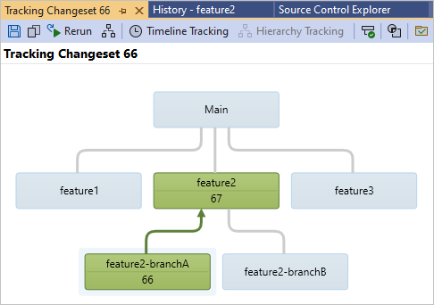

# Merge folders and files in Azure Repos

[!INCLUDE [version-lt-eq-azure-devops](../../includes/version-lt-eq-azure-devops.md)]
[!INCLUDE [version-vs-gt-eq-2019](../../includes/version-vs-gt-eq-2019.md)]

For the various reasons described in [Branch folders and files](branch-folders-files.md), many software development teams work in a codebase that's forked into various branches in Team Foundation Version Control (TFVC). If you use branches, eventually your team must integrate the work that's been completed on different branches during certain phases of your project. For example, when you're ready to test a full version of your software, you need the changes made on different feature team branches to be merged together.

The procedures in this article explain how you can use the Visual Studio graphical user interface to merge together changes made in different branches. For information about how to do merges at the command prompt, see [Merge command](merge-command.md).

## Prerequisites

To do these procedures, you must have the following permissions set:

- You must have the **Read** permission for the item in the source tree and your **Check out** permission for the item in the target tree set to **Allow**.
- You must have the **Merge** permission set for the target path.
- If the item in the target tree is being renamed, you must have the **Check out** permission for both the source tree and the target tree set to **Allow**.
- If any files affected by the operation are locked, you must have the **Lock** permission set to **Allow**.

For more information about permissions, see [Default TFVC permissions](../../organizations/security/default-tfvc-permissions.md).

## Initiate a merge from the Source Control window

Branches and folders are different. For example, the following illustration shows how branches and folders display with different icons in Visual Studio **Source Control Explorer**.

While you can still branch and merge among folders, the best practice for your team to follow is to branch and merge only among branches. For more information, see [Branch folders and files](branch-folders-files.md).

### Merge branches, files, and folders from Source Control Explorer

1. In Visual Studio **Source Control Explorer**, right-click the branch, folder, or file that you want to merge, and select **Branching and Merging** > **Merge**.

   You can also select the file and then select **File** > **Source Control** > **Branching and Merging** > **Merge**.

1. In the **Source Control Merge Wizard**, [complete the merge](#sourcecontrolwizard).

## Initiate a merge from the Tracking Changeset window

You can use the **Tracking Changeset** window to view information such as where a changeset was made, where it was merged, and when these events occurred. Branches where a changeset hasn't been merged are also highlighted. If you see a branch where the changeset is needed but is missing, you can drag it in.

> [!IMPORTANT]
> You can do this procedure only for changesets that affect a branch. For more information, see [Branch folders and files](branch-folders-files.md).

### Drag and drop a changeset into the Tracking Changeset window

1. In **Source Control Explorer**, select either a branch, a folder, or a file that's contained within a branch.

1. Right-click the selected item and select **View History**.

1. In the **History** window, right-click the changeset you want to view and select **Track Changeset**.

   The **Select Branches** dialog box appears. In the **Target branches** list, optionally check the branches that you want to view and uncheck the branches that you want to hide.

1. Select **Visualize**.

1. In the **Tracking Changeset** window, drag the branch that contains the changeset you want to merge to the target branch.

1. In the **Source Control Merge Wizard**, [complete the merge](#sourcecontrolwizard).

### Example: Merge a new method

To illustrate how you might use the preceding procedure, consider the following example. Your teammate asks you to implement a new method in some of the **feature2-branchA** code that they use in their **feature2-branchB** code. You write code for the new method and check it into the **feature2-branchA** branch. You let your teammate know that you've checked in the new method.

Your teammate finds the latest source, but doesn't see the new method that you checked in. They open **Source Control Explorer**, view the **History** window for the **feature2-branchA** branch, and see that with changeset **66**, you checked in the new method. Your teammate right-clicks changeset **66** and selects **Track Changeset**, and the following window appears:

From the **Tracking Changeset** window, your teammate can see that you checked in the method with changeset **66**, and merged it to the **feature2** branch with changeset **67**. But they can't get the new code until changeset 67 is merged into the **feature2-branchB** branch. So they drag the **feature2** branch onto the **feature2-branchB** branch to launch the **Source Control Merge Wizard**, which they use to complete the merge.

## Use the Source Control Merge Wizard to complete a merge

After you complete one of the preceding procedures, the **Source Control Merge Wizard** appears. This wizard enables you to specify the source and target of the merge. You can merge one entire branch to another branch, or you can pick a specific changeset or group of changesets that you want to merge.

### Use the Source Control Merge Wizard to merge files, folders, or branches:

1. In the Source Control Merge Wizard, in **Source branch**, either type the name of the project source branch, or select **Browse** to select one from the list.

1. In the **Target branch** dropdown list, select the target project branch to which you want to merge the source branch.

1. Select the range of changes that you want to merge into the target branch by selecting either **All changes up to a specific version** or **Selected changesets**, and then select **Next**.

   > [!TIP]
   > If possible, select **All changes up to a specific version**. This practice reduces the risk of conflicts in future merges.

1. If you selected **All changes up to a specific version**, the **Select the versions of the source items** page appears. Select the version of the items that you want to use.

   - **Changeset**: Merge by specifying a [changeset](find-view-changesets.md) version.
   - **Date**: Merge by specifying a date version.
   - **Label**: Merge by specifying a [label](use-labels-take-snapshot-your-files.md) version.
   - **Latest Version**: Merge by specifying the latest version.
   - **Workspace Version**: Merge by specifying a [workspace](create-work-workspaces.md) version.

   Or, if you chose **Selected changesets**, the **Select changesets to merge into the target branch** page appears. Select the changeset you want to merge.

   > [!TIP]
   > You can press and hold the **Ctrl** or **Shift** keys and then select multiple items.

1. Select **Next**, and then on the **Perform the merge operation** page, select **Finish**.

   One or more pending changes are generated.

1. Optionally, use the **Pending Changes** page in **Team Explorer** to check in the pending changes immediately. You can use **View** > **Other Windows** > **Pending Changes** to open the page. For more information, see [Check in your work to the team's codebase](check-your-work-team-codebase.md).

## Next steps

- [Use branches to isolate risk in Team Foundation Version Control](./branching-strategies-with-tfvc.md)
- [Merge Command](merge-command.md)
- [Merges Command](merges-command.md)
- [Resolve Team Foundation Version Control conflicts](resolve-team-foundation-version-control-conflicts.md)
- [Use Source Control Explorer to manage files under version control](use-source-control-explorer-manage-files-under-version-control.md)
