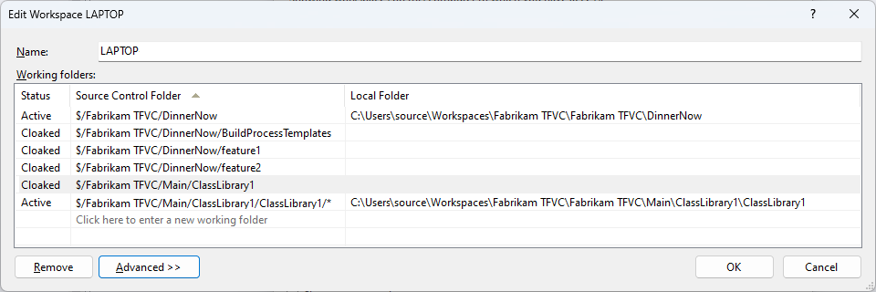
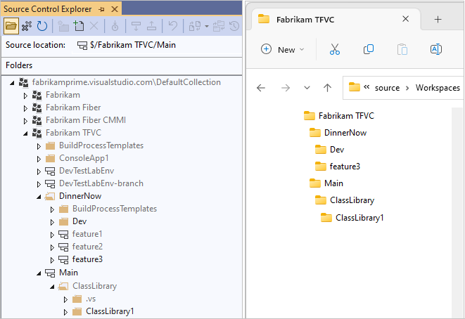
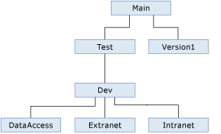
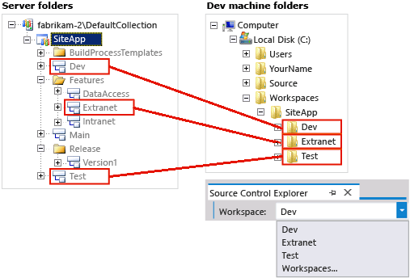

# Optimize your workspace

[!INCLUDE [version-lt-eq-azure-devops](../../includes/version-lt-eq-azure-devops.md)]
[!INCLUDE [version-vs-gt-eq-2019](../../includes/version-vs-gt-eq-2019.md)]

If your team has a large and complex codebase, you can optimize your workspace to contain only the files you need. Optimizing your workspace improves performance, reduces network traffic, and reduces the disk space required on your dev machine.

> [!NOTE]
> [Branching](branching-strategies-with-tfvc.md) and [suspending or shelving](suspend-your-work-manage-your-shelvesets.md) are the preferred ways to isolate different work efforts against the same codebase. However, if neither of these approaches meets your needs, you can map the same server folder in more than one workspace. In most cases you shouldn't need to do this.
> 
> If you do map the same server folder in more than one workspace, remember that you could have separate and different pending changes to the same file stored in each workspace.

## Optimize your folder names

If you don't yet use branches, put all your code in a subfolder called *Main* on your server, for example: *$/TFVCTeamProject/Main/*. You'll then be ready when your team grows big enough to require branches to manage its codebase. On your dev machine, you should use a short, understandable folder path that matches your project structure, such as *C:\\Users\\\<YourName>\\Source\\Workspaces\\TFVCTeamProject\\Main\\SolutionName*.

Some more tips on effective folder names:

-   Keep all folder, subfolder, and file names short to simplify your work and avoid potential long-path issues that can occur with some types of code projects.

-   Avoid whitespace in file and folder names to make command-line operations easier to perform.

## Optimize your workspace

If your team's codebase is large, you can avoid wasting time, network bandwidth, and local disk space by optimizing your workspace folder mappings. You can use explicit, implicit, cloaked, and non-recursive folder mappings to more simply and quickly create a usable workspace.

When you map a folder to your workspace, make sure that you choose a folder high enough in the code tree that you get all the files you need to create a local build, but low enough that you aren't getting more files than you need. In the following example workspace, you could simply map *$/SiteApp/* to *c:\\code\\SiteApp\\*. A simple workspace like this would *implicitly* map all the folders in *$/SiteApp/Main/* to your workspace, including the files you need.

The main problem with this approach is that it provides you with many files you don't need, and thus wastes time and resources. For example, if you don't develop customized build processes, you don't need *$/SiteApp/BuildProcessTemplates/*.

Over time you expect your team codebase to grow, and you don't want to automatically download every new bit of code added to *$/SiteApp/Main/*. As teams working in other folders change those files, when you get the latest files from the server, you could incur long delays waiting for updates to files you don't need.

You can optimize your workspace to create more tailored folder mappings.

1. In Visual Studio **Source Control Explorer**, select the dropdown arrow next to **Workspaces**, and select **Workspaces**.

1. In the **Manage Workspaces** dialog box, select the workspace you want to optimize, and then select **Edit**.

1. In the **Edit Workspace** dialog box, edit the workspace mappings.

   

1. For example, to develop your code, you need code projects from the *DinnerNow* project. Rather than explicitly including each code project in the solution, such as *$/Fabrikam TFVC/DinnerNow/feature3*, you can map *$/Fabrikam TFVC/DinnerNow*, and thus *implicitly* map all the subfolders that contain the code projects you need. 

1. You don't need the files in *$/Fabrikam TFVC/DinnerNow/feature1* or *$/Fabrikam TFVC/DinnerNow/feature2*, but because they're implicitly mapped, you can use two *cloaked* mappings to exclude these folders from your workspace.

1. Your team maintains and sometimes augments a set of some fundamental libraries. You need almost all current libraries in this folder, and expect to need libraries your team adds there in the future, so you map *$/Fabrikam TFVC/Main/*.

1. You need only a small segment of a large folder, *$/Fabrikam TFVC/Main/ClassLibrary*, so you map it as cloaked, and then explicitly map just the subfolder you need, *$/Fabrikam TFVC/Main/ClassLibrary1*.

1. You need some of the files immediately within *ClassLibrary1*, but you don't need the contents of its subfolders, so you apply a *non-recursive* mapping to the *$/Fabrikam TFVC/Main/ClassLibrary1/* folder.

You can also map folders to workspaces by right-clicking an unmapped branch or folder in **Source Control Explorer** and selecting **Advanced** > **Map to local folder**. Or, select the **Not mapped** link next to **Local folder** at the top of **Source Control Explorer**. In the **Map** dialog box, select a local folder to map to, and select the **Recursive** checkbox if you want to make the mapping recursive across subfolders.

The following screenshots show the results of applying these workspace optimizations on the server tree in **Source Control Explorer** and on the local files on your computer.

## Use workspaces to isolate branches

If your organization uses branches to isolate risk in your codebase, you can create a separate workspace for each branch you work in. You continue your work within your small team, but you use a few workspaces to manage the work that you do in multiple branches.

For example:

- **Develop features**: You modify your default workspace to do work in the `Extranet` branch, where you participate in the development of the customer-facing website.

- **Integrate and stabilize**: You create two new workspaces to do work in the `Test` and `Dev` branches, where you collaborate with other developers and testers to stabilize the code during integration.

You manage your work in three workspaces, each of which maps folders in a branch on the server to the folders on your dev machine.

## Next steps

[Select an effective branching strategy](branching-strategies-with-tfvc.md)
