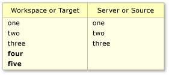
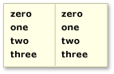

# Resolve Team Foundation Version Control conflicts

#### Azure Repos | TFS 2018 | TFS 2017 | TFS 2015 | VS 2017 | VS 2015 | VS 2013

An advantage of using Team Foundation version control to manage your files is that several people can work concurrently on a file. One drawback is that sometimes you must resolve conflicts before you can get, check in, unshelve, merge, or roll back your files.

Although it can be frustrating to encounter conflicts, the system provides information and tools to help you understand and resolve conflicts.

-   [Resolve conflicts](resolve-team-foundation-version-control-conflicts.md#manage_items)

-   [AutoResolve all conflicts](resolve-team-foundation-version-control-conflicts.md#autoresolve)

-   [AutoMerge an individual conflict](resolve-team-foundation-version-control-conflicts.md#automerge)

-   [Manually resolve an individual conflict](resolve-team-foundation-version-control-conflicts.md#manual)

-   [Understand the automatic options](resolve-team-foundation-version-control-conflicts.md#automatic_options)

-   [Work from the command prompt](resolve-team-foundation-version-control-conflicts.md#command_prompt)

-   [Get tips](resolve-team-foundation-version-control-conflicts.md#tips)

## Resolve conflicts

Use the Resolve Conflicts window to resolve conflicts that are blocking you.

By default, the window shows only the conflicts caused by the most recent operation you attempted. When the window is in this state, a message appears that begins: **Path filter applied**. To show all conflicts in your workspace, choose **Get All Conflicts**. A message that begins with: **n Conflict(s)** appears.

If a lot of time has passed since you made changes to files in your workspace, new conflicts might have occurred. To refresh the **Resolve Conflicts** window, choose **Refresh**.

Each conflict contains information and sometimes links that might help you resolve it. To get more information, you can select the conflict and choose:

-    **History** to see the history of the file. If the operation that caused the conflict is a Merge or a Rollback, then you can choose the menu control to the right of **History** and then select either **Source History** or **Target History**.

    See [Get the history of an item](get-history-item.md).

-    **Annotate** to view details on all changes that were made to the most recent version of the file, including who made each change and when they made it. See [View file changes using annotate](view-file-changes-using-annotate.md).

-    **Compare** (or the menu to the right of the button and then choose a command). The [Diff](compare-files.md) window appears.

## AutoResolve all conflicts

By default the system automatically attempts to **AutoResolve All** conflicts unless you have turned off this option (see [Tips](resolve-team-foundation-version-control-conflicts.md#tips)). In the Resolve Conflicts window, you can also manually choose **AutoResolve All**, and then choose:

-   Select **All Conflict Types** if you want the system to attempt to resolve the conflicts automatically by using all its heuristics.

-   Select **Specific Conflict Types** if you want the system to attempt to resolve the conflicts, but you want to exclude some heuristics.

    The **Choose Conflicts to Resolve** dialog box appears. Check or clear the options that you want to enable or disable, and then choose **AutoResolve**. For more information, see [Understand the automatic options](resolve-team-foundation-version-control-conflicts.md#automatic_options) below.

The system attempts to automatically resolve the conflicts displayed in the Pending Changes window. Any conflicts the system was unable to resolve will remain in the window. You have to [manually resolve](resolve-team-foundation-version-control-conflicts.md#manual) these conflicts.

## AutoMerge a single conflict

Choose **AutoMerge** if you want to try to resolve selected conflicts using all the AutoMerge options described in [Understand the automatic options](resolve-team-foundation-version-control-conflicts.md#automatic_options) below.

> **Tip:**  
> You can press and hold either the Ctrl or the Shift key and then select multiple conflicts.

> **Note:**  
> If **AutoMerge** is disabled, then this conflict must be [manually resolved](resolve-team-foundation-version-control-conflicts.md#manual).

## Manually resolve a single conflict

If the system cannot automatically resolve a conflict, or if you want to make sure you understand what is changing, you must manually resolve the conflict. Within each conflict, the system displays the actions that you can take to resolve the conflict. The actions displayed depend upon the conflict type, and the operation that caused the conflict.

### Merge changes in merge tool

When a conflict is caused by conflicting content changes, you can choose **Merge Changes in Merge Tool**.

When you choose this action, the Merge window appears.

The outcome of your work to resolve the conflict is shown in the **Results** pane.

In this window you can:

-   Select the layout of the window: **Vertical View**, **Horizontal View**, **Mixed View**.

-   Navigate among the differences and the conflicts.

-   Select items from the left and right versions of the file to include them in the result.

-   Type additional content into the file in the Result pane.

-   View the History of the file. See [Get the history of an item](get-history-item.md).

-   Compare the various versions of the file.

-   Annotate the file to see who changed what. See [View file changes using annotate](view-file-changes-using-annotate.md).

When are satisfied with the contents of the **Result** pane, choose **Accept Merge**.

## Understand the automatic options

In special cases, you may want to restrict the types of conflicts automatically resolved by the **AutoResolve All** option.

When you choose **AutoResolve All**, and then **Specific Conflict Types**, the **Choose Conflicts to Resolve** dialog box appears.

<table>
<thead>
<tr>
<th>
If you want the system to automatically resolve conflicts that occurred because...
</th>
<th>
As explained in this example...
</th>
<th>
Then select this check box...
</th>
</tr>
</thead>
<tbody>
<tr>
<td>
Non-conflicting content changes were made in each version of a file
</td>
<td>
In the file version on the left, a <strong>zero</strong> was added at the beginning. In the file on the right, a <strong>three</strong> was added at the end:

</td>
<td>
<strong>Conflicts with any content changes</strong>
</td>
</tr>
<tr>
<td>
Content changes were made that are unique to the workspace (during get or checkin operation) or target version (during merge or rollback operation)
</td>
<td>
<strong>four</strong> and <strong>five</strong> were added to the workspace or target version:

</td>
<td>
<strong>Conflicts with content changes made only in the local workspace or target branch</strong>
</td>
</tr>
<tr>
<td>
Content changes were made that are unique to the server (during get or checkin operation) or source version (during merge or rollback operation)
</td>
<td>
<strong>four</strong> and <strong>five</strong> were added to the server or source version:

</td>
<td>
<strong>Conflicts with content changes made only in the server version or source branch</strong>
</td>
</tr>
<tr>
<td>
A file on the server (during get or checkin operation) or in the source branch (during merge or rollback operation) was renamed
</td>
<td>
You checked out a file that is named <strong>launch.cs</strong> and worked on it. During that time, someone else checked in a changeset that affected the same file. That changeset did not modify the contents of the file, but it did change the name of the file to <strong>start.cs</strong>.
</td>
<td>
<strong>Conflicts caused by renaming file in the server version or source branch</strong>
</td>
</tr>
<tr>
<td><ul>
<li>
Common content changes were made that resulted in identical content in each version
</li>
<li>
You changed a file, checked it in through a Gated Check-in build, and selected the <strong>Preserve my pending changes locally</strong> option
</li>
</ul></td>
<td>
Changes to each version resulted in identical file content. The changes can be to the content in the files, as shown in the following example:

This option also resolves conflicts that are caused by all other operations (for example, rename, delete, undelete, and branch) and that result in identical files.

<table>
<thead>
<tr>
<th> <strong>Tip</strong></th>
</tr>
</thead>
<tbody>
<tr>
<td>
If you select this check box, when you proceed, the system will resolve these changes by taking (downloading) the server version onto your workspace.
</td>
</tr>
</tbody>
</table>

</td>
<td>
<strong>Conflicts caused by identical change in the server and workspace</strong>
</td>
</tr>
</tbody>
</table>

## Work from the command prompt

-    [Resolve Command](resolve-command.md) 

## Tips

-    By default the system automatically attempts to **AutoResolve All** conflicts. To change the option, from the menu bar choose **Tools**, **Options**, and then in the **Options** dialog box, navigate to **Source Control**, **Visual Studio Team Foundation Server**. Clear the **Attempt to automatically resolve conflicts when they are generated** checkbox.

-    Does your team need to collaborate to resolve a large number of conflicts (for example, which might occur after merge operation in a large codebase)? If so, a public workspace on a shared dev machine might help. See [Create and work with workspaces](create-work-workspaces.md).
