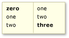
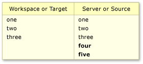

# Resolve Team Foundation Version Control conflicts

[!INCLUDE [version-lt-eq-azure-devops](../../includes/version-lt-eq-azure-devops.md)]
[!INCLUDE [version-vs-gt-eq-2019](../../includes/version-vs-gt-eq-2019.md)]

An advantage of using Team Foundation Version Control (TFVC) to manage your files is that several people can work concurrently on a file. One drawback is that sometimes you must resolve conflicts before you can get, check in, unshelve, merge, or roll back your files.

Although it can be frustrating to encounter conflicts, the system provides information and tools to help you understand and resolve conflicts.

You can also resolve conflicts from the command line by using the [Resolve command](resolve-command.md).

> [!TIP]
> If your team needs to collaborate to resolve a large number of conflicts, for example after a merge operation in a large codebase, a public workspace on a shared dev machine might help. For more information, see [Create and work with workspaces](create-work-workspaces.md).

## Resolve conflicts

You can use the Visual Studio **Resolve Conflicts** window to resolve conflicts that are blocking you. To open the window, select **Actions** > **Resolve conflicts** in the **Pending Changes** page of **Team Explorer**.

:::image type="content" source="media/resolve-team-foundation-version-control-conflicts/IC745580.png" alt-text="Screenshot of using the Resolve Conflicts window to resolve conflicts.":::

By default, the window shows only the conflicts caused by the most recent operation you attempted. When the window is in this state, a message appears that begins: **Path filter applied**. To show all conflicts in your workspace, choose **Get All Conflicts**. A message that begins with: **\<N> Conflict(s)** appears.

If a lot of time has passed since you made changes to files in your workspace, new conflicts might have occurred. To refresh the **Resolve Conflicts** window, choose **Refresh**.

:::image type="content" source="media/resolve-team-foundation-version-control-conflicts/IC612247.png" alt-text="Screenshot that shows the Resolve Conflicts window.":::

Each conflict contains information and sometimes links that might help you resolve it. To get more information, you can select the conflict and choose one of the following options:

-    **History** to see the history of the file. If the operation that caused the conflict is a merge or a rollback, you can choose the menu control to the right of **History** and then select either **Source History** or **Target History**. For more information, see [Get the history of an item](get-history-item.md).

-    **Compare**, or select the dropdown arrow next to the icon and then choose a command. The [Diff window](compare-files.md) opens.

-    **Annotate** to view details on all changes that were made to the most recent version of the file, including who made each change and when they made it. See [View file changes using annotate](view-file-changes-using-annotate.md).

## AutoResolve all conflicts

By default, the system automatically attempts to **AutoResolve All** conflicts unless you turn off this option. To turn off automatic **AutoResolve All**, choose **Tools** > **Options**. In the **Options** dialog box, under **Source Control** > **Visual Studio Team Foundation Server**, deselect **Attempt to automatically resolve conflicts when they are generated**.

You can also manually choose **AutoResolve All** in the **Resolve Conflicts** window, and then select one of the following options:

- **All Conflict Types** if you want the system to attempt to resolve the conflicts automatically by using all its heuristics.

- **Specific Conflict Types** if you want the system to attempt to resolve the conflicts, but you want to exclude some heuristics.

  The **Choose Conflicts to Resolve** dialog box appears. Check or clear the options that you want to enable or disable, and then choose **AutoResolve**.

  The system attempts to automatically resolve the conflicts displayed in the **Pending Changes** window. Any conflicts the system is unable to resolve remain in the window. You have to [manually resolve](#manual) these conflicts.

## Understand the automatic options

You can restrict the types of conflicts automatically resolved by the **AutoResolve All** option. When you choose **AutoResolve All** and then select **Specific Conflict Types**, the **Choose Conflicts to Resolve** dialog box appears.

:::image type="content" source="media/resolve-team-foundation-version-control-conflicts/IC612249.png" alt-text="Screenshot that shows the Choose Conflicts to Resolve dialog box.":::

:::row:::
   :::column span="1":::
   **Cause of conflict**
   :::column-end:::
   :::column span="1":::
   **Example**
   :::column-end:::
   :::column span="1":::
   **Checkbox selection**
   :::column-end:::
:::row-end:::
---
:::row:::
   :::column span="1":::
   Non-conflicting content changes were made in each version of a file.
   :::column-end:::
   :::column span="1":::
   In the file version on the left, a **zero** was added at the beginning. In the file on the right, a **three** was added at the end:

   
   :::column-end:::
   :::column span="1":::
   **Conflicts with any content changes**
   :::column-end:::
:::row-end:::
:::row:::
   :::column span="1":::
   Content changes were made during a get or checkin operation that are unique to the workspace, or during a merge or rollback operation that are unique to the target version.
   :::column-end:::
   :::column span="1":::
   The entries **four** and **five** were added to the workspace or target version:

   
   :::column-end:::
   :::column span="1":::
   **Conflicts with content changes made only in the local workspace or target branch**
   :::column-end:::
:::row-end:::
:::row:::
   :::column span="1":::
   Content changes were made during get or checkin operation that are unique to the server, or during a merge or rollback operation that are unique to the source version.
   :::column-end:::
   :::column span="1":::
   The entries **four** and **five** were added to the server or source version:

   
   :::column-end:::
   :::column span="1":::
   **Conflicts with content changes made only in the server version or source branch**
   :::column-end:::
:::row-end:::
:::row:::
   :::column span="1":::
   A file was renamed on the server during a get or checkin operation or in the source branch during a merge or rollback operation.
   :::column-end:::
   :::column span="1":::
   You checked out a file that is named *launch.cs* and worked on it. During that time, someone else checked in a changeset that affected the same file. That changeset didn't modify the contents of the file, but it changed the name of the file to *start.cs*.
   :::column-end:::
   :::column span="1":::
   **Conflicts caused by renaming file in the server version or source branch**
   :::column-end:::
:::row-end:::
:::row:::
   :::column span="1":::
   
   Common content changes were made that resulted in identical content in each version. Or, you changed a file, checked it in through a gated check-in build, and selected the **Preserve my pending changes locally** option.

   
   :::column-end:::
   :::column span="1":::
   Changes to each version resulted in identical file content. The changes can be to the content in the files, as shown in the following example:

   
   :::column-end:::
   :::column span="1":::
   **Conflicts caused by identical change in the server and workspace**
   
   This option also resolves conflicts that are caused by all other operations, for example, rename, delete, undelete, and branch, that result in identical files.
   
   > [!Tip]  
   > If you select this checkbox, when you proceed, the system resolves these changes by downloading the server version onto your workspace.
   :::column-end:::
:::row-end:::

## AutoMerge selected conflicts

To try to resolve selected conflicts by using all the preceding automerge options, select one or more conflicts and then choose **AutoMerge**.

> [!TIP]
> You can press and hold either the Ctrl or the Shift key to select multiple conflicts.
>
> [!NOTE]
> If **AutoMerge** is disabled, you must [manually resolve](#manual) the conflicts.

## Manually resolve selected conflicts

If the system can't automatically resolve a conflict, or if you want to make sure you understand what's changing, you must manually resolve the conflict. Within each conflict, the system displays the actions that you can take to resolve the conflict. The actions displayed depend upon the conflict type and the operation that caused the conflict.

## Use the Merge window

When conflicting content changes cause a conflict, you can choose **Merge Changes in Merge Tool**. The **Merge** window appears.

:::image type="content" source="media/resolve-team-foundation-version-control-conflicts/IC612248.png" alt-text="Screenshot that shows Merge changes in the merge tool.":::

In the **Merge** window, you can:

-   Select the layout of the window: **Vertical View**, **Horizontal View**, or **Mixed View**.
-   Navigate among the differences and the conflicts.
-   Select items from the left and right versions of the file to include them in the results.
-   Type more content into the file in the **Result** pane.
-   View the history of the file. For more information, see [Get the history of an item](get-history-item.md).
-   Compare the versions of the file.
-   Annotate the file to see who changed what. For more information, see [View file changes by using annotate](view-file-changes-using-annotate.md).

When you're satisfied with the contents of the **Result** pane, choose **Accept Merge**.

The outcome of resolving the conflict appears in the **Result** pane.

