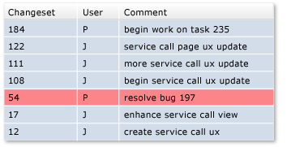
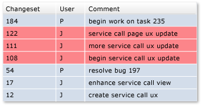
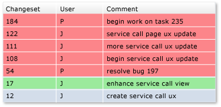

# Roll back changesets

[!INCLUDE [version-lt-eq-azure-devops](../../includes/version-lt-eq-azure-devops.md)]
[!INCLUDE [version-vs-gt-eq-2019](../../includes/version-vs-gt-eq-2019.md)]

A Team Foundation Version Control (TFVC) [changeset](find-view-changesets.md) is a permanent part of the history of your version-controlled items and can't be undone or removed. However, you can roll back the effects of one or more changesets.

You can also use the `tf` command-line utility to roll back changes. For more information, see [Rollback command (Team Foundation Version Control)](rollback-command-team-foundation-version-control.md).

## Prerequisites

You must be one of the **Contributors** for your project. For more information, see [Default TFVC permissions](../../organizations/security/default-tfvc-permissions.md).

## Roll back changes from a single changeset

For example, a developer wants to remove the effects of a changeset:

### To roll back a changeset from the Changeset Details page

- Select the changeset, and on the [Changeset Details](find-view-changesets.md) page of Visual Studio **Team Explorer**, choose **Rollback**.

### To roll back a changeset from the History window

- In the Visual Studio [History](get-history-item.md) window, right-click a version and choose **Rollback Entire Changeset**.

### To roll back a changeset from Source Control Explorer

1. In Visual Studio [Source Control Explorer](use-source-control-explorer-manage-files-under-version-control.md), right-click an item and choose **Rollback**.

   > [!NOTE]
   > The item you select determines the scope that the rollback changes.

1. In the **Rollback** dialog box, select **Rollback changes from a single changeset**.

1. Specify the changeset, and then select **Rollback**.

## Roll back changes from a range of changesets

For example, a developer wants to remove the effects of some consecutive changesets:

### To roll back a range of changesets

1. From the [History](get-history-item.md) window, select two or more consecutive versions, right-click, and choose **Rollback**.

   Or, in [Source Control Explorer](use-source-control-explorer-manage-files-under-version-control.md), right-click an item and choose **Rollback**.

   > [!NOTE]
   > The item you select determines the scope that the rollback changes.

1. In the **Rollback** dialog box, select **Rollback changes from a range of changesets**.

1. Specify the changeset range, and then select **Rollback**.

## Roll back to a specific version

For example, a developer wants to roll back a file to an earlier version, eliminating the effect of all changesets that occurred after that version:

### To roll back to a specific version

1. In [Source Control Explorer](use-source-control-explorer-manage-files-under-version-control.md), right-click an item and choose **Rollback**.

1. In the **Rollback** dialog box, select **Rollback to a specific version**.

1. Specify the version details, and then select **Rollback**.

## Next steps

- If your change is still pending, that is you haven't checked it in, you can undo the change instead of rolling it back. See [Develop code and manage pending changes](develop-code-manage-pending-changes.md).

- Like most changes you make to files, a rollback change is queued as a pending change. After you roll back the files, you can [view the files you're changing](develop-code-manage-pending-changes.md) and [compare the files with the latest version on the server](compare-files.md). After you confirm that the changes match what you intend to do, you can [check in](check-your-work-team-codebase.md) your changes.

- Rollback doesn't delete changesets or any data. If you change your mind, use rollback to revert the content of the files back to their state before the rollback.

