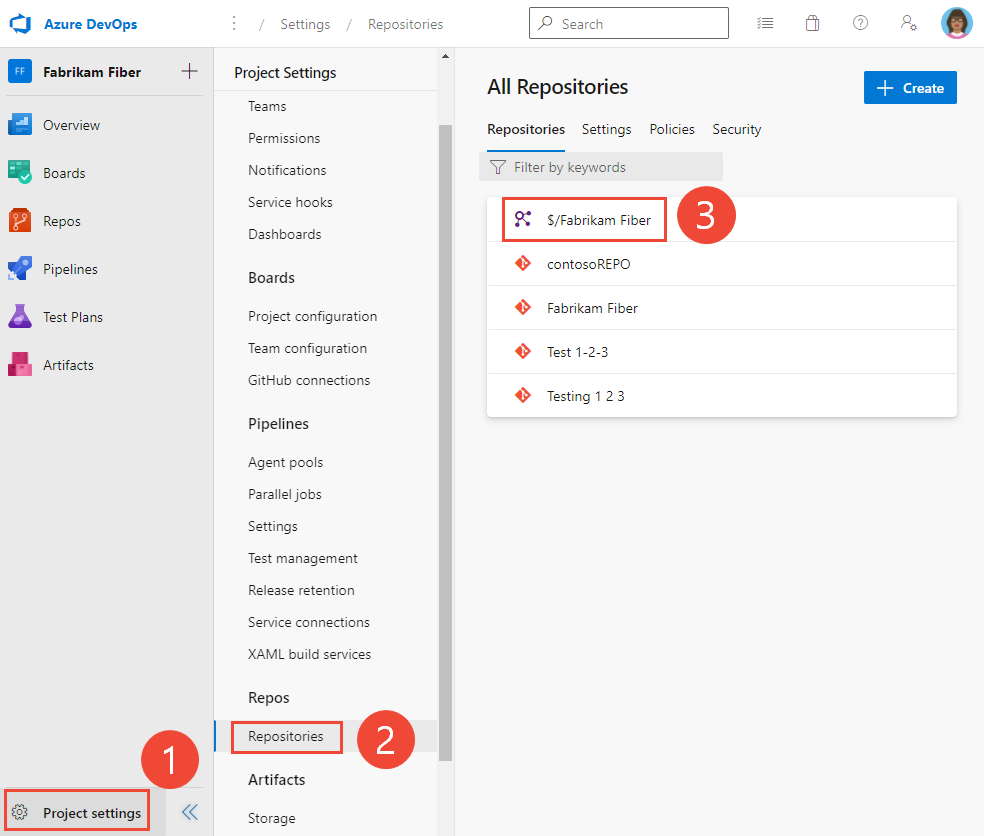
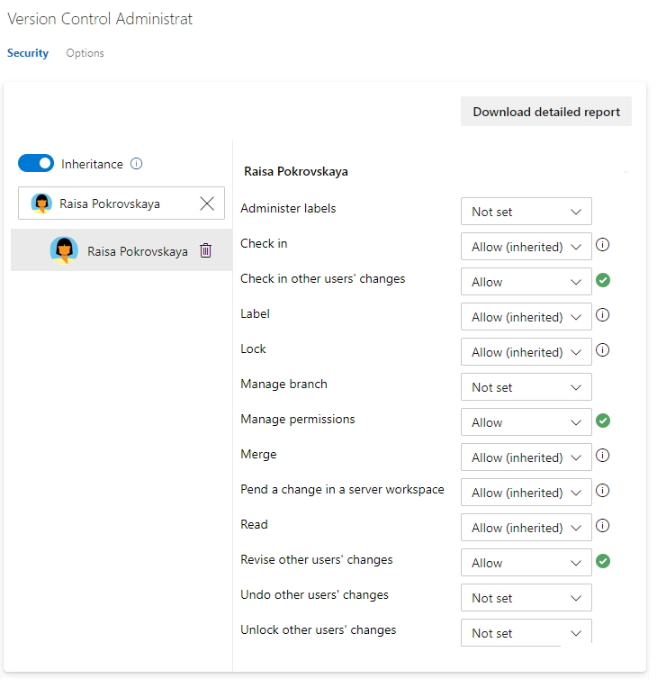
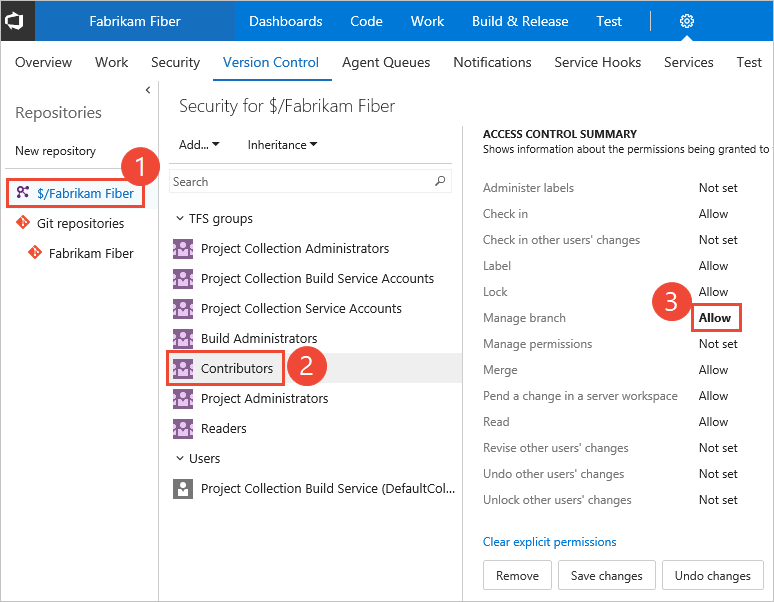

# Set TFVC repository permissions 

[!INCLUDE [version-all](../../includes/version-all.md)]

You grant or restrict access to a TFVC repository to lock down who can contribute to your source code. There is only one TFVC repository per project.   

For guidance on who to provide greater permission levels, see [Grant or restrict access using permissions](../../organizations/security/restrict-access.md).

## Prerequisites

* You must have a project. If you don't have a project yet, create one in [Azure DevOps](../../user-guide/sign-up-invite-teammates.md) or set one up in an [on-premises TFS](../../organizations/projects/create-project.md).
* You must be a member of the [Project Administrators Group](../../organizations/security/set-project-collection-level-permissions.md) or have your **Manage permissions** set to **Allow** for the TFVC repository.  

::: moniker range="azure-devops"

To contribute to the source code, you must be granted **Basic** access level or greater. Users granted **Stakeholder** access for private projects have no access to source code. Users granted **Stakeholder** access for public projects have the same access as Contributors and those granted **Basic** access. To learn more, see [About access levels](../../organizations/security/access-levels.md).

::: moniker-end

::: moniker range="< azure-devops"

To contribute to the source code, you must be granted **Basic** access level or greater. Users granted **Stakeholder** access have no access to source code. To learn more, see [About access levels](../../organizations/security/access-levels.md).
::: moniker-end 

## Default repository permissions  

By default, members of the project Contributors group have permissions to contribute to a repository. For a description of each security group and permission level, see [Permissions and group reference](../../organizations/security/permissions.md).  
 

[!INCLUDE [temp](../../organizations/security/includes/code-tfvc.md)]

 

## Open TFVC repository Security

To set permissions for a custom security group, you must have defined that group previously. See [Set permissions at the project- or collection-level](../../organizations/security/set-project-collection-level-permissions.md#project-level)

::: moniker range="azure-devops"

1. Open the web portal and choose the project where you want to add users or groups. To choose another project, see [Switch project, repository, team](../../project/navigation/go-to-project-repo.md).

2. Open **Project settings>Repositories**.  

	For example, Choose (1) **Project settings**, (2) **Repositories**, and then (3) the TFVC repository labeled with the name of the project.

	> [!div class="mx-imgBorder"]  
	> 

1. Next, choose the user or security group you want to change permissions. 

	To set permissions for a specific user or group, enter their name in the identity box and select their identity. 

	> [!div class="mx-imgBorder"]  
	>   

	Then make the changes to the permission set. 

	> [!div class="mx-imgBorder"]  
	>   

1. When done, navigate away from the page. The permission changes are automatically saved for the selected group. 

	If you add a user or group, and don't change any permissions for that user or group, then upon refresh of the permissions page, the user or group you added no longer appears.

	[!INCLUDE [temp](../../includes/ability-to-find-user-once-added.md)]

::: moniker-end    

::: moniker range="azure-devops-2019 || azure-devops-2020"

1. To set the set the permissions for the TFVC repository for a project, choose **TFVC Repository** and then choose the security group whose permissions you want to manage.

	For example, here we choose (1) **Project Settings**, (2) **Repositories**, (3) the **TFVC repository**, (4) the **Contributors** group, and then (5) the permission for **Manage branch**.

	[!INCLUDE [temp](../../includes/lightbox-image.md)] 

	 

	[!INCLUDE [temp](../../includes/ability-to-find-user-once-added.md)]

	If you add a user or group, and don't change any permissions for that user or group, then upon refresh of the permissions page, the user or group you added no longer appears.

1. Save your changes.  

::: moniker-end    

::: moniker range="<= tfs-2018"

1. From the web portal, open the admin context by choosing the :::image type="icon" source="../../boards/media/icons/gear_icon.png" border="false"::: **Settings** and choose **Version Control**.

1. Choose the TFVC repository for the project and then choose the security group whose permissions you want to manage.   

2. Change the permission setting to **Allow** or **Deny**. 

	For example, here we change the **Manage branch** permission to Allow for all members of the Contributors group. 

	  

	[!INCLUDE [temp](../../includes/ability-to-find-user-once-added.md)]

3. Save your changes. 

::: moniker-end

## Related articles

- [Grant or restrict access using permissions](../../organizations/security/restrict-access.md)
- [Default permissions and access](../../organizations/security/permissions-access.md) 
- [Permissions and groups reference](../../organizations/security/permissions.md)  
- [Tf Team Foundation Version Control (TFVC) permission command-line tool](permission-command.md)  
- [Security REST API commands](/rest/api/azure/devops/security/)

