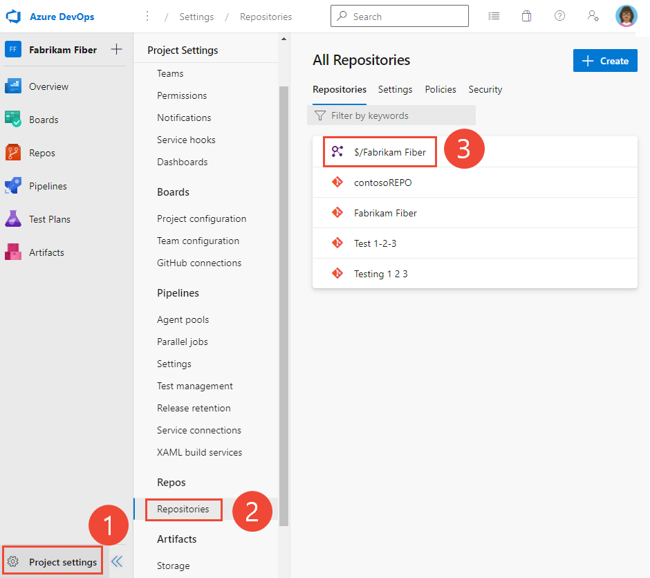

# Set TFVC repository permissions 

[!INCLUDE [version-lt-eq-azure-devops](../../includes/version-lt-eq-azure-devops.md)]
[!INCLUDE [version-vs-gt-eq-2019](../../includes/version-vs-gt-eq-2019.md)]

You can grant or restrict access to a Team Foundation Version Control (TFVC) repository to lock down who can contribute to your source code. There's only one TFVC repository per project. For guidance on who to give greater permission levels, see [Grant or restrict access using permissions](../../organizations/security/restrict-access.md).

## Prerequisites

- You must have a TFVC project. If you don't have a project yet, create one in [Azure DevOps Services](../../user-guide/sign-up-invite-teammates.md) or set one up in [on-premises Azure DevOps Server](../../organizations/projects/create-project.md).

- You must be a member of the [Project Administrators group](../../organizations/security/change-project-level-permissions.md) or have **Manage permissions** set to **Allow** for the TFVC repository.

::: moniker range="azure-devops"

- To contribute to the source code, you must be granted **Basic** access level or greater. Users granted **Stakeholder** access for private projects have no access to source code. Users granted **Stakeholder** access for public projects have the same access as **Contributors** and those granted **Basic** access. To learn more, see [About access levels](../../organizations/security/access-levels.md).

::: moniker-end

::: moniker range="< azure-devops"

- To contribute to the source code, you must be granted **Basic** access level or greater. Users granted **Stakeholder** access have no access to source code. To learn more, see [About access levels](../../organizations/security/access-levels.md).
::: moniker-end 

## Default repository permissions  

By default, members of the project **Contributors** group have permissions to contribute to a repository. For a description of each security group and permission level, see [Security groups, service accounts, and permissions in Azure DevOps](../../organizations/security/permissions.md).

[!INCLUDE [temp](../../organizations/security/includes/code-tfvc.md)]

## Set TFVC repository security permissions

To set permissions for a custom security group, you must have defined that group previously. See [Change project-level permissions](../../organizations/security/change-project-level-permissions.md).

::: moniker range="azure-devops"

1. In the Azure DevOps web portal for the project where you want to set permissions, select **Project settings**. To choose another project, see [Switch project, repository, team](../../project/navigation/go-to-project-repo.md).

1. Select **Repositories**.

1. Select the TFVC repository labeled with the name of the project.

   

1. Choose the user or security group you want to change permissions for. 

   To set permissions for a specific user or group, enter their name in the identity box and select their identity. 

     

1. Make the changes to the permission set. 

     

1. When you're done, navigate away from the page. The permission changes are automatically saved for the selected user or group.

   If you add a user or group and don't change any of their permissions, the user or group you added no longer appears after you refresh the permissions page.

   [!INCLUDE [temp](../../includes/ability-to-find-user-once-added.md)]

::: moniker-end    

::: moniker range=">= azure-devops-2019 < azure-devops"

To set the permissions for the TFVC repository for a project:

1. In the Azure DevOps web portal for the project where you want to set permissions, select **Project Settings**.

1. Select **Repositories**.

1. Select the TFVC repository.

1. Choose the security group whose permissions you want to manage, in this case the **Contributors** group. 

1. Select the permission for **Manage branch**.

   [!INCLUDE [temp](../../includes/lightbox-image.md)] 

    

   [!INCLUDE [temp](../../includes/ability-to-find-user-once-added.md)]

   If you add a user or group and don't change any of their permissions, the user or group you added no longer appears after you refresh the permissions page.

1. Save your changes.  

::: moniker-end    

::: moniker range="tfs-2018"

1. In the web portal for the project where you want to set permissions, select **Settings** and then select **Version Control**. Choose the TFVC repository for the project.

1. Choose the security group whose permissions you want to manage.

1. Change the permission setting to **Allow** or **Deny**. 

   For example, here you change the **Manage branch** permission to **Allow** for all members of the **Contributors** group. 

     

   [!INCLUDE [temp](../../includes/ability-to-find-user-once-added.md)]

1. Save your changes. 

::: moniker-end

## Related articles

- [Grant or restrict access using permissions](../../organizations/security/restrict-access.md)
- [Default permissions and access](../../organizations/security/permissions-access.md) 
- [Permissions and groups reference](../../organizations/security/permissions.md)  
- [Permission command](permission-command.md)
- [Security REST API commands](/rest/api/azure/devops/security)

