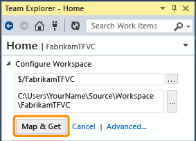

# Set up Team Foundation Version Control on your dev machine

#### Azure Repos | TFS 2018 | TFS 2017 | TFS 2015 | VS 2017 | VS 2015 | VS 2013

To set up Team Foundation Version Control (TFVC) on your dev machine, you just need to create a workspace and then add your code.

**Before you start**

-   If you don't have Visual Studio, [get it here](https://visualstudio.microsoft.com/).

-   If you don't have a project, [create](../../organizations/projects/create-project.md) or [get access](https://msdn.microsoft.com/library/jj920206) to one.

## Create a workspace and get the code

From Visual Studio, go to the Team Explorer Connect page (Keyboard: Ctrl + 0, C) and then connect to the project.

(If the project you want to open is not listed, choose **Select Projects** and then 
[connect to the project](../../organizations/projects/connect-to-projects.md).)

Map the project to a folder on your dev machine.

Map the workspace and get your code.

## Work in a "Main" parent folder

Do you want to prepare for when your team grows large enough to need [branches](use-branches-isolate-risk-team-foundation-version-control.md) to manage your work? Put all your code in a parent called Main (for example: `$/MyTeamProject/Main/`).

1.  Go to the Team Explorer Home page (Keyboard: Ctrl + 0, H), and then open **Source Control Explorer**.

2.  In **Source Control Explorer**, select your project in the left pane.

3.  On the menu bar choose **File**, **Source Control**, **New Folder**.

    

    Name the folder.

    Open the context menu of the `Main` folder and choose **Check in**.

4.  Check in the new folder.

    

    Your changeset is checked in.

    

When your team decides to branch the codebase, you can convert the Main folder to a branch. See [Branch folders and files](branch-folders-files.md).

## Add your code to version control

### Create a new solution under version control

If you've got an idea for a new app, you can use version control from the start. Create a new code project (Keyboard: Ctrl + Shift + N), and add it to TFVC version control:

>**Tip:**
We suggest that you put your new project in **c:\Users\***YourName***\Source\Workspaces\**.

When the **Choose Source Control** dialog box appears, choose **Team Foundation Version Control**.

When you are ready, [check in your changes](check-your-work-team-codebase.md) (Keyboard: Ctrl + 0, P).

### Put an existing solution under version control

You've already got an app in progress and you want to begin working on it under TFVC version control.

1.  Move your solution into your workspace folder (for example: **c:\\Users\\YourName\\Source\\Workspaces\\YourTeamProject\\Main\\**).

2.  If you have not already done so, open your solution, (Keyboard: Ctrl + Shift + O) and then open Solution Explorer (Keyboard: Ctrl + Alt + L).

3.  Add your solution to source control.

    

4.  On the **Choose Source Control** dialog box, choose **Team Foundation Version Control**.

5.  When you are ready, [check in your changes](check-your-work-team-codebase.md) (Keyboard: Ctrl + 0,P).

## Q & A

-   **Q: I'm really new to all this; can I get more help?**

    **A:** Yes, [let us walk you step by step to get started](share-your-code-in-tfvc-vs.md).

-   **Q: Is your folder structure complex or do you use branches?**

    **A:** If so, you can [create one or more workspaces](create-work-workspaces.md) and then [optimize them to meet your needs](optimize-your-workspace.md).

## Try this next

 [Set up a CI build](../../pipelines/build/triggers.md) 

## Dig deeper

 [Develop your app in Team Foundation version control](develop-your-app-team-foundation-version-control.md) 
