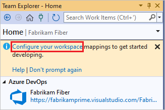
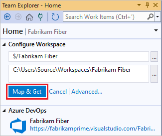
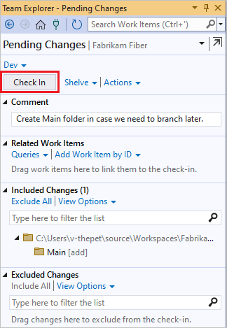

# Set up Team Foundation Version Control on your dev machine

[!INCLUDE [version-lt-eq-azure-devops](../../includes/version-lt-eq-azure-devops.md)]
[!INCLUDE [version-vs-gt-eq-2019](../../includes/version-vs-gt-eq-2019.md)]

To set up Team Foundation Version Control (TFVC) on your dev machine, you create a workspace and then add your code.

## Prerequisites

- [Visual Studio installed](https://visualstudio.microsoft.com).

- An Azure DevOps project. If you don't have a project, [create one](../../organizations/projects/create-project.md) or [get access to one](../../organizations/accounts/add-external-user.md).

## Create a workspace and get the code

1. Press Ctrl+0, C to open the **Connect** page of the Visual Studio **Team Explorer** window.

1. Right-click a project, and then select **Connect**.

   

   If the project you want isn't listed, select **Manage Connections**, select **Connect to a Project**, and then select the project you want. For more information, see [connect to a project](../../organizations/projects/connect-to-projects.md).

1. Select **Configure your workspace** to map the project to a folder on your dev machine.

   

1. Select **Map & Get** to map the workspace and get your code.

   

## Work in a Main folder

To prepare for when your team grows large enough to need [branches](./branching-strategies-with-tfvc.md) to manage your work, put all your code in a parent folder called *Main*, for example *$/MyTeamProject/Main*.

1. Press Ctrl+0, H to open the **Home** page of **Team Explorer**.

1. Select **Source Control Explorer**.

1. In the **Source Control Explorer** window, select your project in the left pane.

1. On the Visual Studio menu bar, choose **File** > **Source Control**> **New Folder**.

1. In **Source Control Explorer**, rename the folder to *Main*.

   

1. Right-click the *Main* folder and choose **Check in Pending Changes**.

1. On the **Pending Changes** page, select **Check In**.

   

   Your changeset is checked in.

   

When your team decides to branch the codebase, you can convert the *Main* folder to a branch. For more information, see [Branch folders and files](branch-folders-files.md).

## Add your code to version control

If you've got an idea for a new app, you can use TFVC version control from the start. Or, you can put an app in progress under TFVC source control.

1. When you create a new code project that you want to put under TFVC solution control, put it in your mapped workspace folder like *c:\Users\\\<YourName>\\Source\\Workspaces\\YourTeamProject\\Main\\*.

   Or, if you already have an app that you want to put under TFVC source control, move the solution into your workspace folder with Windows File Explorer.

1. In Visual Studio, press Ctrl+Shift+O and open your solution, and open **Solution Explorer** by pressing Ctrl+Alt+L.

1. In **Solution Explorer**, right-click your solution and select **Add Solution to Source Control**.

   

1. In the **Add Solution to Source Control** dialog box, review the details, and then select **OK**.

1. When you're ready, press Ctrl+0, P to [check in your changes](check-your-work-team-codebase.md).

## Next steps

- If you're new to this process, you can [get a detailed step-by-step walkthrough](share-your-code-in-tfvc-vs.md).

- If your folder structure is complex or you use branches, you can [create one or more workspaces](create-work-workspaces.md) and [optimize them to meet your needs](optimize-your-workspace.md).

## Related articles

- [Set up a CI build](../../pipelines/build/triggers.md) 
- [Develop your app in Team Foundation version control](develop-your-app-team-foundation-version-control.md)