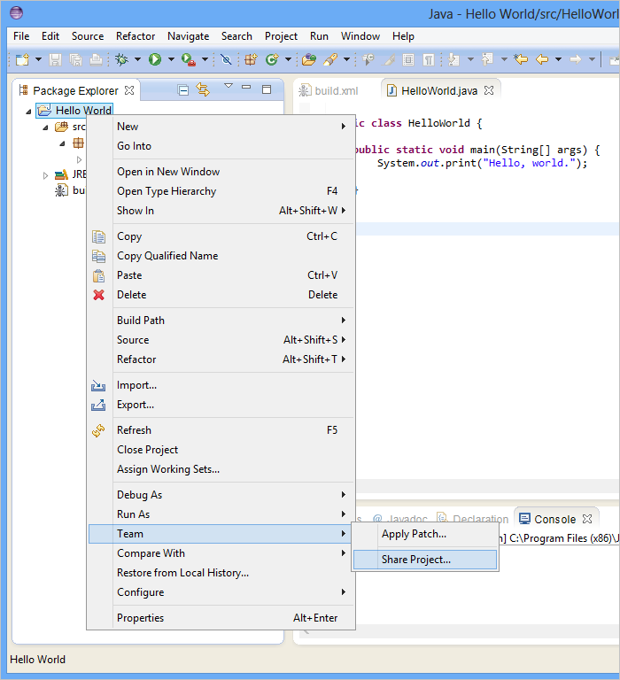
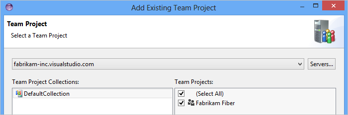

# Share your code in TFVC using Eclipse

[!INCLUDE [version-lt-eq-azure-devops](../../includes/version-lt-eq-azure-devops.md)] 

Share your code with your team with Azure DevOps Services and Eclipse.

[!INCLUDE [include](includes/connect-eclipse-to-vso.md)]

If your project uses TFVC in your Azure DevOps organization, read on. However, if your project uses Git in your Azure DevOps organization,then read [Share your code in Git using Eclipse](../../repos/git/share-your-code-in-git-eclipse.md)

## Share using TFVC

1. If you haven't yet, [Connect to Azure DevOps Services using Eclipse](../../organizations/projects/connect-to-projects.md).

2. In Package Explorer, right-click the project and choose Team, Share Project.

   

3. Make sure you share it to Team Foundation Server.

   

4. Select the server and project.

   

5. Check in the files.

   

Your code is in TFVC, so now your teammates can contribute.

## Next steps

> [!div class="nextstepaction"]
> [Build your Eclipse projects](../../pipelines/ecosystems/java.md) 