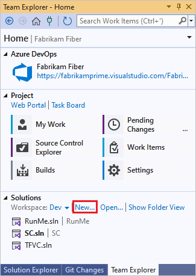
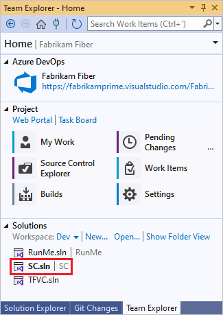
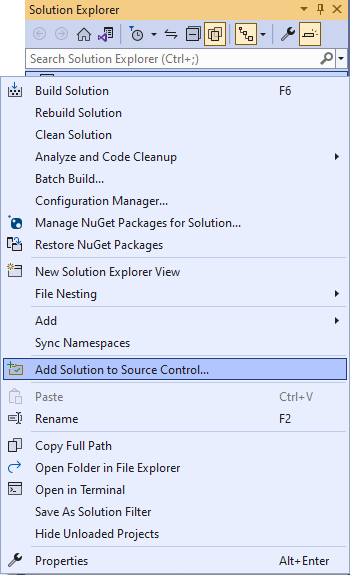
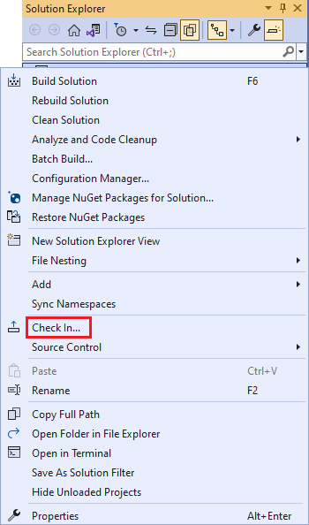
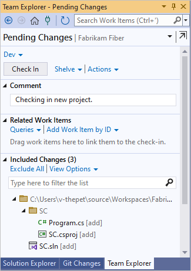
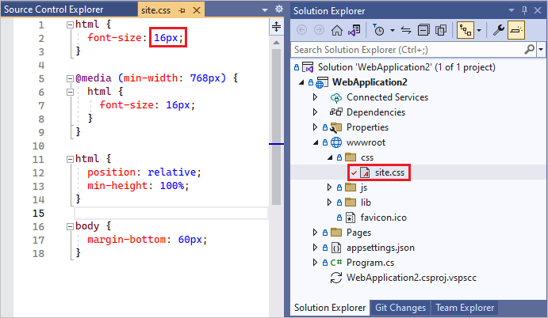
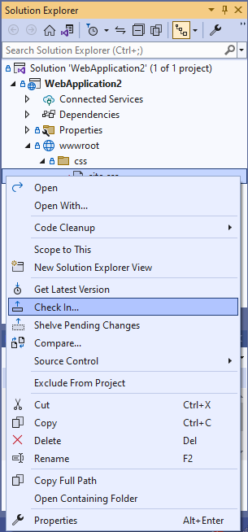
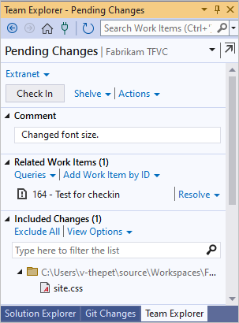
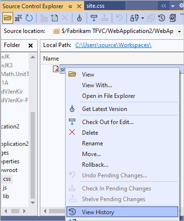

# Develop and share your code in Team Foundation Version Control using Visual Studio

[!INCLUDE [version-lt-eq-azure-devops](../../includes/version-lt-eq-azure-devops.md)]
[!INCLUDE [version-vs-gt-2013](../../includes/version-vs-gt-2013.md)]

Whether your software project is large, small, or brand new, in most cases you'll be better off if you use version control as early as possible.
Here, we'll show you how to get started with Team Foundation Version Control (TFVC), a centralized system.
If you want to work in a distributed system, you can instead use [Git with Azure Repos](../../repos/git/share-your-code-in-git-vs.md).

Is your code in another place? [Learn how to migrate it here](#migrate).

[!INCLUDE [open-team-project-in-vs](includes/open-team-project-in-vs.md)]

> [!NOTE]
> Some menu options for TFVC may not be displayed in Visual Studio until you [connect Visual Studio to TFVC](../../organizations/projects/connect-to-projects.md#connect-from-visual-studio-or-team-explorer) as described in the previous section.

## Configure your workspace

1. In Visual Studio, configure your workspace.

   

   [I don't see the Configure Workspace link. What do I do next?](#workspace_exists)

2. Confirm your workspace path. Select **Map & Get** to map your workspace and get the source.

   :::image type="content" source="media/share-your-code-in-tfvc-vs/MapAndGet.png" alt-text="Screenshot shows the Team Explorer Home page, with Map and get highlighted.":::

3. Now you can check in source, queue builds, and manage work.

   

   > [!NOTE]
   > TFVC is not supported when workspaces are placed on network drives or UNC paths.

## Create a new app

If you already have an app that you want to add to version control, skip to [Add an existing app](#app_add).

In Team Explorer, select **New**.

Now that you've added your app, you can skip to [snapshot your code](#snapshot).

## Add an existing app

### Move and open the solution

1. Close the solution.

2. Open the workspace folder that you created when you [configured your workspace](#workspace).

   

3. Move the code you want to upload to the workspace folder.

   

4. Open your solution in Visual Studio.

   

### Add the solution to Azure Repos

1. Press **Ctrl**+**Alt**+**L** to open Solution Explorer.

2. Add your solution to version control.

   

3. Check in the solution.

   

4. Add a comment and check in.

   

5. Open the source control explorer.

   

   Your solution is now in TFS.

   

Your whole team can work on the code now. All your changes are tracked in version control.

## Snapshot (check in) your code

1. When you edit code in Visual Studio, the changed file is automatically checked out. For example, *Site.css* is checked out after the border color has been changed to #ddd.

   

2. Compare the modified file with the latest version in source control.

   

   You can see the difference between the two versions.

   

3. Check in the changes.

   

   You can also check in from the code window or Team Explorer.

4. If you're working on a task or fixing a bug that's tracked as a work item, add that work item to your pending changes. Source control resolves the bug or closes the task. It links the changeset to the work item.

   

5. Add a comment and check in.

   

6. Select Source Control Explorer.

   

7. View the history of the file you changed.

   

   All the changesets that include this file are listed.

   

## Troubleshooting

- My code is somewhere else. Can I migrate it to my TFVC project on Azure DevOps Services?

  Yes. See [Migrate from Team Foundation Server into Azure DevOps Services](../../migrate/migrate-from-tfs.md).

- I don't see the Configure Workspace link shown in the steps above. What do I do next?

  You might already have a workspace on your computer. To see your workspace, open Source Control Explorer, or change your workspace.
  Find out how to [manage files under source control](./use-source-control-explorer-manage-files-under-version-control.md) or [manage workspaces](./create-work-workspaces.md).

  

## Next steps

> [!div class="nextstepaction"]
> [Get your code reviewed](get-code-reviewed-vs.md)
