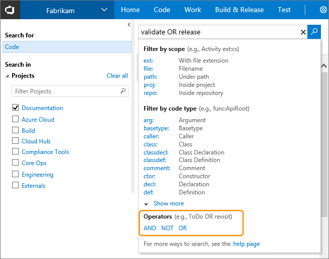
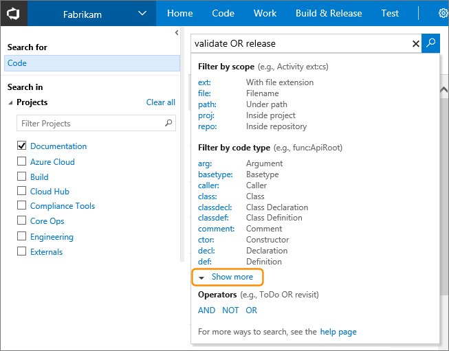
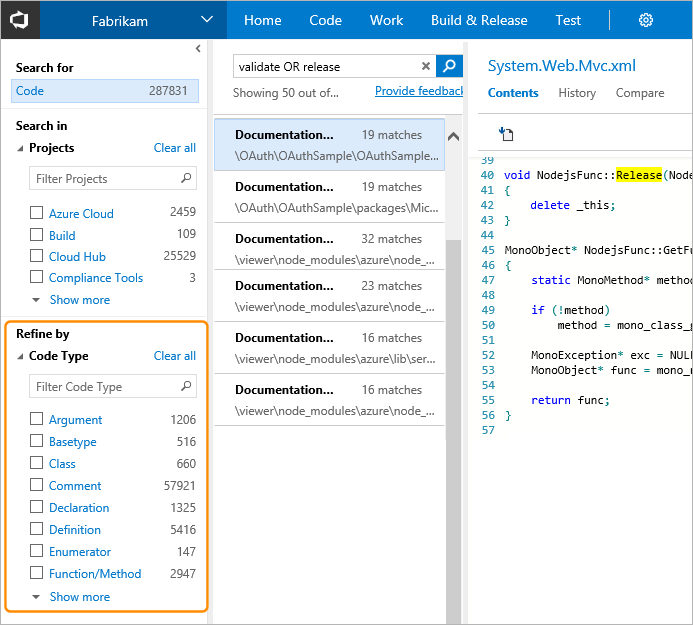
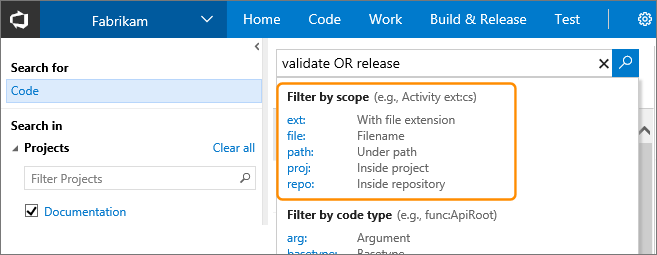

# Advanced Code Search options

[!INCLUDE [version-header-shared](../_shared/version-header-shared.md)]

You can:

* [Use simple or compound search terms](#syntaxdetails)
* [Use functions for specific types of code](#codefunctions)
* [Use functions to specify projects, repositories, paths, and files](#locationfunctions)

[!INCLUDE [shared-back-to-overview](../_shared/shared-back-to-overview.md)]

## Syntax for simple and compound searches

Use simple search strings for words or phrases. The default is a whole word search; 
for example, a search for "valid" will not find instances of the word 
"validation". However, searches are _not_ case-sensitive.

### Narrow your search with Boolean operators
 
Narrow your search by using Boolean operators to combine search criteria.
Combine multiple search criteria using `AND`, `OR`, or `NOT` (they must be 
uppercase). 

Use parentheses to specify the precedence of the operations when you use more than 
one Boolean operator. By default, a search combines all the words you enter using 
the `AND` operator so that it will return only files that contain all of the 
words you entered. 

For example:

* `validate AND revisit` finds files that contain both the words **validate** and 
  **revisit**. Note that `AND` is the default operator, and so this is equivalent to 
  the search string `validate revisit`.
* `validate OR revisit` finds files that contain either of the words **validate** or **revisit**.
* `validate NOT revisit` finds files that contain the word **validate** but not the word **revisit**.
* `(validate NOT revisit) OR "release delayed"` finds files that contain the word **validate**
  but not the word **revisit** or files that contain the phrase **release delayed**.

To find an exact match to a set of words, enclose your search terms in double-quotes. 
For example, `"Client not found"`

### Broaden your search with wildcards

Use the wildcard characters `*` and `?` to broaden your search criteria. For 
example:

* `CodeSenseHttp*` finds files containing words that start with **CodeSenseHttp**, 
  such as **CodeSenseHttpClient** and **CodeSenseHttpClientTest**.
* `CodeX23?R` finds files containing words that start with **CodeX23**, have any 
  alphanumeric character next, and end with **R**. For example, **CodeX234R** and **CodeX23QR**. 

You can use wildcard characters anywhere in your search string **except** as 
a **prefix** in a simple search string or a query that uses a 
[code type filter](#codefunctions). 
For example, you cannot use a search query such as `*RequestHandler` or 
`class:?RequestHandler`. However, you can use prefix wildcards with the 
other search filter functions; for example, the search query strings 
`file:*RequestHandler.cs` and `repo:?Handlers` are valid.  

You can use more than one `?` wildcard to match more than one character.

  
 **No results found for ...**  
If there is a very large number of hits when using a wildcard search, such 
as when using a very simple wildcard search string, you may see a message that no 
matching files were found. In this case, narrow your search to reduce the number
of matches. For example, specify more characters of the word(s) you want to find,
or add a condition or filter to limit the number of possible matches.   
  

## Functions to find specific types of code

As you type in the search box, select functions and keywords from the drop-down 
list to quickly create your query. Use the **Show more** link to display all the 
available functions and keywords. Mix and match the functions as required.

You can also select one or a combination of filters from the list in the left column.
Again, the **Show more** link displays all the available functions and keywords.

 

Alternatively, you can type the functions and parameters directly into the search box. The following table shows 
the full list of functions for selecting specific types or members in your
C#, C, C++, Java, and Visual Basic.NET code.

| To find code where _findThis_ appears as a ... | ... search for argument **arg:**_findThis_ |
| --- | --- |
| Argument | **arg:**_findThis_ | 
| Base type | **basetype:**_findThis_ | 
| Calling function | **caller:**_findThis_ |
| Class definition or declaration | **class:**_findThis_ |
| Class declaration | **classdecl:**_findThis_ |
| Class definition | **classdef:**_findThis_ |
| Comment | **comment:**_findThis_ |
| Constructor | **ctor:**_findThis_ |
| Declaration | **decl:**_findThis_ |
| Definition | **def:**_findThis_ |
| Destructor | **dtor:**_findThis_ |
| Enumerator | **enum:**_findThis_ |
| Extern | **extern:**_findThis_ |
| Field | **field:**_findThis_ |
| Friend function | **friend:**_findThis_ |
| Function | **func:**_findThis_ |
| Function declaration | **funcdecl:**_findThis_ |
| Function definition | **funcdef:**_findThis_ |
| Global | **global:**_findThis_ |
| Header | **header:**_findThis_ |
| Interface | **interface:**_findThis_ |
| Macro | **macro:**_findThis_ |
| Macro definition | **macrodef:**_findThis_ |
| Macro reference | **macroref:**_findThis_ |
| Method | **method:**_findThis_ |
| Method declaration | **methoddecl:**_findThis_ |
| Method definition | **methoddef:**_findThis_ |
| Namespace | **namespace:**_findThis_ |
| Property | **prop:**_findThis_ |
| Reference | **ref:**_findThis_ |
| String literal | **strlit:**_findThis_ |
| Struct | **struct:**_findThis_ |
| Struct declaration | **structdecl:**_findThis_ |
| Struct definition | **structdef:**_findThis_ |
| Template argument | **tmplarg:**_findThis_ |
| Template specification | **tmplspec:**_findThis_ |
| Type | **type:**_findThis_ |
| Typedef | **typedef:**_findThis_ |
| Union | **union:**_findThis_ |

## Functions to select projects, repositories, paths, and files

Functions make it easy to narrow the search to specified locations, 
specific types of files within these locations, or specified filenames.
Mix and match the functions as required.

Narrow the search to a specific location using the `proj`, `repo`, or `path` filters:

* `QueueJobsNow proj:Fabrikam` finds all occurrences of the word **QueueJobsNow** in the **Fabrikam** project.
* `QueueJobsNow repo:Contoso` finds all occurrences of the word **QueueJobsNow** in the **Contoso** repository.
* `QueueJobsNow path:VisualStudio/Services/Framework` finds all occurrences of the word **QueueJobsNow** 
  in the path **VisualStudio/Services/Framework** and its sub-paths.
* Enclose the argument to the filter in double-quotes if it contains a space. 
  For example: `QueueJobsNow path:"VisualStudio/Windows Phones and Devices/Services"`.

Narrow the search to specific files using the `file` or `ext` filters:

* `QueueJobsNow file:queueRegister*` finds all occurrences of the word **QueueJobsNow** in all 
  files where the filename starts with **queueRegister**.
* `QueueJobsNow ext:cs` finds all occurrences of the word **QueueJobsNow** in only C# source files.
* A plain text search string that does not include file type functions 
  will also find files where the string matches part of the filename.

## See also

* [Get started with Code Search](get-started.md)
* [Choose your search scope](repos-and-projects.md)
* [Rich Code Search results](search-results.md)
* [Set up and administration](administration.md)

[!INCLUDE [shared-back-to-overview](../_shared/shared-back-to-overview.md)]

[!INCLUDE [shared-got-feedback](../_shared/shared-got-feedback.md)]
