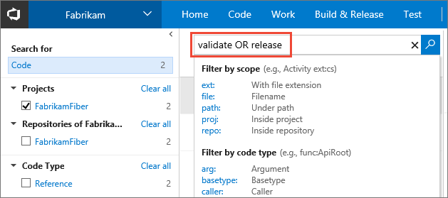
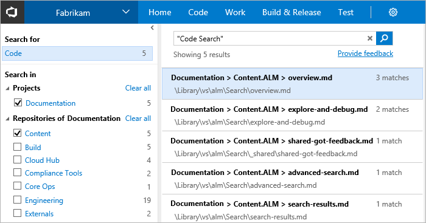
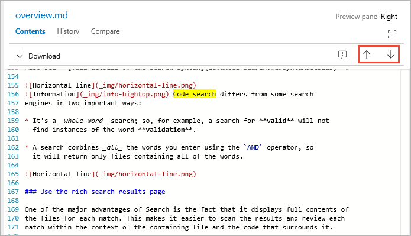
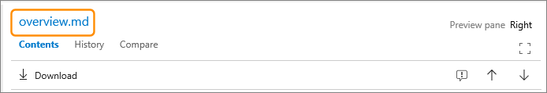

# Get started with Code Search

[!INCLUDE [version-header-shared](../_shared/version-header-shared.md)]

By using Code Search you can:

* **Search across all of your projects**:
  Search in your own codebase and your partner teams' codebases. Use cross-project 
  searches over all the code in your Team Services or TFS instance to search 
  across your organization's entire codebase. Narrow your search by using project, repository, 
  path, file name, and other filter operators. Use wildcards to widen your search and 
  Boolean operators to fine-tune it. 

* **Find specific types of code**: Use code type filters 
  to search for specific kinds of code such as definitions, references, functions, 
  comments, strings, namespaces, and more. You can use Code Search to narrow 
  down your results to exact code type matches. Navigate quickly to a method 
  definition to understand its implementation simply by applying the definition 
  filter, or scope the search to references in order to view calls and maximize 
  code reuse.

* **Easily drill down or widen your search**: When you find an item of interest, 
  simply place the cursor on it and use the shortcut menu to quickly search for 
  that text across all your projects and files. Easily trace how your code works 
  by using the shortcut menu to search for related items such as definitions and 
  references - directly from inside a file.

 <iframe width="640" height="360" src="//channel9.msdn.com/Events/Visual-Studio/Connect-event-2015/500/player" frameborder="0" allowfullscreen="true"></iframe>

Simply **[install the extension](administration.md)**
and **[get searching](#start-search)**. The
**[rich search results page](#start-results)** includes
plenty of features to help you examine, trace, and
debug your code.

After you install Code Search, you'll see the 
search textbox in the Team Services or Team Foundation Server (TFS) title bar.

    

>Only users with Basic access can use Code Search. 

Notice that, when you are in a project, you can use the 
 selector to switch
between searching for code and searching for work items.

For more details about searching for work items, see 
**[Work Item Search](../workitem/get-started.md)**.

If you don't see the 
selector in the Search box, open the **Manage extensions** page 
and check that Code Search is installed.

## Get searching

From anywhere in Team Services or TFS, make sure the search text box in the title bar 
contains _Search code_, enter a search string in the textbox, and press _Enter_ (or choose the 
 icon) to start your search. Or you 
can assemble more complex search strings using the operators and functions listed in the handy 
drop-down list.

    

Select the filter function or code type you want to include in your search string from the
list, and type the criteria value. For example:

* You can find all instances of "ToDo" comments in your code simply by selecting `comment:` and typing `todo`. 

* You can search in specific locations, such as within a particular path, by using a search string such as `Driver path:MyShuttle/Server`. 

* You can search for files by name, such as `Driver file:GreenCabs.cs`, or just by file extension. For example, the search string 
  `error ext:resx` could be useful when you want to review all error strings in your code. 
  But even if your plain text search string (without specific file type functions) 
  matches part of a filename, the file appears in the list of found files.

* You can combine two or more words by using Boolean operators; for example, `validate OR release`.

* You can find an exact match to a set of words by enclosing your search terms in double-quotes. For example, `"Client not found"`. 

* You can use the code type search functions with files written in C#, C, C++, Java, and Visual Basic.NET.

* See also **[full details of the search syntax](advanced-search.md#syntaxdetails)**. 

After this, you can use the textbox in the search results page to enter simple search strings,
or to select functions and enter the filter criteria. 

Open the search results in a new browser tab from either search box by
pressing _Ctrl_ + _Enter_ or by holding _Ctrl_ and clicking  the
 icon.
In Google Chrome, press _Ctrl_ + _Shift_ + _Enter_ to switch the focus
to the new browser tab. 
 

## Use the rich search results page

One of the major advantages of Code Search is the fact that it displays the full contents of
the files for each result. This makes it easier for you to scan each match within a result file 
in the context of the containing file and the code that surrounds it. 

The results page shows, in the left column, the number of hits in each project and 
repository. The selected projects and any selected Git repositories are always at 
the top of these lists. Notice how the hit counts are provided for projects and repositories that were
not selected.

The second column in the previous screenshot shows the list of matching documents; by default it shows the 
first 50 but there is a **Show more** link at the end of the list to display more. 
In the center column, you see:

* The project, repository, and file name delimited with "\>" characters
* The total number of matches in this file
* The full path and name of this file  

The right column of the results page shows the matching file with all the 
hits highlighted. Scroll through the highlighted matches in all the matching files using the up and
down arrow icons located near the top right of the page, or **F8** and **Shift+F8** on your keyboard. 

Choose the filename link at the top of this column to open the file in
a new Code Explorer window.

## Next steps

See more details of how you can
**[filter and scope your search](repos-and-projects.md)** to the projects, repositories, and paths 
you're interested in, and how to use the powerful features of the 
**[rich search results page](search-results.md)**. 

## See also

* [Choose your search scope](repos-and-projects.md)
* [Advanced Code Search options](advanced-search.md)
* [Rich Code Search results](search-results.md)
* [Set up and administration](administration.md)

[!INCLUDE [shared-back-to-overview](../_shared/shared-back-to-overview.md)]

[!INCLUDE [shared-got-feedback](../_shared/shared-got-feedback.md)]
