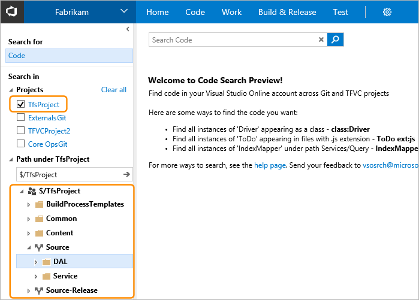
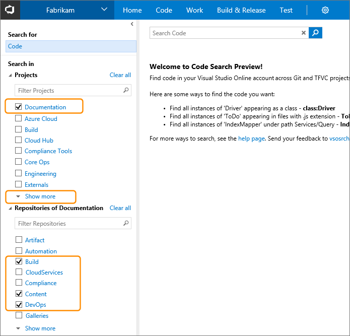
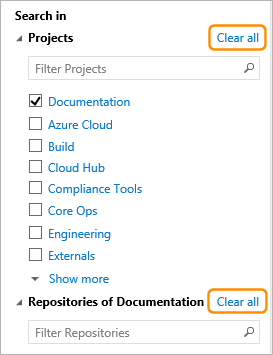
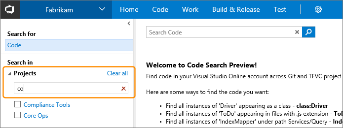
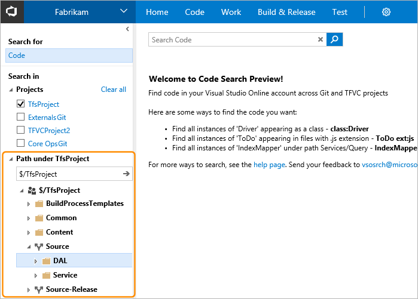
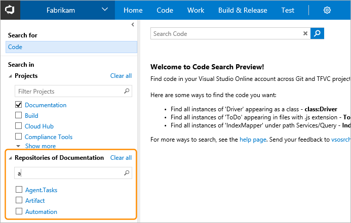
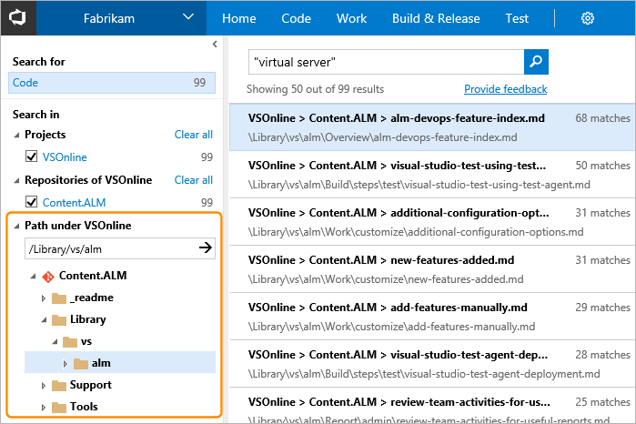

# Choose your search scope in Code Search

When you search your code, you can:

* [Choose projects and repositories](#choose-projects)
* [Filter projects, repositories,and paths](#filter-options)

[!INCLUDE [shared-back-to-overview](../_shared/shared-back-to-overview.md)]

## Choose projects and repositories

When you search from inside a project, the default is to search only within that 
project. 

In a TFVC project, you see a list of folder paths in that project for 
which you have read access - you won't see any projects and folders 
for which you don't have read permission. Select paths in the folder tree 
to narrow your search if required.

  
In a Git project, you see a list of the repositories it contains (Code Search indexes 
files in only the default branch of your Git repositories; usually this is the **master** branch). 
Use the project and repository checkboxes to widen your search to more or all projects, or to 
narrow your search to fewer projects and repositories. If there is more than a few 
projects or repositories, use the **Show more** link to see them all.

Code Search remembers your last settings, such as the project and repository or path you
searched in. Clear all the checkboxes to search across all projects. Do this quickly and 
easily with the **Clear all** links when you want to search in a different scope.

## Filter the lists of projects, repositories, and paths

You can filter the lists of projects, repositories, or paths to make it 
easier to see and select the ones you are interested in. Filter the list of projects using the Filter 
Projects textbox. 

Filter and select paths for a TFVC project using the Paths textbox. 

Filter the list of repositories for a Git project using the Filter Repositories textbox. 

Filter and select paths in a Git repository using its Paths textbox. 

You can also limit the search to specific projects, repositories, 
TFVC folder paths, file paths, and files using 
**[functions in the search string](advanced-search.md)**.

## Next steps

See more details of how you can use the 
**[advanced search options](advanced-search.md)**
and the **[rich search results page](search-results.md)**. 

## See also

* [Get started with Code Search](get-started.md)
* [Advanced Code Search options](advanced-search.md)
* [Rich Code Search results](search-results.md)
* [Set up and administration](administration.md)

[!INCLUDE [shared-back-to-overview](../_shared/shared-back-to-overview.md)]

[!INCLUDE [shared-got-feedback](../_shared/shared-got-feedback.md)]
