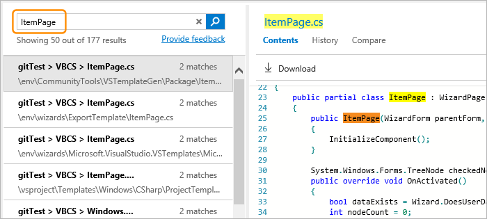
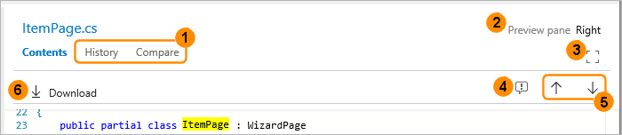
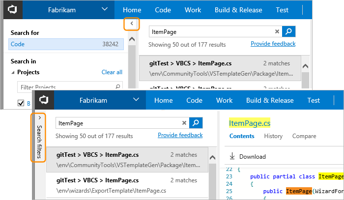
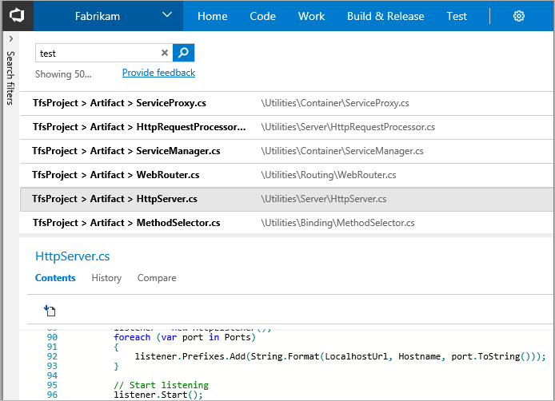
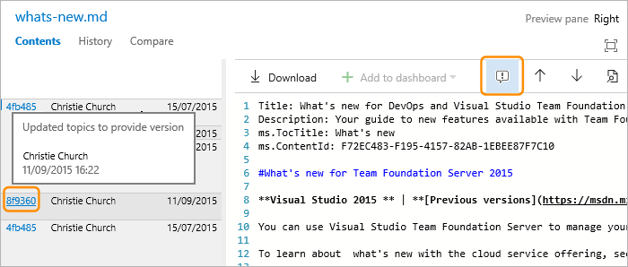
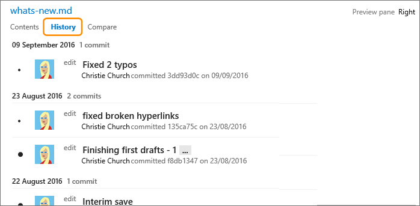
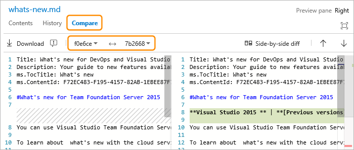
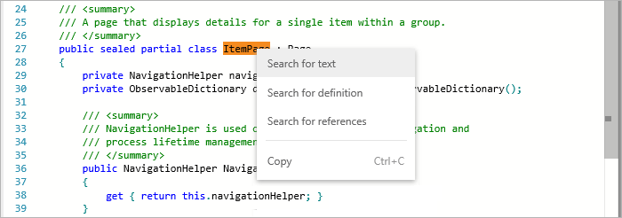

# Rich Code Search results

[!INCLUDE [version-header-shared](../_shared/version-header-shared.md)]

In the Code Search results page you can:

* [Use the rich set of options in the results page](#understandchanges)
* [Change the layout to see more of the code in the file](#seemorecode)
* [Trace changes to the code and contact the owner or editor](#tracechanges)
* [Widen your search for related items or other terms](#findrelatedfiles)
 
[!INCLUDE [shared-back-to-overview](../_shared/shared-back-to-overview.md)]

## Use the rich set of options in the results page

Choose a search result to see a rich view of that file with the search hits highlighted.

Notice that, if your search string matches part of a filename, the name is highlighted
in the right pane when you select that match. The filename is also a hyperlink that
opens the file in a new Code Explorer window so you can easily see the original source
and the folder structure in the repository where it was found.
  

Analyze the changes made to the file using the search page features as well as the 
familiar features on the Explorer page. These feaures makes it easy to understand 
the evolution of the code, trace and debug issues, and contact the owners or experts
for each part of the code.  

1. View the history of the changes and compare with other versions of the same file.
1. Show the file details pane below or to the right of the list of results.
1. View the selected file in full screen mode.
1. Show the annotation blocks for the selected file (to see who changed the code).
1. Scroll through the highlighted matches in all the results files (keyboard: **F8** and **Shift+F8**).
1. Download the selected file. 

## See more of the code file

You can quickly get a fullscreen view of the selected file using the expand

and shrink

icons in the toolbar. However, another way to see more of the file, while still being able to 
select files from the list of matching results, is to hide the left column filter pane
by choosing the **<** icon at the top left of the column. Use the **>** icon to restore the filter pane. 

If you want maximum screen width for long code lines, especially when 
using a portrait orientation screen, use the **Preview pane: Right**
link at the top right of the window to display the code below the 
search results list.

> Search remembers the state of the filter pane and position of the code
view pane between sessions as part of your user preferences.

## Trace code changes and contact the owner

Use the tabs and icons in the toolbar to see the evolution, history, and owner of the file.
Choose the **Show annotation blocks** icon for a file to see the changes made by owners 
and other editors or developers. Choose a commit ID or change ID to see more details.

Open the **History** tab to see a list of changes to the file, and details of the persons
making these changes. Choose the description of the change to open the **Compare** pane,
which shows the changes between this version and the previous version of the file.

Open the **Compare** tab to compare the current version of the file with other versions.
Select the versions you want to compare in the dropdown lists. For example, in this 
screenshot, you can see the comparison between the versions from two Git commits. The 
differences between the versions are shown line by line.
 

## Widen your search for related items or other terms
   
One of the powerful features of Code Search is the capability to expand your
search interactively, based on the results of previous searches. For example,
you can easily broaden your search to related files when tracing or debugging code. 

Place the insertion point on a term in the file and open the shortcut menu (mouse: right-click) to start a new search 
for other files containing the selected term. You can search for it as text, for 
the definition if you select an object name, or for references to a selected object. 
    

## See also

* [Get started with Code Search](get-started.md)
* [Choose your search scope](repos-and-projects.md)
* [Advanced Code Search options](advanced-search.md)
* [Set up and administration](administration.md)

[!INCLUDE [shared-back-to-overview](../_shared/shared-back-to-overview.md)]

[!INCLUDE [shared-got-feedback](../_shared/shared-got-feedback.md)]

