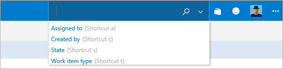

# Advanced Work Item Search options

[!INCLUDE [version-header-shared-tsonly](../_shared/version-header-shared-tsonly.md)]

You can:

* [Use full text search across all fields](#acrossfield)
* [Use quick inline filters for matching in specific field](#quickfilters)
* [Use functions to specify projects, area and iteration paths](#locationfunctions)
* [Use work item IDs to quickly navigate to the work item](#quicknavigation)
* [Use Boolean operators to create specific searches](#boolean)
* [Use wildcards to broaden your search criteria](#wildcards)

[!INCLUDE [shared-back-to-overview](../_shared/shared-back-to-overview.md)]

## Full text search across all fields

You can easily search across all work item fields, including custom fields, 
which enables more natural searches. The snippet view indicates where matches were found.

</img>  

Use simple search strings for words or phrases. Work item search matches derived forms 
of your search terms; for example, a search for "updating" will also find instances of the word 
"updated" and "update". Note that searches are _not_ case-sensitive.

## Quick Filters for matching in specific fields

Quick inline search filters let you refine work items in seconds. 
The dropdown list of suggestions helps complete your search faster. 
Mix and match the functions to create quick powerful searches. For example:

* Scope your search terms to match in any work item field including custom fields.
Simply type the field name followed by the search terms; for example, a search such as **tags:Critical** 
finds work items having a field 'tags' containing the term 'Critical'.

* Use multiple inline search filters to scope your search by any work item field, including custom fields.
For example, a search such as **t: Bug path:"project\search"** finds all bugs in the area path "project\search".

* Use the operators `>`, `>=`, `<`, `<=`, `=`, and `!=` for date, integer and float fields.
For example, a search such as **t: Bug CreatedDate> @Today-7** finds all bugs created in the last week

* For the search query that contain multiple terms and users looking for exact match, embed the search term inside " ";
for example, a search such as **BuildPath: "tools.demoproject.com"** finds all work items that neccesarily contain the path "tools.demoproject.com". 

</img>  

## Quick Filters shortcuts

The common inline search filters can be quickly accessed using shortcuts:

* `a:` for **Assigned to:** 
* `c:` for **Created by:** 
* `s:` for **State** 
* `t:` for **Work item type**

For example, you can use quick searches such as **a:@Me s:active t:bug** to find all bugs assigned to you.

## Filters to scope projects, area and iteration paths

Filters make it easy to narrow the search to specified projects and area paths.
Narrow the search to a specific location using the `proj`, `area`, or `iteration` filters:

* `Wiki proj:Fabrikam` finds all occurrences of the word **Wiki** in the **Fabrikam** project.
* `Wiki area:Contoso/Mobile` finds all occurrences of the word **Wiki** 
  in the area path **Contoso/Mobile** and its sub-paths.
* `Wiki iteration:Contoso/Sprint101` finds all occurrences of the word **Wiki** 
  in the iteration path **Contoso/Sprint101** and its sub-paths.
* Enclose the argument to the filter in double-quotes if it contains a space. 
  For example: `Wiki path:"Contoso/Windows Phones and Devices/Services"`.
  

## Quickly navigate to a work item using its ID

Type or paste the work item ID in the search box in the Team Services title bar 
to quickly navigate to it. Searching for a work item ID opens the work item in a 
modal dialog, providing quick access to read and edit work items.

## Narrow your search with Boolean operators
 
Narrow your search by using Boolean operators to combine search criteria.
Combine multiple search criteria using `AND`, `OR`, or `NOT` (they must be 
uppercase). 

Use parentheses to specify the precedence of the operations when you use more than 
one Boolean operator. By default, a search combines all the words you enter using 
the `AND` operator so that it will return only work items that contain all of the 
words you entered. 

For example:

* `welcome AND page` finds work items that contain derived forms of both the words **welcome** and 
  **page**. Note that `AND` is the default operator, and so this is equivalent to 
  the search string `welcome page`.
* `signup OR signin` finds work items that contain either of the words **signup** or **signin**.
* `signin NOT signup` finds work items that contain the word **signin** but not the word **signup**.
* `(signin NOT signup) OR "user login"` finds work items that contain the word **signin**
  but not the word **signup** or work items that contain the phrase **user login**.

To find an exact match to a set of words, enclose your search terms in double-quotes. 
For example, `"Client not found"`

## Broaden your search with wildcards

Use the wildcard characters `*` and `?` to broaden your search criteria. For 
example:

* `Browser*` finds work items containing words that start with **Browser**, 
  such as **BrowserEdge**, **BrowserIE** and **BrowserFirefox**.
* `alpha?version` finds work items containing words that start with **alpha**, have any 
  alphanumeric character next, and end with **version**. For example, **alpha1version** and **alphaXversion**. 

You can use wildcard characters anywhere in your search string **except** as 
a **prefix**. For example, you cannot use a search query such as `*RequestHandler`. 
However, you can use prefix wildcards with the 
other search filter functions; for example, the search query strings 
`area:*mobile` and `tags:*Browser` are valid.  

You can use more than one `?` wildcard to match more than one character.

  
 **No results found for ...**  

* If there are no results matching the input, try removing filters and retry the search. This will broaden the search and after you view the search results,
  you can apply appropriate filters again and search again for relevant results

* Check for the spelling of your search terms. Currently Work item search doesn't support ignoring of users' spelling mistakes

* If there are a very large number of hits when using a wildcard search, such 
 as when using a very simple wildcard search string, you may see a message that no 
 matching files were found. In this case, narrow your search to reduce the number
 of matches. For example, specify more characters of the word(s) you want to find,
 or add a condition or filter to limit the number of possible matches.

  

[!INCLUDE [shared-back-to-overview](../_shared/shared-back-to-overview.md)]

[!INCLUDE [shared-got-feedback](../_shared/shared-got-feedback.md)]
