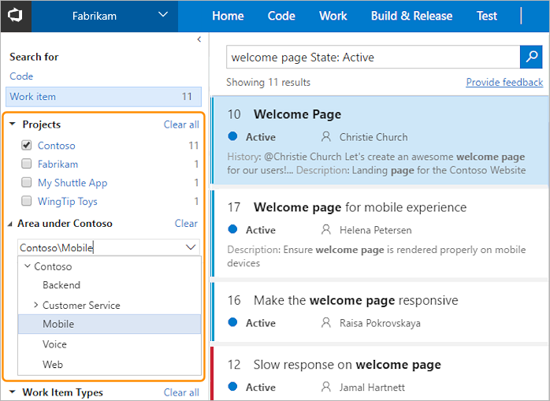

# Get started with Work Item Search

[!INCLUDE [version-header-shared-tsonly](../_shared/version-header-shared-tsonly.md)]

Work Item Search provides fast and flexible search across all your work items over all projects in an account. 
You can use the Work Item Search full text search engine to easily search for terms across all work item fields 
and efficiently locate relevant work items. Use in-line search filters, on any work item field, to quickly narrow 
down to a list of work items. 

## Work Item Search offering in Visual Studio Team Services

Work Item Search is available as a built-in extension in Visual Studio Team Services. Users can **[get searching](#start-search)** by default without any installation. By using Work Item Search you can:

* **Search over all your projects**:
  Search in your own and your partner teams' backlog. Use cross-project 
  searches over all the work items in your Team Services account to search 
  across your organization's entire work items. Narrow your search by using project and 
  area path filters. 
  
* **Search across all work item fields**:
  Quickly and easily find relevant work items by searching across all work item fields
  (including custom fields). Use a full text search across all fields to efficiently
  locate relevant work items. The snippet view indicates where matches were found.

  
* **Search in specific fields**:
  Use the quick in-line search filters, on any work item field, to narrow down to a
  list of work items in seconds. The dropdown list of suggestions helps complete your
  search faster. For example, a search such as **AssignedTo:Chris WorkItemType:Bug
  State:Active** finds all active bugs assigned to a user named Chris. 

* **Take advantage of integration with work item tracking**:
  The Work Item Search interface integrates with familiar controls in the **Work** hub,
  letting you view, edit, comment, share, and much more.
  
</img>  

## Get searching

By default in Visual Studio team services you will see _Search work items_, but if you have Code Search extension also installed, make sure the search text box in the title bar 
contains _Search work items_, enter a search string in the textbox, and press _Enter_ (or choose the 
 icon) to start your search. 

    

Search results are displayed in a snippet view where the matches found are highlighted. By default you can do a [full text search](advanced-search-syntax.md#acrossfield) across all fields of the work items or apply in-line search filters to view relevant results. 

</img>  

A helper drop down is provided to the users where they can use the [quick in-line search filters](advanced-search-syntax.md#quickfilters), on any work item field, to narrow down to a
list of work items in seconds. 

    

The dropdown list shows work item field name suggestions 
that match user input thereby helping the user to complete the search faster. For example, a search such as 
**tags:Critical** finds all work items tagged 'Critical'. 

    

You can repeat this to add multiple
quick filters. As you do so, the list updates to show matches, letting you quickly narrow
down your search to exactly the item you want to find. For example,
**a: Chris t: Bug s: Active** finds all active bugs assigned
to a user named Chris.

>Open the search results in a new browser tab from a search box by
pressing _Ctrl_ + _Enter_ or by holding _Ctrl_ and clicking  the
 icon.
In Google Chrome, press _Ctrl_ + _Shift_ + _Enter_ to switch the focus
to the new browser tab. 
 

## Use the rich search results page

One of the major advantages of Work Item Search is its ability to display the full
contents of the work item for each result in the [rich results page](search-results.md). This makes it easier for you to scan
each work item in the result, locate the work item you need and then directly work with it. 

For every result, you can see the work item ID, title, state, who its assigned to, and 
any tags associated with the work item. By default, search terms are matched across all fields. 
The snippet view indicates matches found in other fields. For example, your search 
terms might match in in any of the work item fields such as work item description, repro steps, test steps, or discussion comments.

The right pane of the results page shows the work item selected in the center column.

## Choose projects and area paths 

When you search from inside a project, the default is to search only within that 
project. When you search from inside a team, the default is to search 
only within the default area path of that team. When you have one project selected, 
you see a list of area paths in that project for which you have read access - 
you won't see any projects and area paths for which you don't have read permission. 
Select area paths in the tree to narrow your search if required.

The selected projects are always at the top of the list.
Notice that hit counts are also shown for projects that are not selected. 

Clear all the checkboxes to search across all projects. Do this quickly and easily with 
the **Clear all** links to search in a different scope.

>Please note that Work Item search remembers your filter settings. For example, project and area path that you have selected in a search will be applied in your subsequent searches.

## Next steps

* See more details of how to use the powerful features of the **[rich search results page](search-results.md)**.
* Learn more about the **[advanced search syntax](advanced-search-syntax.md)**.

[!INCLUDE [shared-back-to-overview](../_shared/shared-back-to-overview.md)]

[!INCLUDE [shared-got-feedback](../_shared/shared-got-feedback.md)]

