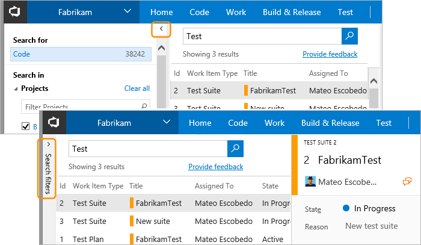

# Rich Work Item Search results

[!INCLUDE [version-header-shared-tsonly](../_shared/version-header-shared-tsonly.md)]

In the Work Item Search results page you can:

* [Use the rich set of options in the results page](#understandchanges)
* [Change the layout to see more of the work item](#seemoreworkitem)
 
[!INCLUDE [shared-back-to-overview](../_shared/shared-back-to-overview.md)]

## Use the rich set of options in the results page

Choose a search result to see a rich view of the familiar work item form in the right pane. 
This makes it easier for you to scan each match and locate the work item you need and then
directly work with it - giving you the ability to view, edit, comment, share and much more.

## See more of the work item

You can quickly get a full screen view of the selected work item using the expand

and shrink 
icons in the toolbar. However, another way to see more of the work item, while still being able to 
select work items from the list of matching results, is to hide the left column filter pane
by choosing the **&lt;** icon at the top left of the column. Use the **&gt;** icon to restore the filter pane. 

If you are using a portrait orientation screen, use the **Preview pane: Right**
link at the top right of the window to display the code below the 
search results list.

>Search remembers the state of the filter pane, configuration of the work item 
view pane, and its position between sessions as part of your user preferences.

[!INCLUDE [shared-back-to-overview](../_shared/shared-back-to-overview.md)]

[!INCLUDE [shared-got-feedback](../_shared/shared-got-feedback.md)]

