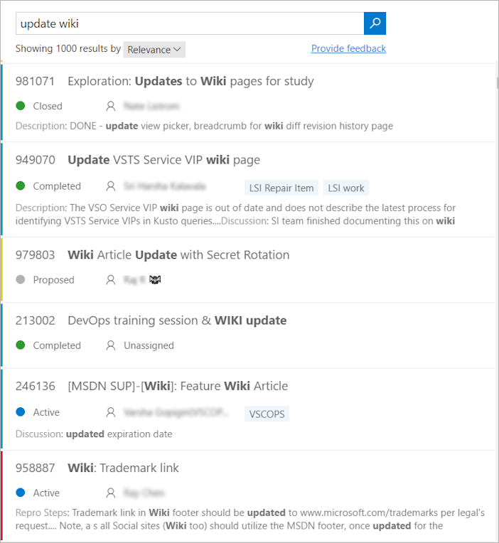
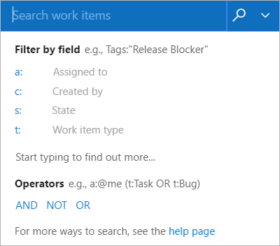
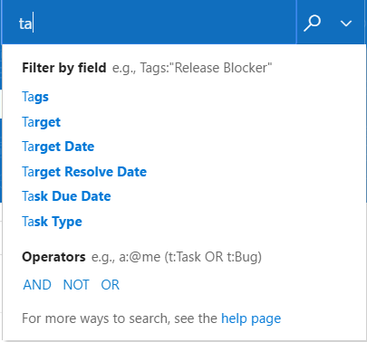

# Search for work items

[!INCLUDE [version-header-shared-vsts-tfs](../_shared/version-header-shared-vsts-tfs.md)]

Work Item Search provides fast and flexible search across all your work items over all projects in an account. 

See also: [Adhoc vs managed work item queries](../../work/track/adhoc-vs-managed-queries.md?toc=/vsts/search/toc.json&bc=/vsts/search/breadcrumb/toc.json)

## Get searching

1. In the search textbox at the top right of the window, check that the text says
   _Search work items_.

       

   If you have the Code Search extension installed, the search text box may
   say _Search code_. In this case, use the drop-down selector to change it. 

1. Enter a search string in the textbox, and press _Enter_ (or choose the 
    icon) to start your search. 

1. Search results are displayed in a snippet view where the matches found are shown in bold.

   

   This is a full text search that uses simple search strings for words or phrases.
   Work item search matches derived forms of your search terms; for example, a search for
   "updating" will also find instances of the word "updated" and "update". Note that searches are _not_ case-sensitive.

1. Select a snippet of a work item to display it in the right window. 
   You can edit and manage this work item in the usual way.

   

   >Open the search results in a new browser tab from a search box by
   pressing _Ctrl_ + _Enter_ or by holding _Ctrl_ and clicking  the
    icon.
   In Google Chrome, press _Ctrl_ + _Shift_ + _Enter_ to switch the focus
   to the new browser tab. 

1. Fine tune your search by specifying the fields to search. Enter `a:` and a user name
   to search for all items assigned to that user.

       

   The quick filters you can use are:

   * `a:` for **Assigned to:** 
   * `c:` for **Created by:** 
   * `s:` for **State** 
   * `t:` for **Work item type**

 
1. Start typing the name of a field in your work items; for example, type `ta`.

       

   The dropdown list shows work item field name suggestions 
   that match user input thereby helping the user to complete the search faster. For example, a search such as 
   **tags:Critical** finds all work items tagged 'Critical'. 

1. Add more filters to further narrow your search, and use Boolean operators
   to combine terms if required. For example, 
   **a: Chris t: Bug s: Active** finds all active bugs assigned
   to a user named Chris.

1. Widen your search across all projects, or narrow it to specific types
   and states, by using the drop-down selector lists at the top of the results page.

       

   >Work Item search remembers your filter settings. For example, the project and area path that you have selected in a search will be applied in your subsequent searches.

## Next step

> [!div class="nextstepaction"]
> [Learn more about Work Item Search](advanced-search-syntax.md)
