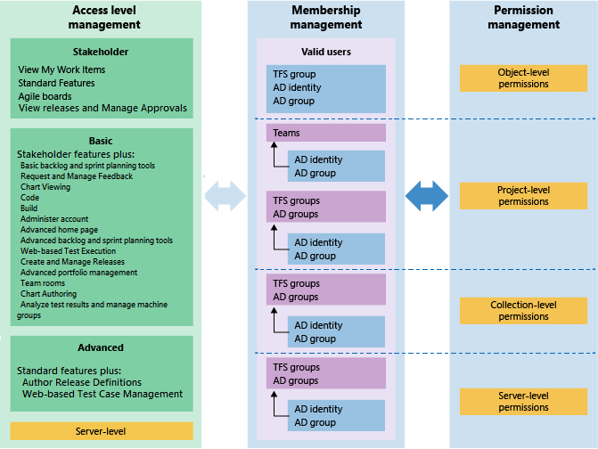

# About security and identity  

[!INCLUDE [temp](../_shared/version-vsts-tfs-all-versions.md)]

Visual Studio Team Services (VSTS), our cloud-hosted application, is based on the capabilities of Team Foundation Server, with additional cloud services. Both support development projects, from planning through deployment. 
VSTS uses Microsoft Azure's Platform as a Service infrastructure and many of Azure's services, including Azure SQL databases, to deliver a reliable, globally available service for your development projects. 

This topic introduces the main security concepts employed by VSTS and TFS. To learn more about the steps Microsoft takes to keep your VSTS projects safe, available, secure, and private, see this white paper, [Visual Studio Team Services (VSTS) Data Protection Overview](../articles/team-services-security-whitepaper.md).    

The main security concepts to understand are

- Authentication
- Authorization 
- Security groups
- Permission levels and permissions 
- Access levels  

## Authentication

Authentication verifies a user's identify based on the credentials provided when they sign into VSTS or TFS. These systems integrate with and rely upon the security features provided by these additional systems: 
- Azure Active Directory (AAD)  
- Microsoft account (MSA)  
- Active Directory (AD)  

AAD and MSA support cloud authentication. We recommend AAD when you need to manage a large group of users. Otherwise, if you have a small user base accessing your VSTS account, you can simply use Microsoft accounts. 

For on-premises TFS, AD is recommended when managing a large group of users. 

### Authentication methods, integrating with other services and apps 

Other applications and services can integrate with VSTS and TFS services and resources. To access your account without asking for user credentials multiple times, apps can use these authentication methods:

*	[Alternate credentials](../git/auth-overview.md#alternate-credentials) 
as a single set of credentials across all tools that don't have 
plug-in, extension, or native support. For example, 
you can use basic authentication to access 
[REST APIs for VSTS and TFS](../integrate/get-started/rest/basics.md), 
but you must turn on alternate credentials.

*	[Personal access tokens](../accounts/use-personal-access-tokens-to-authenticate.md) 
to generate tokens for: 

	*	Accessing specific resources or activities, like builds or work items
	*	Clients like Xcode and Nuget that require usernames and passwords 
		as basic credentials and don't support Microsoft account 
		and Azure Active Directory features like multi-factor authentication 
	*	Accessing [REST APIs for VSTS and TFS](../integrate/get-started/rest/basics.md)

*	[OAuth](/vsts/integrate/get-started/Authentication/oauth) 
to generate tokens for accessing [REST APIs](/vsts/integrate/get-started/rest/basics). The [Accounts](/vsts/integrate/api/shared/accounts) 
and [Profiles](/vsts/integrate/api/shared/profiles) 
APIs support only OAuth. 

*	[SSH authentication](../git/use-ssh-keys-to-authenticate.md) 
to generate encryption keys when you use Linux, macOS, 
or Windows running [Git for Windows](http://www.git-scm.com/download/win) 
and can't use 
[Git credential managers](../git/set-up-credential-managers.md) 
or [personal access tokens](../accounts/use-personal-access-tokens-to-authenticate.md) 
for HTTPS authentication.

By default, your account or collection allows access for all authentication methods. 
You can limit access, but you must specifically restrict access for each method. 
When you deny access to an authentication method, 
no app can use that method to access your account. 
Any app that previously had access will get an 
authentication error and can't access your account.

## Authorization
Authorization verifies that the identity which is attempting to connect has the necessary permissions to access a service, feature, function, object, or method. 

Authorization always occurs after successful authentication. If a connection is not authenticated, it fails before any authorization checking is performed. If authentication of a connection succeeds, a specific action might still be disallowed because the user or group did not have authorization to perform that action.  

Authorization is based on users and groups, and the permissions assigned directly to both those users and groups and permissions those users and groups might inherit by belonging to one or more VSTS/TFS security groups. These users and groups can be AAD or AD users and groups. For TFS, they can also be local Windows users and groups.

Also, for select features, users and groups may need to belong to an access level that grants them access to a feature. 

## Security groups and permissions  

VSTS and TFS are preconfigured with default security groups. Default permissions are assigned to the default security groups.   

> [!div class="mx-tdBreakAll"]  
> | Security groups | Permission levels | Permission States  | 
> |-------------|----------| ----------| 
> |- Team project level - Collection or Account level - Server level (TFS only) |- Object-level - Project-level - Collection-level - Server-level (TFS only) |User or group has permissions to perform a task: - **Allow** - **Inherited allow** User or group doesn't have permission to perform a task: - **Deny** - **Inherited deny** - **Not set** |

You can populate these groups by using individual users. However, for ease of management, it's easier if you populate these groups by using AAD or AD security groups. This method enables you to manage group membership and permissions more efficiently across multiple computers.

 

VSTS and TFS control access through these three inter-connected functional areas:

-   **Membership management** supports adding individual Windows user accounts and groups to default TFS groups. Also, you can create TFS groups. Each default TFS group is associated with a set of default permissions. All users added to any TFS group are added to the Valid Users group. A valid user is someone who can connect to the team project.

-   **Permission management** controls access to specific functional tasks at different levels of the system. Object-level permissions set permissions on a file, folder, build definition, or a shared query. Permission settings correspond to **Allow**, **Deny**, **Inherited allow**, **Inherited deny**, and **Not set**. To learn more about inheritance, see [About permissions and groups](about-permissions.md#inheritance).

-   **Access level management** controls access to features provided via the web portal, the web application for TFS. Based on  what has been purchased for a user, administrators set the user's access  level to Basic, Advanced, or Stakeholder (previously labeled Standard, Full, and Limited).

Each functional area uses groups to simplify management across the deployment. You add users and groups through the web administration context. Permissions are automatically set based on the security group that you add users to, or based on the object, project, collection, or server level to which you add groups. On the other hand, access level management controls access for all users and groups at the server level.

  

You can create local groups or Active Directory (AD) [groups to manage your users](../tfs-server/admin/setup-ad-groups.md). If you decide to use groups, make sure that membership in those groups is limited to TFS users. Because group membership can be altered by their owners at any time, if those owners did not consider TFS when they created those groups, their changes to membership can cause unwanted side effects within TFS.  

### Default permissions set for the Contributors group 

The following image shows the default permission assignments made to the Contributors group.

To learn more about other groups and their permission assignments,
see [Permissions and groups reference](permissions.md).

<a id="access-levels" />
## Access levels 

Certain features are only available to users who have the appropriate licensing level for those features. Access to those features is not controlled by permissions but by membership in an access level. To learn more, see [Access levels](access-levels.md). 

## Related notes

See these topics for more information: 
- [Permissions and groups reference](permissions.md)
- [Access with Azure Active Directory (Azure AD)](../accounts/add-users-to-aad.md). 
- [Set up groups for use in TFS deployments](../tfs-server/admin/setup-ad-groups.md).
- [Setting up HTTPS with Secure Sockets Layer (SSL)](../tfs-server/admin/setup-secure-sockets-layer.md)

<!-- TODO: Cover how to set permissions for Reporting Services and SharePoint as mainline sections.

VSTS and TFS security concepts fall into three general categories: topology, authentication, and authorization. Topology includes where and how Team Foundation servers are deployed, the network traffic that passes between Team Foundation Server and Team Foundation clients, and the services that must run on Team Foundation Server. Authentication includes the determination of the validity of Team Foundation Server users, groups, and services. Authorization includes the determination of whether valid Team Foundation Server users, groups, and services have the appropriate permissions to perform actions. Also, you must consider Team Foundation Server dependencies on other components and services in order to optimize the security of Team Foundation Server in the network.
When you consider Team Foundation Server security, you must understand the difference between authentication and authorization.

 > [!NOTE] 
 > Permissions are different than access levels.
 > Access levels control what features are visible to users in the web portal,
 > and are dependent on user licenses; permissions control a user's ability to use features across TFS.
 > If you're just trying to give someone access to a team room or to Agile portfolio management
 > and test case management features,
 > you'll want to [change access levels](change-access-levels.md), not permissions.

## Permissions 

Besides configuring permissions for authorization, you might need authorization within source code control and within work items. These permissions are managed separately at the command line, but are integrated as part of the Team Explorer interface. For more information about source control permissions, see Team Foundation Version Control. For more information about work item customization, see Working with Team Foundation Work Items.

   
 -->  