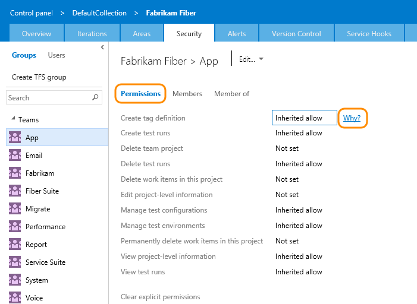

# Access levels

**Team Services | TFS 2017 | TFS 2015 | TFS 2013**  

Access levels enable administrators the ability to provide their user base access to the features they need and only pay for those features. To connect and use the functions and features that TFS provides, users must be added to a group with the appropriate permissions. To use select web portal features, they must also belong to the access level that enables access to that feature.

Three access levels are used: 

- **Basic**: Should be assigned to all users with a TFS client access license (CAL). Basic provides access to most features, except for Test.
All Visual Studio subscriptions and paid Team Services users include a TFS CAL.
- **Stakeholder**: Should be assigned to those users who need to enter bugs, view backlogs, boards, charts, and dashboards, but who don't have a TFS CAL. Stakeholders can also view releases and manage release approvals. Stakeholder access is free. 
- **VS Enterprise**: Should be assigned to those users for whom you've purchased Visual Studio Enterprise. These include a TFS CAL plus the rights to access VS Enterprise features. (For users with MSDN subscriptions or Test Professional, assign the Basic access level and the Test Manager extension.) To learn more, see [Get extensions for TFS, Assign paid extension access to users](../marketplace/get-tfs-extensions.md#assign-extension). For example, for users with Visual Studio Test Professional or Visual Studio Enterprise, assign them [access to the Test Manager extension](../marketplace/get-tfs-extensions.md#assign-extension).

For TFS 2017 and earlier versions, the **Advanced** level should be assigned to those users for whom you've purchased the full Test feature set. Here are the purchasing options:  
- Higher-level Visual Studio subscriptions: Visual Studio Test Professional, Visual Studio Enterprise, or MSDN platform subscriptions.
These include a TFS CAL plus the rights to access the full set of Test features.  
- A paid Visual Studio Team Services user (which includes a TFS CAL) plus the [Test Manager extension](#test-manager). 

For TFS 2017.2, Assign **Advanced** access to those users for whom you've purchased MSDN Platform or Visual Studio Test Professional subscriptions. These include a TFS CAL plus the rights to access Test Manager. To learn more, see [Get extensions for TFS, Assign paid extension access to users](../marketplace/get-tfs-extensions.md#assign-extension).

> [!NOTE]   
> The **Advanced** access level is deprecated for TFS 2017 and later versions of TFS. Use the **VS Enterprise** access level only for active Visual Studio Enterprise subscribers. For MSDN Platforms and Visual Studio Test Professional with MSDN subscribers needing access to the Test hub, assign them to the Advanced access level and the Test Manager extension.  
 

When you add a user or group to a team or team project, they're automatically granted access to those features supported by the default access level, which is Basic. This provides most users all the features they need. For a simplified overview of the permissions assigned to the most common groups&#151;Readers, Contributors, and Project Administrators&#151;as well as the Stakeholder access group, see [Permissions and access](../setup-admin/permissions-access.md).  

Make sure to set each user's access level based on what you've purchased for that user. Basic access includes all Stakeholder features. Advanced and Visual Enterprise access levels include all Basic features.  
 
See [Stakeholder access](../quickstart/get-started-stakeholder.md) for details of features available to stakeholders.

  
## Permissions versus access levels  

Setting the access level for  users or groups doesn't provide them access to a team project or the web portal. Only users or groups added to a team or TFS group can connect to a team project and the web portal. Make sure your users have both the permissions and the access level they need. You do this by making sure they're [added to the team project](../setup-admin/add-users.md) or as a [team member](../work/scale/multiple-teams.md#add-team-members).

TFS controls access through these three inter-connected functional areas:

-   **Access level management** controls access to features provided via the web portal, the web application for TFS. Based on  what has been purchased for a user, administrators set the user's access  level to Basic, Advanced, or Stakeholder (previously labeled Standard, Full, and Limited).

-   **Membership management** supports adding individual Windows user accounts and groups to default TFS groups. Also, you can create TFS groups. Each default TFS group is associated with a set of default permissions. All users added to any TFS group are added to the Valid Users group. A valid user is someone who can connect to the team project.

-   **Permission management** controls access to specific functional tasks at different levels of the system. Object-level permissions set permissions on a file, folder, build definition, or a shared query. Permission settings correspond to **Allow**, **Deny**, **Inherited allow**, **Inherited deny**, and **Not set**.

Each functional area uses groups to simplify management across the deployment. You add users and groups through the TFS web service administration pages. Permissions are automatically set based on the TFS group that you add users to, or based on the object, project, collection, or server level to which you add groups. On the other hand, access level management controls access for all users and groups at the server level.

  

You can create local groups or Active Directory (AD) [groups to manage your users](../setup-admin/tfs/admin/setup-ad-groups.md). If you decide to use groups, make sure that membership in those groups is limited to TFS users. Because group membership can be altered by their owners at any time, if those owners did not consider TFS when they created those groups, their changes to membership can cause unwanted side effects within TFS.  

Here's what you need to know about permission settings:  

-   **Allow** or **Deny** explicitly grants or restricts users from performing specific tasks, and are usually inherited from group membership.  

-   **Not set** implicitly denies users the ability to perform tasks that require that permission, but allows membership in a group that does have that permission set to take precedence, also known as **Inherited allow** and **Inherited deny**.  

-   For most groups and almost all permissions, **Deny** trumps **Allow**. If a user belongs to two groups, and one of them has a specific permission set to **Deny**, that user will not be able to perform tasks that require that permission even if they belong to a group that has that permission set to **Allow**.  

    For members of the **Project Collection Administrators** or **Team Foundation Administrators** groups, Deny doesn't trump Allow. Permissions assigned to these groups take precedent over any Deny set within any other group to which that member might belong.

-   Changing a permission for a group changes that permission for all users who are granted that permission through their membership in that group. In other words, depending on the size of the group, you might affect the ability of hundreds of users to do their jobs by changing just one permission. So make sure you understand the impact before you make a change.

Two useful tips for understanding the effects of change: The **Member of** tab shows the groups that an individual user or group belongs to. You can also hover over an inherited permission, and a **Why?** icon will appear. If you choose it, a dialog box will open with more information.

  
