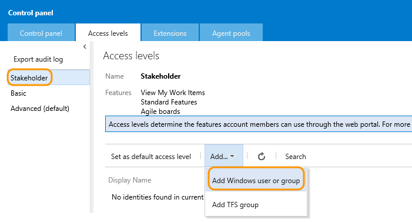
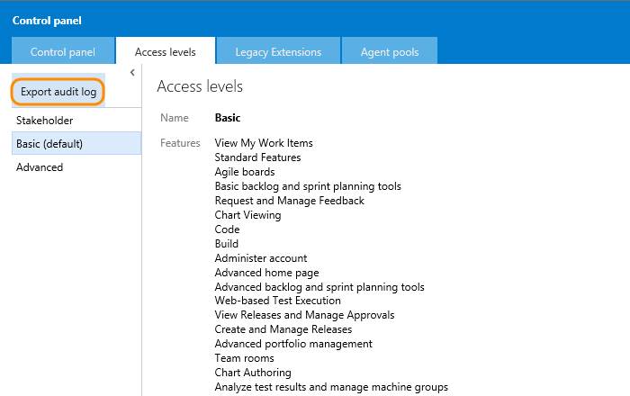

# Change access levels

**TFS 2017 | TFS 2015 | TFS 2013**  

<!--- TO BE COMPLETED   --> 


!!! WORK IN PROGRESS !!! 

**UPDATE - To Be Completed - Make into a Tutorial **

!!! WORK IN PROGRESS !!! 

See [Access levels](access-levels.md).


>[!IMPORTANT]  
>This topic applies to managing access levels for team projects defined on an on-premises Team Foundation Server (TFS). To manage access levels for Team Services, see [Manage users and access in Visual Studio Team Services](../accounts/add-account-users-assign-access-levels.md). For Team Services feature availability, see the [Visual Studio Team Services Feature Matrix](https://www.visualstudio.com/pricing/visual-studio-online-feature-matrix-vs).

To connect and use the functions and features that TFS provides, users must be added to a group with the appropriate permissions. To use select web portal features, they must also belong to the access level that enables access to that feature.

When you add a user or group to a team or team project, they're automatically granted access to those features supported by the default access level, which is Basic. This provides most users all the features they need. For a simplified overview of the permissions assigned to the most common groups&#151;Readers, Contributors, and Project Administrators&#151;as well as the Stakeholder access group, see [Permissions and access](permissions-access.md).  

Make sure to set each user's access level based on what you've purchased for that user. Basic access includes all Stakeholder features. Advanced and Visual Enterprise access levels include all Basic features. In the images provided below (click &#x25BC; to view), the circled features indicate the features made available from the previous access level.


<a id="manage-access" >  </a>
## Manage access

You manage access levels for all collections defined on the application tier for TFS. The default access level you set applies to all team projects defined for all collections. Users or groups that you add to teams, team projects, or collections are granted the access level that you set as the default. To change the access level for a specific group or user, you add them specifically to one of the other, non-default access levels.

<a id="add-user" >  </a>
### Set the access level for a user or group  

>[!IMPORTANT]  
>Even if you set a user or group's access level, you must add them to a team project collection or team project for them to connect to TFS and access features available through a supported client or the web portal.  

If you're managing access for a large group of users, a best practice is to first create either a [Windows group or TFS group](../tfs-server/admin/setup-ad-groups.md) and add individuals to those groups.

>[!NOTE]  
>The images you see from your web portal may differ from the images you see in this topic. These differences result from updates made to your on-premises TFS. However, the basic functionality available to you remains the same unless explicitly mentioned.  

From a user context, open the admin context by clicking the  gear Settings icon. The tabs and pages available differ depending on which admin context you access.
 

### TFS 2017 

<ol>
<li><p>From the web portal home page for a team project (for example, ```http://MyServer:8080/tfs/DefaultCollection/MyProject/```), open the Server Settings administration context.</p>  

  
</li>
<li>
<p>From the Access levels page, select the access level you want to manage. For example, here we click Add to add a group to Stakeholder access.</p>  

	

<p>If you don't see the Access levels tab, you aren't a TFS administrator and don't have permission. [Here's how to get permissions](../accounts/add-administrator-tfs.md).</p>  
</li>
</ol>  


### TFS 2015

<ol>
<li>
<p>From the web portal home page for a team project (for example, ```http://MyServer:8080/tfs/DefaultCollection/MyProject/```), open the administration context.</p>  


</li>
<li>
<p>From the Access levels page, select the access level you want to manage. For example, here we add a group to Stakeholder access.</p>  

	

<p>If you don't see the Access levels tab, you aren't a TFS administrator and don't have permission. [Here's how to get permissions](../accounts/add-administrator-tfs.md).</p>  
</li>

</ol>
 


<a id="set-default" >  </a>
### Change the default access level

Change the default access level to match the access you have licenses for. If you change the default access level to Stakeholder, all users not explicitly added to the Basic or Advanced level will be limited to the features provided through Stakeholder access.

>[!IMPORTANT]  
>Service accounts are added to the default access level. If you set Stakeholder as the default access level, you must add the TFS service accounts to the Basic or Advanced group.    

You set an access level from its page. Click Set as default access level as shown.

  


<a id="export-audit-log" >  </a>
### List users and groups who have access  

You can get a list of users and groups that have access to the server by exporting the audit log. The audit log also indicates which access level has been granted.   

1. From the Access levels page, export the audit log.  

	  

2. Save the audit log .csv file which is downloaded to a folder.  

3. You can open the file in Excel and determine the access level assigned to each group or user.

<a id="guide-features-access" >  </a>
## Guide to features and access levels

You can learn more about each of the features you have access to from the following topics. Basic  includes all features supported by Stakeholder, and Advanced includes access to all features supported by Basic.

### Stakeholder access<sup> 1</sup> 
<ul style="padding-left:10px;font-size:90%">
 <li style="margin-bottom:2px">View My [Work items](../work/backlogs/add-work-items.md)</li>
 <li style="margin-bottom:2px">Standard features: [Dashboards](../report/dashboards.md) & [Queries](../work/track/using-queries.md)<sup> 2</sup></li>
 <li style="margin-bottom:2px">Agile boards: [Backlogs](../work/backlogs/create-your-backlog.md), [Kanban](../work/kanban/kanban-basics.md) & [Task](../work/scrum/task-board.md) <sup> 3</sup></li>
 <li style="margin-bottom:2px">[View releases and manage approvals](../build-release/actions/view-manage-releases.md)<sup> 4</sup></li>
</ul>
 

### Basic access<sup> 5</sup> 
<ul style="padding-left:30px;font-size:90%">
 <li style="margin-bottom:2px">[Basic & Advanced backlog and sprint planning tools](../work/scrum/sprint-planning.md)</li>
 <li style="margin-bottom:2px">[Request and manage feedback](../work/connect/get-feedback.md)<sup> 6</sup></li>
 <li style="margin-bottom:2px">[Chart viewing & Chart authoring](../report/charts.md)</li>
 <li style="margin-bottom:2px">Code: [Git](../git/overview.md) and [TFVC](../tfvc/overview.md)</li>
 <li style="margin-bottom:2px">[Build](../build-release/overview.md)</li>
 <li style="margin-bottom:2px">[Administer account](#administer-account)<sup> 7</sup></li>
 <li style="margin-bottom:2px">[Advanced home page](../work/backlogs/organize-backlog.md)<sup> 8</sup></li>
 <li style="margin-bottom:2px">[Web-based test execution](../manual-test/getting-started/run-manual-tests.md)
 <li style="margin-bottom:2px">[Create and manage releases](../build-release/actions/create-deploy-releases.md)<sup> 4</sup></li>
 <li style="margin-bottom:2px">[Author release definitions](../build-release/concepts/definitions/release/index.md)<sup> 4</sup></li>
 <li style="margin-bottom:2px">[Advanced portfolio management](../work/backlogs/define-features-epics.md)</li>
 <li style="margin-bottom:2px">[Team rooms](../collaborate/collaborate-in-a-team-room.md)</li>
 <li style="margin-bottom:2px">[Analyze test results and manage machine groups](https://msdn.microsoft.com/library/dd286743.aspx)</li>

</ul>
 

### Advanced access (TFS 2017, TFS 2015, TFS 2013) 
<ul style="padding-left:30px;font-size:90%">
 <li style="margin-bottom:2px">[Web-based test case management](../manual-test/getting-started/create-a-test-plan.md)<sup> 9</sup></li>
</ul>
<blockquote>Advanced access will be deprecated in future versions of TFS.</blockquote>
<p style="font-weight:bold;padding-bottom:0px;text-align:center;">VS Enterprise (TFS 2017)</p>
<ul style="padding-left:30px;font-size:90%">
 <li style="margin-bottom:2px">Microsoft published TFS Extensions<sup> 10</sup></li>
</ul>

#### Notes:
1.	With Stakeholder access, users can create and modify all work items, and can create and save queries on all work items under their My Queries folder. (This is a change from Limited access in which users could create and modify only those work items that they created and query and view work items they created.)
Also, stakeholders can create and modify work items using Team Foundation clients such as Visual Studio Community, Microsoft Excel, Microsoft Project, and Microsoft Feedback Client.
2.	Standard features include access to the Home and Work hubs.
3. 	Includes all backlogs and boards, including product, portfolio, and sprint backlogs and Kanban and sprint task boards. Can add work items to backlogs, which appear at the bottom of the list. Can't reorder items on the page or use some other features. See [Stakeholder access](../quickstart/get-started-stakeholder.md) for details.
4. 	Release Management is in preview and available when you [upgrade your application server to TFS 2015 Update 2 or later version](https://www.visualstudio.com/downloads/download-visual-studio-vs).   
5.	Basic access allows you to access the Code, Build, and Test hubs in addition to the Home and Work hubs.
6.	Request and manage feedback is now available within the Basic access level when you [upgrade your application server to TFS 2015 Update 1 or later version](https://www.visualstudio.com/downloads/download-visual-studio-vs).
7.	You can open the Admin context and view and modify settings provided you are a team, project, or project collection administrator. See [Administer account features](#administer-account).
8.	Advanced home page allows you to configure and view the Welcome page in addition to team dashboards.  
9.	You can [purchase Test Manager extensions and assign to user accounts](#test-manager) to gain full access to web-based Test case management tools.
10.	With VS Enterprise access, users have access to any fee-based, Marketplace extension published by Microsoft Marketplace extension published by Microsoft that is included for active Visual Studio Enterprise subscribers. Examples include [Package Management](https://marketplace.visualstudio.com/items?itemName=ms.feed) (which is also free for 5 users who are not Visual Studio Enterprise subscribers) and [Test Manager](https://marketplace.visualstudio.com/items?itemName=ms.vss-testmanager-web).    


## Related notes

To get started, manage permissions, or learn more about features made available through access to TFS, see these topics:    

- [Work in the web portal](../connect/work-web-portal.md)   
- [Permissions & access](permissions-access.md)  
- [Add team members](../work/scale/multiple-teams.md#add-team-members)  

 
<a id="administer-account" >  </a>

Within the admin context, there are several hubs which support administrating features at the team, project, or project collection level. You can learn more from these resources:

- [Security, permissions](permissions.md)   
- [Overview, teams](../work/scale/multiple-teams.md)   


<a id="test-manager"  >  </a>
###Access to the Test hub and Marketplace extensions

Full access to the Test hub requires Advanced (TFS 2015) or VS Enterprise (TFS 2017) access . Visual Studio Test Professional plus the Test hub features in the TFS web portal are managed through Visual Studio Team Services, Azure billing services, and purchase of Test Manager extensions from the Marketplace.  

To learn how to grant access to an extensions, see [Get extensions for TFS](../marketplace/get-tfs-extensions.md).  

### What features are accessible to users who belong to two different groups?
If a user belongs to a group that has Basic access and another group that has Advanced access, the user has access to all features available through Advanced, which is a superset of Basic.

### Service account access  
[TFS service accounts](../tfs-server/admin/service-accounts-dependencies-tfs.md) are added to the default access level. If you make Stakeholder the default access level, you must set the TFS service accounts to Basic or Advanced/VS Enterprise access.  

Service accounts don't require a TFS CAL or other purchase.  
