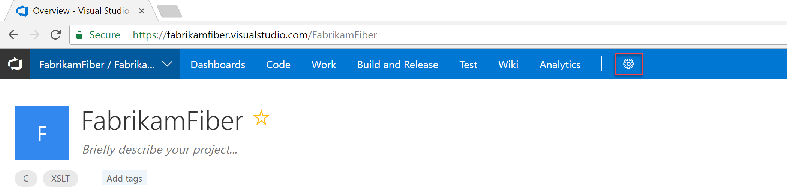

# Tutorial: Change individual permissions, grant select access to specific functions

[!INCLUDE [temp](../_shared/version-vsts-tfs-all-versions.md)]

The standard way for permissions to accrue to individuals are by adding user accounts to one or more built-in security groups. However, in certain instances, you'll want to grant additional permissions to select individuals, but perhaps not all permissions assigned to the security group. For example, you might want to grant several individuals the ability to add or edit area and iteration paths, but not have all permissions available to members of the Project Administrators group.

The three ways to change permissions for an individual are:

- Create a custom group, define permissions for that group, add the user account to the group
- For object-level permissions: Add the user account and set permissions
- For project or collection-level permissions: Search for the user account and selectively change their permission assignments

In this topic you'll learn how to:
> [!div class="checklist"]
> * Create a custom security group 
> * Set permissions for a custom security group 
> * Add members to a custom security group 
> * Change the permission assignments for an individual user account  

If you are new to administrating permissions and groups, review [About permissions and groups](about-permissions.md) to learn about permission states and inheritance.

[!INCLUDE [temp](../_shared/image-differences.md)]

<a id="create-custom-group" />

## Create a custom security group

Create a custom security group at the project-level or the collection-level. The method for creating a custom security group is the same, no matter at what level you add it. 

1. To create a project-level security group, open the web portal and choose the team project where you want to add users or groups. Choose the  gear icon to open the administrative context.

     

2. Open the **Security** page and and choose **Create group** to open the dialog for adding a group.

     

3. Enter a name for the group, and optionally a description.

    For example, here we define a Team Admins group.

    

4. Choose **Create group**.

<a id="set-permissions-custom-group" />

## Set permissions for a custom security group

1. To set permissions for the custom group you just created, click the group name and then set one or more permissions.

     

    For a description of each permission, see [Permissions and groups reference, project-level permissions](permissions.md#project-level-permissions).

2. Choose **Save changes**.

<a id="add-members-custom-group" />

## Add members to a custom security group

You add members to a custom security group in the same way you add users to a built-in group. 

1. Choose the security group, choose **Members**, and then choose **Add**.

     

2. Type the name of the user account into the text box. You can type several identities into the text box, separated by commas. The system will automatically search for matches. Choose the match(es) that meets your choice.

    

    > [!NOTE]
    > Users that have limited access, such as Stakeholders, won't be able to access select features even if granted permissions to those features. To learn more, see [Permissions and access](permissions-access.md).

## Change the permission assignments for an individual user account

### To change the permission at a project-level

1. From the project-level **Security** admin page, type the name of the user account in the **Filter users and groups** box and select the account whose permissions you want to change.

     

2. Change the permissions for the account, setting a permission as **Allow** or **Deny**.

     

    For a description of each permission, see [Permissions and groups reference, project-level permissions](permissions.md#project-level-permissions).

3. Choose **Save changes**.

### To change the permission at a collection level

1. Open the account-level or collection-level **Security** admin page and follow the instructions provided in the previous section for project-level permissions.

    For a description of each collection-level permission, see [Permissions and groups reference, collection-level permissions](permissions.md#collection-level).

### To change the permission at an object-level

1. From the web portal, open the Security dialog for the object whose permissions you want to set. For specific instructions, see these topics:

	> [!div class="mx-tdBreakAll"]
	> |Wiki & Dashboard permissions | DevOps permissions  |Agile/Work tracking permissions |  
	> |-------------|----------|---------|   
	> |- [README & Wiki](../collaborate/manage-readme-wiki-permissions.md) - [Dashboards](../report/dashboards/dashboard-permissions.md)  |- [Git branch](../git/branch-permissions.md) - [Git repository](set-git-tfvc-repository-permissions.md) - [TFVC](set-git-tfvc-repository-permissions.md) - [Builds](../pipelines/policies/set-permissions.md) - [Release definition security](../pipelines/policies/set-permissions.md) - [Approvals and approvers](../pipelines/release/approvals/index.md) |- [Area and iteration paths](../security/set-permissions-access-work-tracking.md) - [Work item query and folder](../work/track/set-query-permissions.md) - [Plan permissions](set-permissions-access-work-tracking.md#plan-permissions)|  

2. From the Security dialog, choose **Add** to add a user account. 

	

3. Type the name of the user account, choose search, and select the account you want.

4. Select the user name from the left pane and then update the permission assignments, setting **Allow** or **Deny** for specific permissions. 

    

    For a description of a specific permission, see [Permissions and groups reference](permissions.md).

5. Choose **Save changes**.

## Next steps

> [!div class="nextstepaction"]
> [Grant or restrict access to select features](restrict-access.md)

## Related articles

- [About permissions and groups](about-permissions.md)
- [Permissions and groups reference](permissions.md)
- [Set permissions at the project-level or project collection-level](set-project-collection-level-permissions.md)

<!--
You can do a search on an individual user and change one of their permissions. However, the preferred method  

User Voice requests: 
* Hide Work Item Types (WITs) based on permission/security group

Recommended permissions 
Team Admins - allow to create area and iteration paths; shared queries. 
-->
