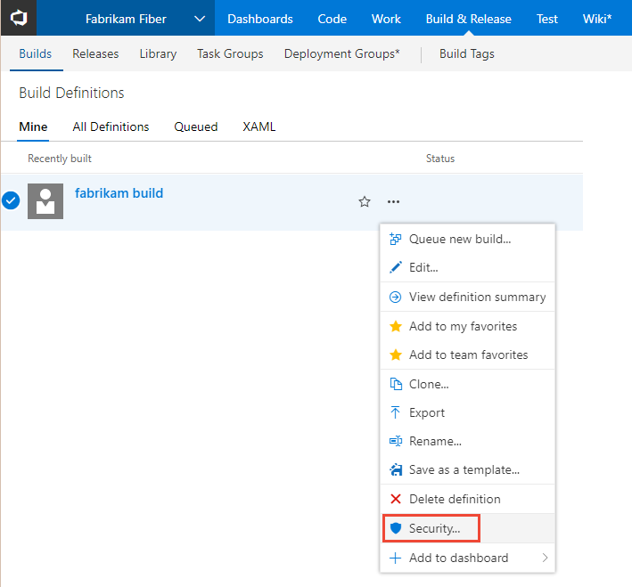
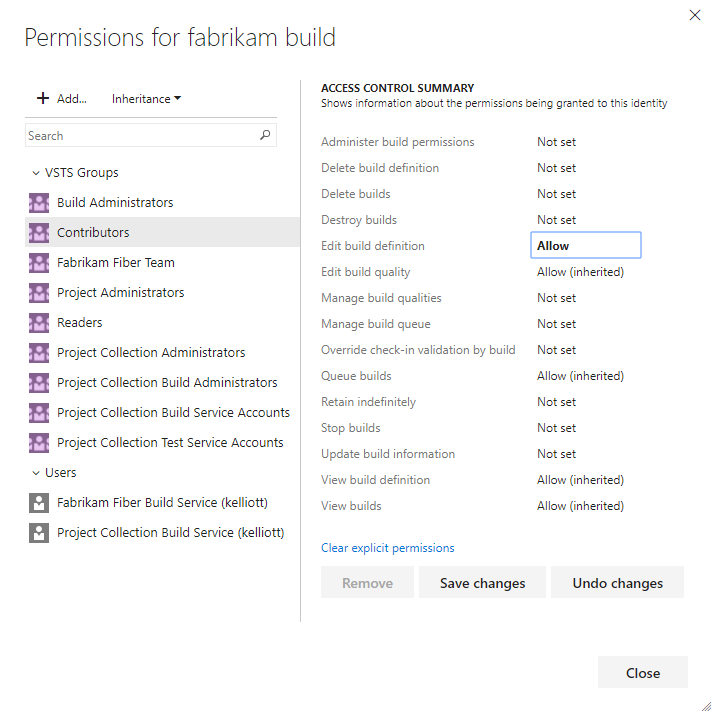
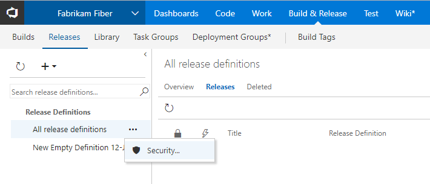
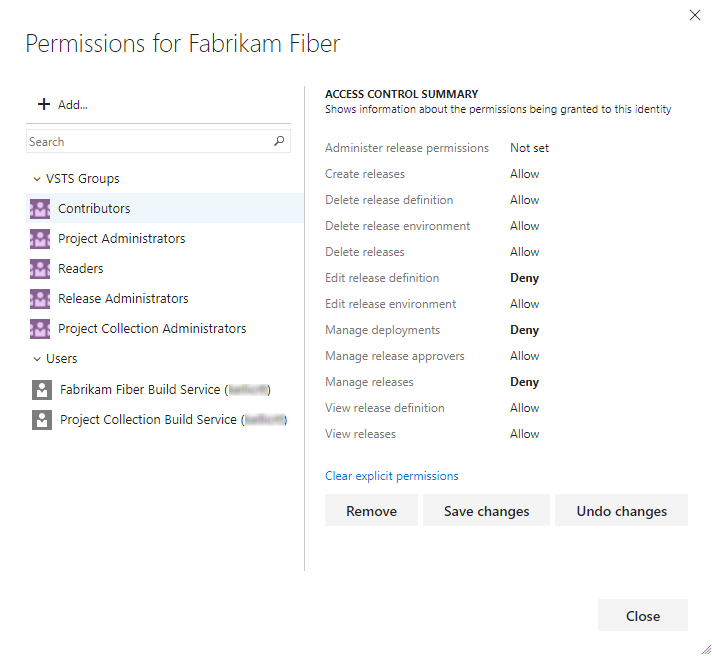
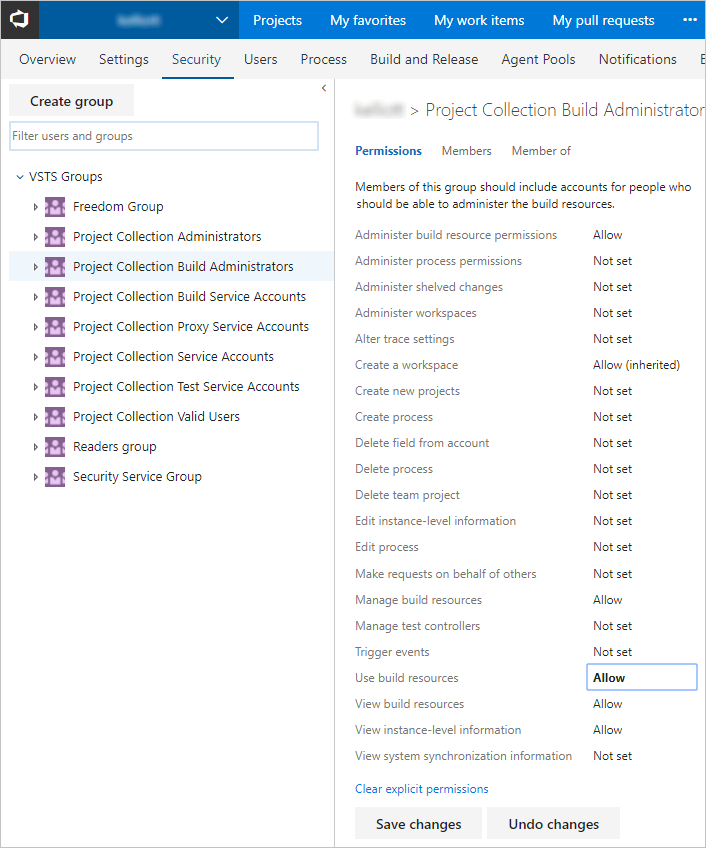

# Set build and release permissions 

[!INCLUDE [temp](../_shared/version-vsts-tfs-all-versions.md)]

Permissions for build and release functions are set at the object-level for a specific build or release. In addition, there are build permissions set at the  collection level. You grant or restrict permissions by setting the permission state to Allow or Deny, either for a security group or an individual user. 

For definitions of each build and release permission, see [Build and release permissions](../build-release/concepts/policies/permissions.md). 

## Set the permissions for a build definition  

1. From the web portal **Build-Release** hub, **Builds** page, open the Security dialog for a build definition.

	

2. Choose the group you want to set permissions for, and then change the permission setting to Allow or Deny. 

	For example, here we change the permission for Edit build definition for the Contributors group to Allow. 

	

3. Save your changes. 

## Set the permissions for all release definitions or a specific release definition   

1. From the web portal **Build-Release** hub, **Releases** page, open the Security dialog for all release definitions.

	

	If you want to manage the permissions for a specific release, then open the Security dialog for that release. 

2. Choose the group you want to set permissions for, and then change the permission setting to Allow or Deny. 

	For example, here we deny access to several permissions for the Contributors group. 

	

3. Save your changes. 
 
## Set collection-level permissions to administer build resources
 
0. From the web portal user context, open the admin context by clicking the  gear Settings icon and choosing Account or Collection settings.

0. Click Security, and then choose the group whose permissions you want to modify. 

	Here we choose the Build Administrators group and change the **Use build resources** permission. 

	

0. Save your changes. 

## Related notes 

- [Default build and release permissions](default-build-release-permissions.md)
- [Default permissions and access](permissions-access.md) 
- [Permissions and groups reference](permissions.md) 