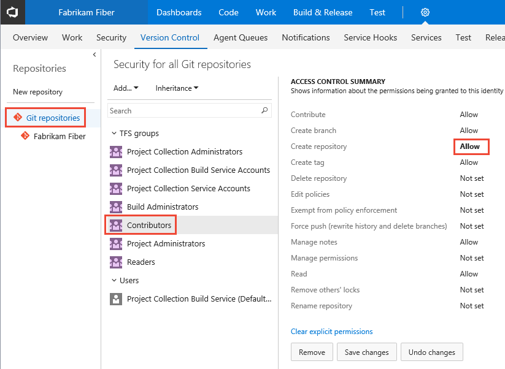
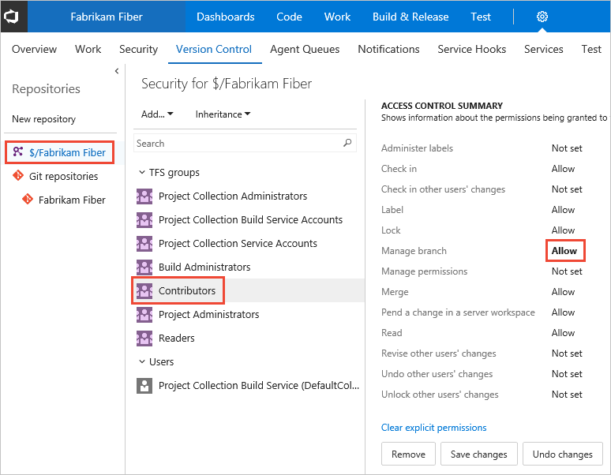

# Set repository permissions for Git or TFVC 

<!---
<b>Team Services | TFS 2017 | TFS 2015 | TFS 2013</b> 
-->

You can grant or restrict access to a repository by setting the permission state to Allow or Deny for a single user or a security group. For a description of each security group and permission level, see [Permissions and group reference](permissions.md).

## Set Git repository permissions

You can set the permissions for all Git repositories for a team project, or for a single repository. 

0. From the web portal user and team project context, open the admin context by clicking the  gear Settings icon and click **Version Control**.

0. To set the set the permissions for all Git repositories for a team project, click Git Repositories and choose the security group whose permissions you want to manage. 

	Otherwise, click a specific repository and choose the security group whose permissions you want to manage.   

3. Click the setting for the permission you want to change. 

	Here we grant permissions to the Contributors group to create repositories. 

	 

4. When done, click Save changes. 

<!---
 
--> 
 

 

## Set TFVC repository permissions

0. From the web portal user and team project context, open the admin context by clicking the  gear Settings icon and click **Version Control**.

1. Click the TFVC repository for the team project and then choose the security group whose permissions you want to manage.   

2. Change the permission setting to Allow or Deny. 

	For example, here we change the **Manage branch** permission to allow for all members of the Contributors group. 

	 

3. Save your changes. 
 
<!---
  
--> 

## Related notes

- [Git permissions prior to TFS 2017 Update 1](../setup-admin/git-permissions-before-2017.md)  