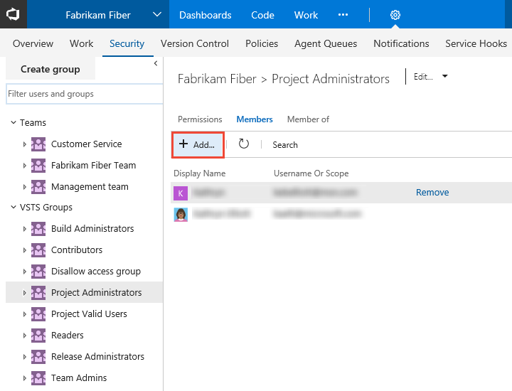
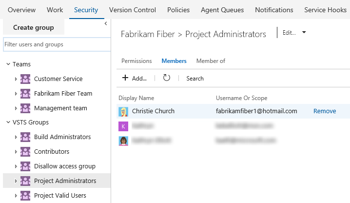
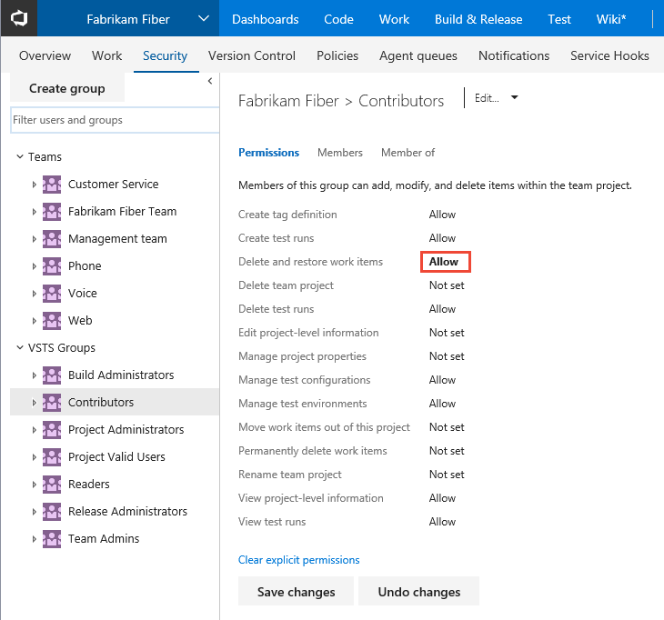
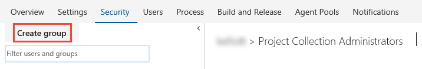
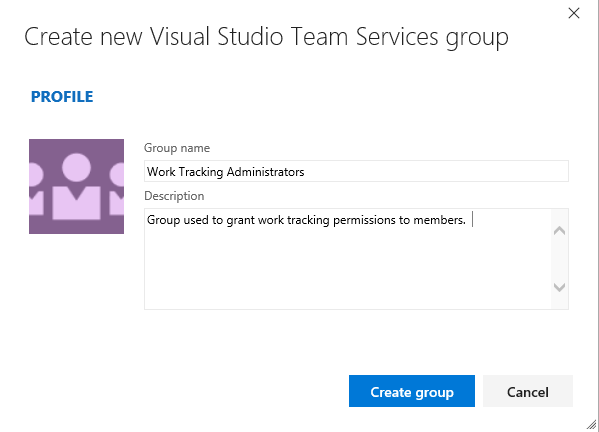
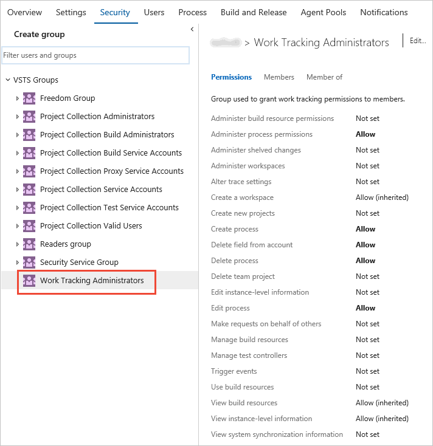

# Add administrators, set permissions at the project-level or project collection-level

[!INCLUDE [temp](../_shared/version-vsts-tfs-all-versions.md)]

Several permissions are set at the team project or at the account/team project collection level. You can grant these permissions by adding a user or group to one of the default security groups listed here. Or, you can create a custom security group within a level and add members to that group. You can then change the default permission settings.    

> [!div class="mx-tdBreakAll"]  
> | Project level | Account/Collection level| 
> |-------------|----------| 
> |- Build Administrators - Contributors - Project Administrators - Project Valid Users - Readers - Release Administrators - Team Admins |- Project Collection Administrators -  Project Collection Build Administrators - Project Collection Build Service Accounts - Project Collection Proxy Service Accounts - Project Collection Service Accounts - Project Collection Test Service Accounts - Project Collection Valid Users - Readers group - Security Service Group | 

> [!Note]  
> The above list indicates the latest groups defined for VSTS and TFS 2017. For earlier versions of TFS, the list may differ. Only add service accounts to [TFS service account groups](../tfs-server/admin/service-accounts-dependencies-tfs.md). To understand valid user groups, see [About permissions and groups, Valid user groups](about-permissions.md#validusers). 

For a description of each group and each permission, see [Permissions and groups reference, Groups](permissions.md#groups).

> [!TIP] 
> For users who will manage features provided at the project-level admin 
> context&mdash;such as, teams, area and iteration paths, repositories, 
> service hooks, and service end points&mdash;add them to the Project  
> Administrators group. 
> For users who will manage features provided at the collection-level admin 
> context &mdash;such as, team projects, processes, retention policies and 
> resource limits, agent pools, and extensions&mdash;add them to the Project  
> Administrators group.  

## Prerequisites

* You must have a team project. If you don't have a team project yet, create one in [VSTS](../user-guide/sign-up-invite-teammates.md) or set one up in an [on-premises TFS](../accounts/create-team-project.md).
* To manage permissions or groups at the project level, you must be a member of the Project Administrators Group or have your **Edit project-level information** set to Allow.  
* To manage permissions or groups at the collection or instance level, you must be a member of the Project Collection Administrators Group or have your **Edit instance-level information** set to Allow.  

<a id="project-level" />
## Add a user or group to a security group

As roles and responsibilities change, you might need to change the permission levels for individual members of a team project. The easiest way to do that is to add the user or a group of users to a pre-defined security group. 

Here we show how to add a user to the built-in Project Administrators group. The method is similar to adding an Azure Active Directory or Active Directory group. 

0. Open the admin context from the user/team project context, click the  gear settings icon, and click the **Security** tab. 

	If you don't have a team project yet, create one in [VSTS](../user-guide/sign-up-invite-teammates.md). 

0. Click the security group, Project Administrators, and then click Members, and then click **Add**.  

	 

0. Type the name of the user account into the text box. You can type several identities into the text box, separated by commas. The system will automatically search for matches. Click the match(es) that meets your choice. 

	 

	> [!NOTE]   
	> Users that have limited access, such as Stakeholders, won't be able to access select features even if granted permissions to those features. To learn more, see [Permissions and access](permissions-access.md).

0. Click Save changes and you'll notice the user Project Administrators, and then click Members, and then click **Add**.  
 
	 

## Change the permission level for a project-level group 

0. To open the admin context from the user/team project context, click the  gear settings icon, and click the **Security** tab. 

0. Click the group whose permissions you want to change. 

	For example, here we grant permission to the Contributors group to delete and restore work items.  

	  

	For a description of each permission, see [Permissions and groups reference, project-level permissions](permissions.md#project-level-permissions).

	> [!NOTE]   
	> You can't change the permission settings for the Project Administrators group. This is by design.  

0. Click **Save changes**.   

<a id="collection-level" />
## Add a group and change its permissions at the account or collection-level group 

0. Open the admin context for the account or collection. Click the  gear Settings icon and choose **Account Settings** (VSTS) or **Collection Settings** (TFS), and then click the **Security** tab. 

0. Click Create group to open the dialog for adding a group. 

	 

0. Enter a name for the group, and optionally a description. 
 
	For example, here we define a Work Tracking Administrators group.  

	 

	For a description of each permission, see [Permissions and groups reference, collection-level permissions](permissions.md#collection-level).

0. Click the group name you just created and change the permission levels. 

	Here we grant this group permissions to [manage customizations for the Inheritance process model](../work/customize/process/manage-process.md). 

	 

0. Click **Save changes**.   

> [!NOTE]   
> You can't change the permission settings for the Project Collection Administrators group. This is by design.  

##On-premises TFS 

For on-premises TFS, see these additional topics: 

- [Add a user as a TFS server administrator](../tfs-server/add-administrator-tfs.md) 
- [TFS service account groups](../tfs-server/admin/service-accounts-dependencies-tfs.md)  

If your TFS deployment is integrated with a SharePoint product or SQL Server Reports, you'll need to manage membership for those products separately from their websites. 

-  [Set SharePoint site permissions](../security/set-sharepoint-permissions.md) 
-  [Grant permissions to view or create SQL Server reports in TFS](../report/admin/grant-permissions-to-reports.md). 

## Related notes

- [About permissions and groups](about-permissions.md)
- [Permissions lookup reference](permissions-lookup-guide.md)
- [Permissions and groups reference](permissions.md)
- [Team administrator permissions](../work/scale/team-administrator-permissions.md)

