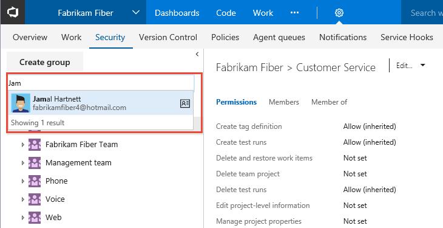
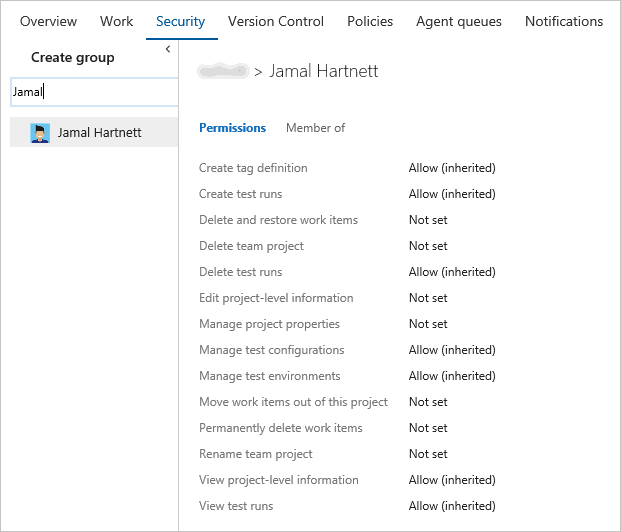
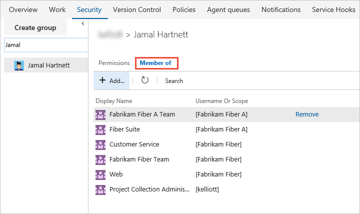
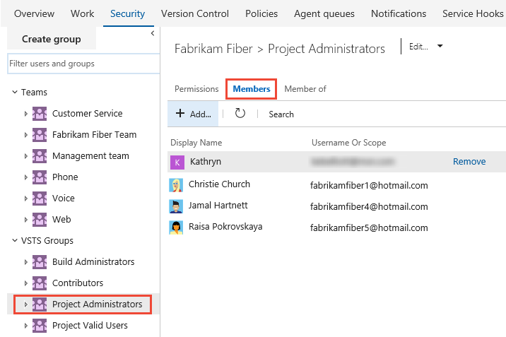

# View permissions for yourself or others  

**VSTS | TFS 2017 | TFS 2015 | TFS 2013** 

You can view your permissions or those defined for another. That way, if you don't have the permission to access a feature or function, you can request it from the right resource. 

Permissions are set at the collection, team project, and object level as described in [About permissions and groups](about-permissions.md).  So to view the permissions you have, you need to open the permissions at the object, project, or collection level. 

> [!NOTE]   
> This topic shows how to view permissions assigned to a user as the project-level. However, the steps are similar whether you work from the Security dialog of an object or at the account/collection level. 
 
## View project-level permissions 

0. Open the admin context from the user/team project context. Click the  gear settings icon, and click the **Security** tab. 

0. Begin typing the name into the *Filter users and groups* box. The system will automatically show the names that being with the characters you type.  

	  

0. Click the name you want. The project-level permissions you have set are based on the groups you belong to or those specifically set for your account.      

	   

0. Click **Member of** to see which security groups the user belongs to.  

	Here we see that the user account, Jamal Hartnett, belongs to several teams as well as the Project Collection Administrators group. 

	    

## Determine who is a member of the Project Administrators group   

If you aren't a project administrator, and you need to be, find someone who is, and have them add you. You can find who is a member of the Project Administrators group by clicking on that group and seeing who are members. 
 

## Try this next
> [!div class="nextstepaction"]
> [Add users to a team project or team](add-users-team-project.md) 

