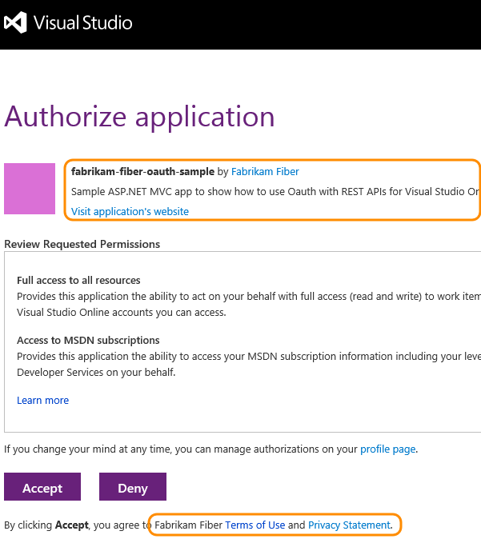
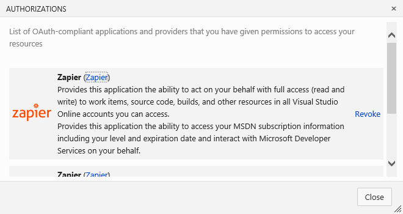

#  Manage authorization of services to access Azure DevOps 

[!INCLUDE [version-lt-eq-azure-devops](../includes/version-lt-eq-azure-devops.md)]

When you use a service that's integrated with Azure DevOps, the industry-standard OAuth 2.0 authorization framework provides safe and secure access to your resources by those other services.
With OAuth, you grant a service the authorization to access your Azure DevOps resources, such as work items, source code, and build results.

- Authorizations are bound to your credentials, so the service can use the authorization to access your resources in Azure DevOps.
- Use your Microsoft account or your work account to authorize the service.
- The service that you authorize never has access to your Azure DevOps credentials.
- Revoke any authorizations that you've granted to other services.

## Authorize a service

A typical authorization flow might go like this:

1. You're using a service that uses Azure DevOps resources, so the service requests authorization.
1. If you're not already signed in, Azure DevOps prompts you for your credentials.

    

2. After you sign in, you get the authorization approval page.

   

   Services can only request full access to all of the resources that are available to you through the REST APIs, so the authorization request might not be specific.

3. Review the request and approve the authorization.

   The authorized service uses that authorization to access resources in your Visual Studio account.

   To ensure an authorization request is legitimate:

- Look for the Azure DevOps branding across the upper portion of the authorization approval page.
- Ensure the authorization approval page URL begins with ```https://app.vssps.visualstudio.com/```.
- Pay attention to any HTTPS-related security warnings in your browser.
- Remember that other services don't ask for your credentials directly. They let you provide them to Azure DevOps through the authorization approval page.

## Manage authorizations

To see the services that you've authorized to access your account, go to [https://app.vssps.visualstudio.com/Profile/View](https://app.vssps.visualstudio.com/Profile/View)
and select **Manage authorizations**.



You can revoke any authorizations here, so the service can't access your account on your behalf.
