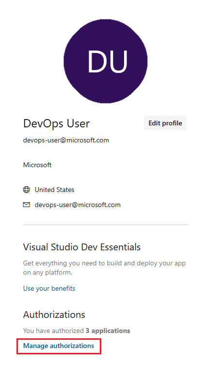

# Integrate with service hooks

[!INCLUDE [version](../includes/version-tfs-2017-through-vsts.md)]

Service hooks let you run tasks on other services when events happen in your Azure DevOps 
projects. For example, create a card in Trello when a work item is created 
or send a push notification to your team's mobile devices when a build fails. You can also use service hooks in custom apps and services as a more efficient way to drive activities when events happen in your projects.

## What is a service hook?

Service hook **publishers** define a set of *events*. **Subscriptions** listen for the *events* and 
define **actions** to take based on the event. 
Subscriptions also target **consumers**, which are external services that can run their own actions, 
when an event occurs.


> [!NOTE]
> For Azure DevOps Services connecting to endpoints for Service Hooks requires allowing IP ranges for inbound connection. For details, see [Allowed address lists and network connections, IP addresses and range restrictions](../organizations/security/allow-list-ip-url.md#range-restrictions).


## Available services

These services are available as the target of service hooks. To learn about others apps and services that 
integrate with Azure DevOps Services, visit the [Visual Studio Marketplace](https://marketplace.visualstudio.com/#AzureDevOpsServices)

Pipelines                  |  Collaborate 	                    | Customer support	                    | Plan and track 	             | Integrate
-------------------		           |  -------------	                    | ----------------		                | ---------		                 | -------
[AppVeyor](https://www.appveyor.com/docs/) | [Flowdock](https://www.flowdock.com/api/integration-getting-started) | [UserVoice](https://feedback.uservoice.com/knowledgebase/articles/363410-vsts-azure-devops-integration)  | [Trello](./services/trello.md) | [Azure Service Bus](../pipelines/tasks/utility/publish-to-azure-service-bus.md)
[Bamboo](https://confluence.atlassian.com/bamboo/enabling-webhooks-946626050.html)	   |	HipChat (No longer supported)	|	[Zendesk](https://support.zendesk.com/hc/articles/204890268-Creating-webhooks-with-the-HTTP-target) 		|  |	[Azure Storage](/azure/azure-functions/functions-integrate-storage-queue-output-binding)
[Jenkins](./services/jenkins.md)   |	[Hubot](https://hubot.github.com/docs/)	|											|			|	[Grafana](./services/grafana.md) |
[MyGet](https://docs.myget.org/docs/reference/webhooks)	   |	[Office 365](/office/office-365-management-api/office-365-management-activity-api-reference#start-a-subscription)	|											|			|	[Web Hooks](./services/webhooks.md) |
[Slack](./services/slack.md)	   |[Slack](./services/slack.md)	|	|	[Slack](./services/slack.md)	| [Zapier](https://zapier.com/apps/webhook/integrations) 
| [Microsoft Teams](./services/teams.md) | [Microsoft Teams](./services/teams.md) |   |[Microsoft Teams](./services/teams.md) | [Datadog](./services/datadog.md)  

## Create a subscription

When you integrate one of these services with Azure DevOps Services, 
you have to create a new subscription. In many cases, 
you have to do some work in the other service, too. For specific details, 
look at the information on the service that you're interested in.

::: moniker range=">= azure-devops-2019"

1.	Open the admin page for a project in web access.
    
    

2. 	Create a subscription by running the wizard.

    
 
3.	Select the service you want to integrate with.

    :::image type="content" source="./media/selectservice.png" alt-text="Select the service to integrate":::   
 
4.	Select the event to trigger on and any filters (if applicable).

    :::image type="content" source="./media/Trello_wizard_Event.png" alt-text="Select the event to trigger on and any filters":::  
 
5.	Select an action to run on the target service. 

	> [!NOTE]
    > The list of available actions may be limited based on the event type you selected. 

    :::image type="content" source="./media/Trello_wizard_Action.png" alt-text="Select an action for the target service":::  

6.	To confirm the settings are correct, test the subscription and then finish the wizard.

    :::image type="content" source="./media/test1.png" alt-text="Test notification 1 for Azure DevOps Server 2019, 2020, and Azure DevOps Services":::  
	
    :::image type="content" source="./media/test2.png" alt-text="Test notification 2 for Azure DevOps Server 2019, 2020, and Azure DevOps Services":::  
 
::: moniker-end

::: moniker range=">= tfs-2017 < azure-devops-2019"

1.	Open the admin page for a project in web access.

    :::image type="content" source="./media/openadmin.png" alt-text="Screenshot of the admin page."::: 

2. 	Create a subscription by running the wizard.

    :::image type="content" source="./media/createfirst.png" alt-text="Screenshot of highlighted box, Create subscription, to select to run the subscription wizard."::: 
 
3.	Select the service you want to integrate with.

    :::image type="content" source="./media/selectservice.png" alt-text="Select the service to integrate":::  
 
4.	Select the event to trigger on and any filters (if applicable).

    :::image type="content" source="./media/Trello_wizard_Event.png" alt-text="Select the event to trigger on and select any desired filters":::  
 
5.	Select an action to run on the target service. 

	> [!NOTE]
    > The list of available actions may be limited based on the event type you selected. 

    :::image type="content" source="./media/Trello_wizard_Action.png" alt-text="Select an action to perform on the target service":::  

6.	To confirm the settings are correct, test the subscription and then finish the wizard.

    :::image type="content" source="./media/test1.png" alt-text="Test notification 1":::  
	
    :::image type="content" source="./media/test2.png" alt-text="Test notification 2":::  
 
::: moniker-end

## Q & A

<!-- BEGINSECTION class="md-qanda" -->

<a id="subscription-permissions" /> 

#### Q: What permissions do I need to set up a subscription?

A: *Edit subscriptions* and *View subscriptions*. By default, only project administrators 
have these permissions. To grant them to other users directly, you can use the [command line tool](../organizations/security/manage-tokens-namespaces.md) or the [Security](/rest/api/azure/devops/security/) REST API. 

#### Q: What are the security implications of granting *Edit subscriptions* and *View subscriptions* permissions?

A: The user with these permissions can see all subscriptions created in the 
project and the notification history for those subscriptions. That user can then 
create any type of service hook subscription in that project. If the user sets up a 
subscription for a resource that they don't otherwise have permission to access, the 
subscription won't get triggered. 

For example: if I don't have access to work items in area path XYZ, and I set up a 
subscription to the work item update events, I won't get notifications for updates 
to work items in area path XYZ. However, if another user who does have access to the work 
items in area path XYZ is receiving those "work item update" events, then I could see the 
notification history of that other user's events, which includes work item data that I 
don't otherwise have access to.

#### Q: Can I create service hook subscriptions for a project programmatically?

A: Yes. For more information, see [Create a service hooks subscription](create-subscription.md).

#### Q: Can I remove an app's access to my organization after I've authorized it?

A: Yes. You can revoke authorizations from your profile.

1. 	Go to your profile page from https://visualstudio.com. 

	Make sure you start from the Visual Studio site (https://visualstudio.com) 
	instead of your organization (```https://dev.azure.com/{orgName}```) because, right now, 
	your profile accessed from your organization takes you to the wrong implementation 
	of the authorizations management feature.

2.	Manage your authorizations.
	
		
	
3.	Revoke any authorizations you no longer want to allow.

	
	
#### Q: Why can't we setup Service Hooks for HipChat anymore?

A: Atlassian officially dropped support for HipChat. See more on that announcement [here](https://www.atlassian.com/partnerships/slack/faq#faq-3ccc5a61-711b-4ef2-9ca2-3a34b2ec143b).


<!-- ENDSECTION -->


## Related articles

* [Troubleshoot service hooks and FAQs](troubleshoot.md)
* [Visual Studio Marketplace](https://marketplace.visualstudio.com/azuredevops)
* [Billing information](../organizations/billing/overview.md)