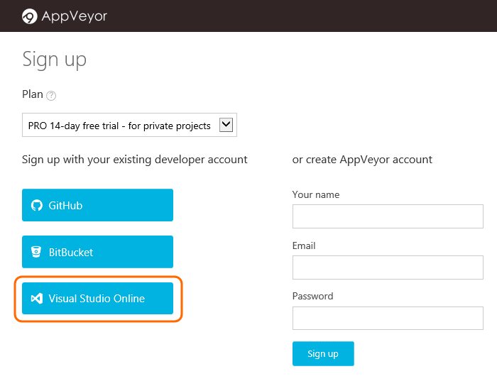
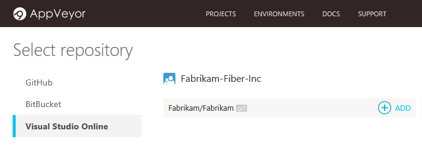
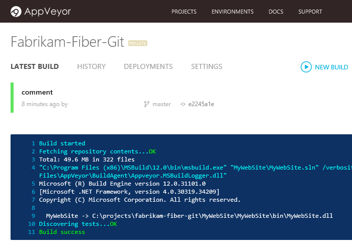
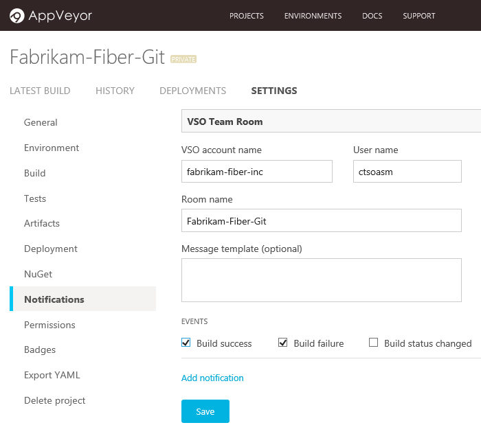

# AppVeyor with Azure DevOps Services

Set up continuous integration builds in AppVeyor for the code in your Azure DevOps Services Git repositories.

## Integrate AppVeyor with Azure DevOps Services

1. If you don't have an AppVeyor account, [sign up](http://ci.appveyor.com/signup) with your Azure DevOps Services organization.

   

1. Create a new project.

   

1. Add a Git repository from your Azure DevOps Services organization.

   

   Now an AppVeyor CI build will start whenever you push code to your repository in Azure DevOps Services.
   
   

## Pricing
Azure DevOps Services doesn't charge for the framework for integrating with external services. Check out the specific service's site
for pricing related to their services. 

## Q & A

<!-- BEGINSECTION class="m-qanda" -->

#### Q: Do I need to sign into AppVeyor using my Visual Studio ID in order to set up this integration?

A: No. If you use an organization that's not already associated with your Visual Studio ID,
you'll authorize access to your Azure DevOps Services organization when you add Git repositories from Azure DevOps Services. 

#### Q: Does AppVeyor change anything in my Azure DevOps Services organization?

A: Yes. It adds a service hook subscription to your project.

#### Q: What happens if I remove the AppVeyor project?

A: The AppVeyor service hook subscription is removed from Azure DevOps Services.

#### Q: Can I get notification of AppVeyor builds in my Azure DevOps Services team room?

A: Yes, you can set that up in the AppVeyor Notifications page.

#### Q: If I reconfigure AppVeyor from Azure DevOps Services, where do I get the webhook ID used by AppVeyor?

A: From the projects settings: 

#### Q: Where can I get more information about AppVeyor?

A: [AppVeyor.com](http://appveyor.com).

<!-- ENDSECTION -->
