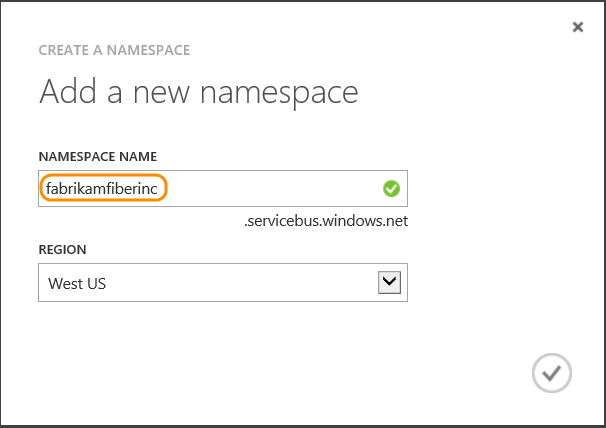
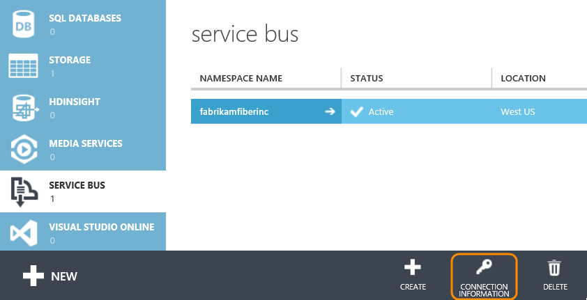
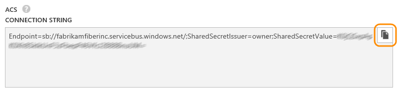
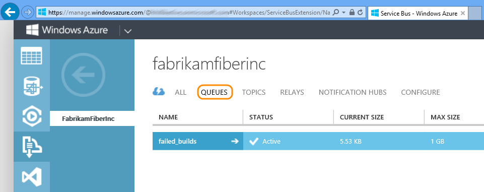
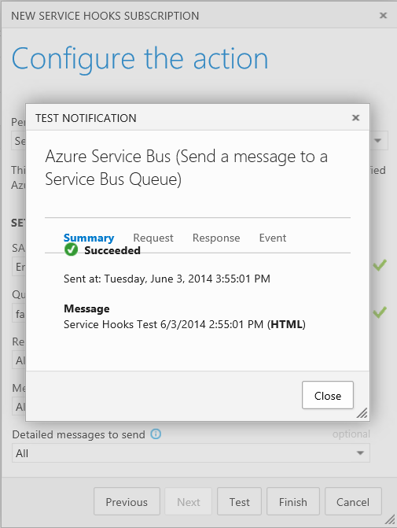
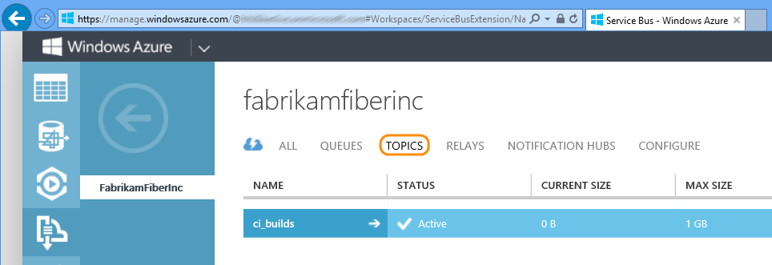
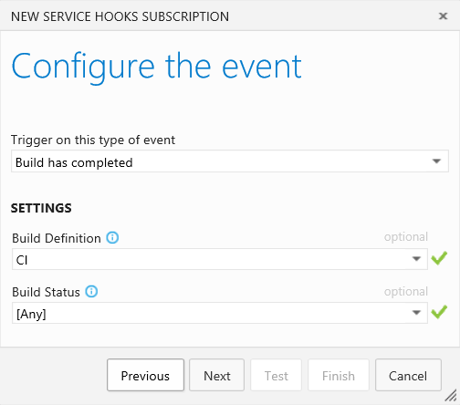
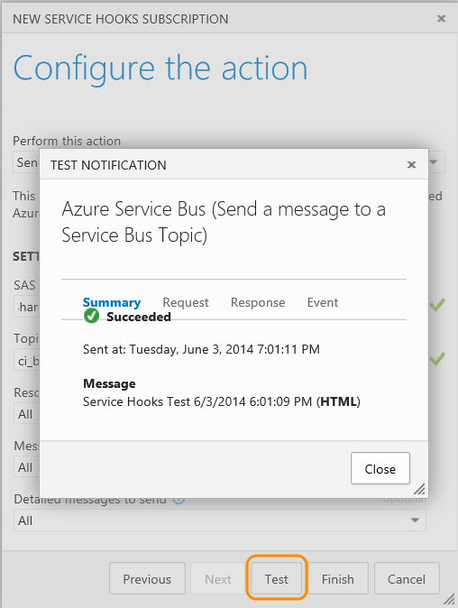

# Microsoft Azure service bus with Azure DevOps Services

The Microsoft Azure service bus provides messaging between services and applications.
You can choose the type of service bus you want to send Azure DevOps Services messages to:

- **Queue:** The Service Bus queue is a simple process.
A sender sends a message to a queue, and a receiver
picks up that message at a later time. A queue is limited to a single receiver.

- **Topics:** Topics are similar to queues, but they let
each receiving application create its own subscription by defining a filter.
A subscriber will see only the messages that match that filter.

- **Notification hub:** Use a notification hub to implement push notifications.
Notification hubs work for both consumer and enterprise applications
for mobile platforms including Android, iOS, Windows Phone 8, and Windows Store.

## Create a Microsoft Azure service bus namespace

1. If you don't have a Microsoft Azure account, get one here.

2. In the Microsoft Azure portal, in the navigation pane select **SERVICE BUS**
and then create a new namespace. 

   

3. Enter a name for the namespace and choose a region.

   

4. View the connection information for the namespace.

   


5. Copy the SAS connection string. You will need to provide this value
when you create a Service Hook subscription. 

   

## Send messages to the service bus queue

1. In the Azure portal, verify the queue you want to use, or create one.

   

2. Create or modify your app's code to receive Azure DevOps Services
messages using a Azure Service Bus queue. For details, go [here](http://azure.microsoft.com/documentation/articles/service-bus-dotnet-how-to-use-queues/).

0. Go to your Azure DevOps Services project service hooks page: `https://dev.azure.com/{orgName}/{project_name}/_apps/hub/ms.vss-servicehooks-web.manageServiceHooks-project`

	

	Click **Create Subscription**.

5. Pick and configure the Azure DevOps Services event.

   

6. Configure what to do when the action occurs. In this case,
to send Visual Studio messages to a service bus queue.
For the SAS connection string, use the value that you copied earlier
from the namespace connection information page. 

   

7. Test the service hook subscription and finish the wizard.

   

Now the messages are set up.
You can verify this in your application or service.

## Send messages to the service bus topic

1. In the Azure portal, verify the queue you want to use, or create one. 

   

2. Create or modify your app's code to receive
Azure DevOps Services messages using a Azure Service Bus topic.
For details, go [here](http://azure.microsoft.com/documentation/articles/service-bus-dotnet-how-to-use-topics-subscriptions/).

3. Open the admin page for the project in Azure DevOps Services.

4. On the **Service Hooks** tab, run the subscription wizard.

   For details about the subscription wizard, go [here](../index.md). 

   

5. Pick and configure the Azure DevOps Services event.

   

6. Configure what to do when the event occurs. In this case,
to send Visual Studio messages to a service bus topic.
For the SAS connection string, use the value that you copied earlier
from the namespace connection information page. 

   

7. Test the service hook subscription and finish the wizard.

   

Now the messages are set up. You can verify this in your application or service.

You can also observe activity in the Windows Azure dashboard.  


## Send messages to the notification hub

Push Azure DevOps Services messages to your application using a notification hub.
For more information about notification hubs go [here](https://msdn.microsoft.com/library/azure/jj891130.aspx/).

1. In the Azure portal, verify the notification hub you want to use, or create one.

   

2. Create or modify an app to receive messages from Azure DevOps Services through the notification hub. 
The steps and code required to set up your app depend on the target platform (Android, iOS, Windows Phone 8, and Windows Store).
For details, go [here](http://azure.microsoft.com/documentation/services/notification-hubs/).

3. Open the admin page for the project in Azure DevOps Services.

4. On the **Service Hooks** tab, run the subscription wizard.
 
   For details about the subscription wizard, go [here](../index.md).

   

5. Pick and configure the Azure DevOps Services event.

   

6. Configure what to do when the event occurs. In this case,
to send Visual Studio messages to a service bus notification hub.
For the SAS connection string, use the value that you copied earlier
from the namespace connection information page.
You can use tags to filter the messages to specific registered apps
or users. For more information regarding tags go [here](https://msdn.microsoft.com/library/azure/dn530749.aspx/).

   

7. Test the service hook subscription and finish the wizard.

Now the messages are set up.
You can verify this in your application or service.

## Pricing
Azure DevOps Services doesn't charge for the framework for integrating with external services. Check out the specific service's site
for pricing related to their services. 

## Q & A

<!-- BEGINSECTION class="m-qanda" -->

#### Q: When using Azure DevOps Services service hooks connected to a Azure notification hub, how do I pass parameters in a push notification template?

A: Use the following taking care to concatenate the variable and value in the param node:

```
    "<?xml version=\"1.0\" encoding=\"utf-8\"?>" +
    "<wp:notification wpnotification\"="" xmlns:wp="\">" +
            "<wp:toast>" +
                "<wp:param>" + "{'?VariableName='" + "$(parameter)" + "}</wp:param>" +
        "</wp:toast>" +
    "</wp:notification>";
```

#### Q: Can I get more information about the differences between service bus queues and service bus topics?

A: Get more details [here](http://azure.microsoft.com/documentation/articles/fundamentals-service-bus-hybrid-solutions/).

#### Q: Can I programmatically create subscriptions?

A: Yes. See details [here](../create-subscription.md).

<!-- ENDSECTION -->
