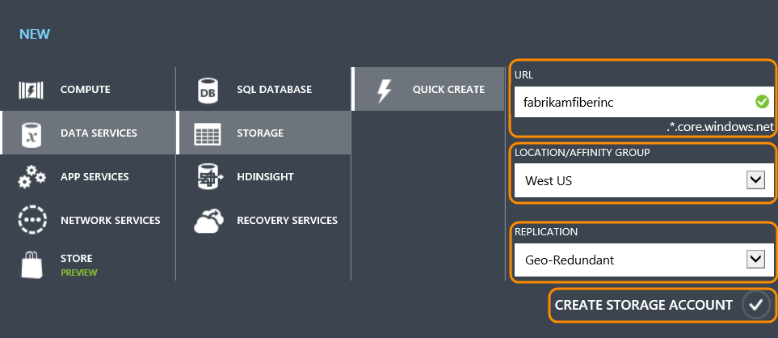
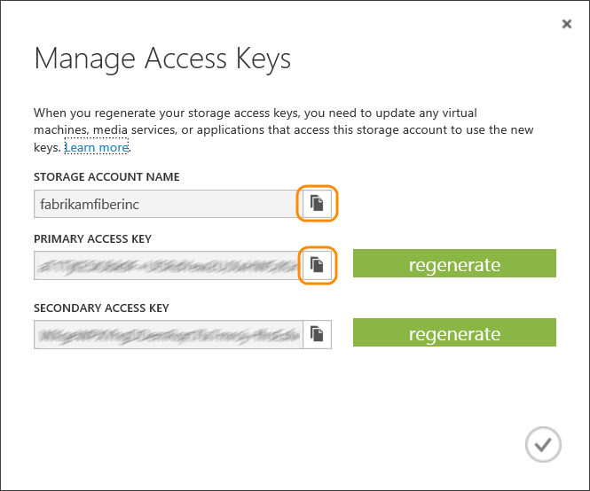
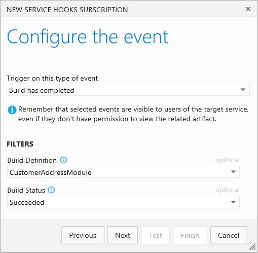
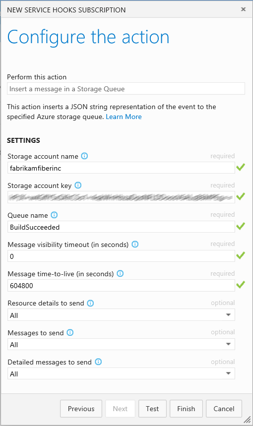
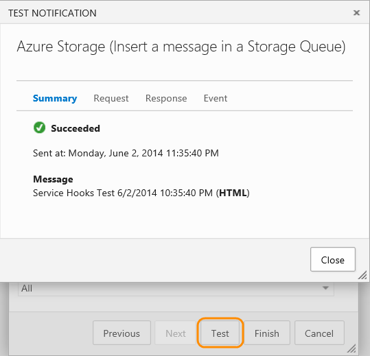

# Azure Storage Queue

Insert a JSON string message in a storage queue in response to
[events](../events.md) from Azure DevOps Services.
For example, you can insert a queue message when a work item is created or changed, or a build occurs.

The storage queue provides reliable, persistent messaging within and between services.
Messages can be accessed from anywhere in the world via authenticated calls using HTTP or HTTPS.
A single queue message can be up to 64 KB in size,
and a queue can contain millions of messages, up to the total capacity limit of a storage account. 

## Create a Microsoft Azure storage account

1. If you don't have a Microsoft Azure account, get one [here](http://azure.microsoft.com/).

2. In the Microsoft Azure portal, at the bottom of the navigation pane, click **NEW**.

   

3. Click **DATA SERVICES**, then **STORAGE**, and then click **QUICK CREATE**.

   - In URL, type a subdomain name to use in the URI for the storage account.
    The entry can contain from 3-24 lowercase letters and numbers.
    This value becomes the host name within the URI that is used
    to address Blob, Queue, or Table resources for the subscription.

   - Choose a Region/Affinity Group in which to locate the storage.
    If you plan to use storage from your Azure application,
    select the same region where you will deploy your application.

   - Optionally, you can enable geo-replication.

   - Click **CREATE STORAGE ACCOUNT**.

   

4. Select the storage account and click **MANAGE ACCESS KEYS**.

   

5. Copy the storage account name and primary access key.
You need to provide these values when you create a Service Hook subscription.

   

You do not have to add a storage queue.
This can be done when you create a service hook subscription.

## Create a service hook subscription

0. Go to your Azure DevOps Services project service hooks page: `https://dev.azure.com/{orgName}/{project_name}/_apps/hub/ms.vss-servicehooks-web.manageServiceHooks-project`

	

	Click **Create Subscription**.

3. Pick the Azure DevOps Services event to use as a trigger to insert a message in a storage queue.

   

4. Enter the storage account name and the queue where you want to insert the event into. For the account key, use the primary access key value that you copied when you managed the access keys.

   

5. Test the service hook subscription and finish the wizard.

   

Now the event is set up.
Your messages are put into the Azure storage queue and are available for reading.

## Reading messages from the queue (.NET Framework)

An event matching a Service Hook subscription will be added
to the selected storage queue as a JSON string.
You can then use APIs provided by the Microsoft Azure SDK
for .NET Framework (and other languages) to access the message:

1. [How to: Peek at the next message](http://www.windowsazure.com/develop/net/how-to-guides/queue-service/#peek-message)

2. [How to: Dequeue the next message](http://www.windowsazure.com/develop/net/how-to-guides/queue-service/#get-message)

Example:

```csharp
    // Retrieve storage account from connection string
    CloudStorageAccount storageAccount = CloudStorageAccount.Parse(
        CloudConfigurationManager.GetSetting("StorageConnectionString"));

    // Create the queue client
    CloudQueueClient queueClient = storageAccount.CreateCloudQueueClient();

    // Retrieve a reference to a queue
    CloudQueue queue = queueClient.GetQueueReference("myqueue");

    // Get the next message
    CloudQueueMessage retrievedMessage = queue.GetMessage();

    //Process the message in less than 30 seconds, and then delete the message
    queue.DeleteMessage(retrievedMessage);
```

## Pricing
Azure DevOps Services doesn't charge for the framework for integrating with external services. Check out the specific service's site
for pricing related to their services. 

## Q & A

<!-- BEGINSECTION class="m-qanda" -->

#### Q: Can I get more information about Microsoft Azure storage?

A: Yes, go [here](/azure/storage/queues/storage-dotnet-how-to-use-queues).

#### Q: Can I programmatically create subscriptions?

A: Yes, see details [here](../create-subscription.md)

<!-- ENDSECTION -->