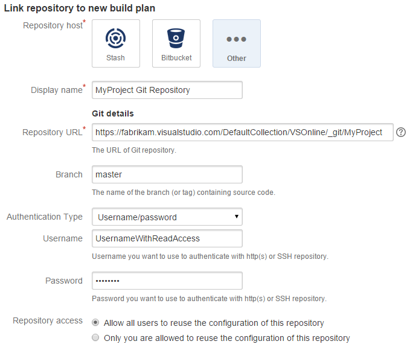
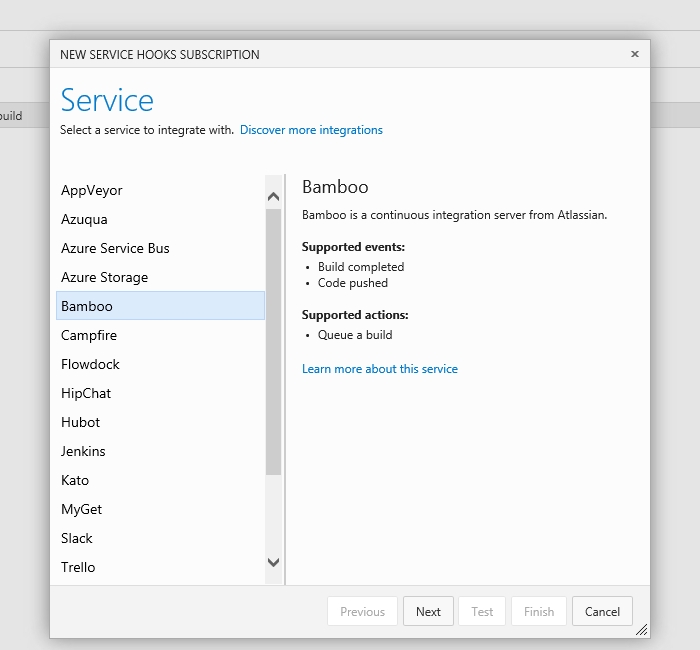
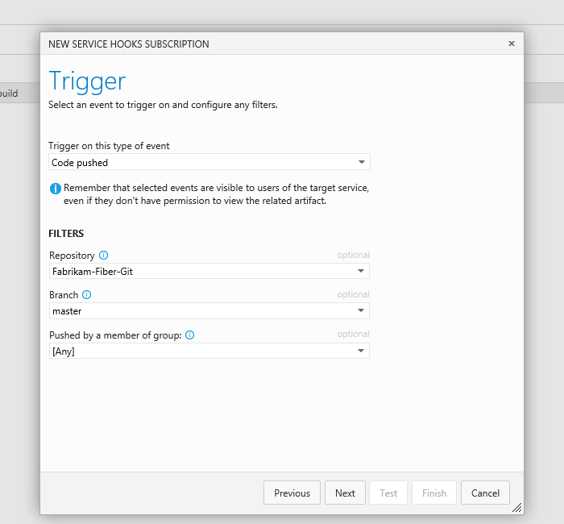
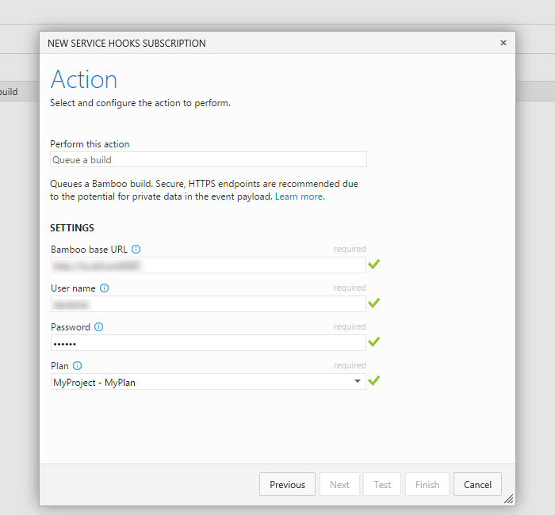

# Bamboo with Azure DevOps Services

If you use Bamboo to build your apps, you can store your code in Azure DevOps Services
and continue to use Bamboo for your continuous integration builds.
You can trigger a Bamboo build when you push code to your project's
Git repository,  when you check code in to Team Foundation version control,
or when an Azure DevOps Services build finishes.

## Configure Bamboo

1. If you haven't already, set up a [Bamboo](https://www.atlassian.com/software/bamboo/) server.

2. If you use Bamboo on-premises, [enable HTTPS](https://confluence.atlassian.com/display/BAMBOO/Advanced+actions) on your Bamboo server.

3. If your project uses Team Foundation version control and not Git, install the [TFS repository add-on](https://marketplace.atlassian.com/search?q=tfs) for Bamboo.

## Enable Azure DevOps Services basic authentication
1. If you haven't already, enable [alternate credentials](../../repos/git/auth-overview.md#alternate-credentials) in your Azure DevOps Services profile.
Be sure to set a secondary user name because you won't be able to use your email address
to connect Azure DevOps Services to Bamboo.

   

## Set up a Bamboo build plan

1. In Bamboo, create a new plan by choosing **Create** > **Create a new plan** from the menu bar.

2. Under **Link repository to new build plan**, choose **Other** > **Git** and set the URL for your Git repository in Azure DevOps Services.
The URL is in the form ```https://dev.azure.com/{orgName}/DefaultCollection/_git/{projectName}```.

3. Next to **Authentication Type**, choose **Username/password** and enter the [alternate credentials](../../repos/git/auth-overview.md#alternate-credentials) of an organization with read access to the repository. 

   

## Trigger Bamboo from Azure DevOps Services 

0. Go to your Azure DevOps Services project service hooks page: `https://dev.azure.com/{orgName}/{projectName}/_apps/hub/ms.vss-servicehooks-web.manageServiceHooks-project`

	

	Click **Create Subscription**.

3. Add Bamboo.

   

4. Pick the event from Azure DevOps Services that you want to trigger a build in Bamboo.

   

5. Configure the action you want Bamboo to take.

   

Now, when that event occurs in Azure DevOps Services, your Bamboo build will be triggered.

## Pricing
Azure DevOps Services doesn't charge for the framework for integrating with external services. Check out the specific service's site
for pricing related to their services. 

## Q & A

<!-- BEGINSECTION class="m-qanda" -->

#### Q: Can I build part of my app in Azure DevOps Services and part in Bamboo?

A: Yes. You can trigger a Bamboo build when your Azure DevOps Services build is completed so that you use both systems to build your app.

#### Q: Can I programmatically create subscriptions?

A: Yes, use [REST APIs](../create-subscription.md).

<!-- ENDSECTION -->