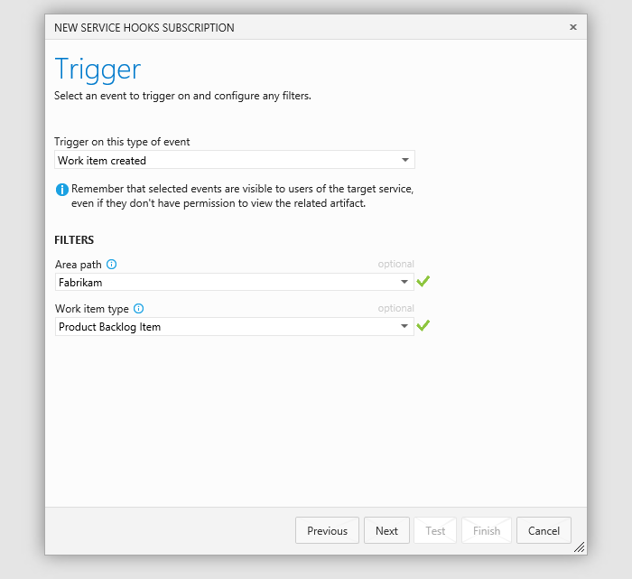
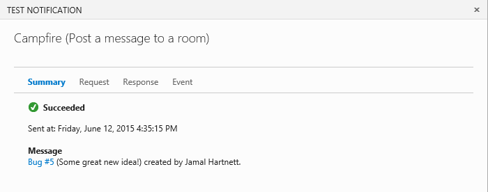
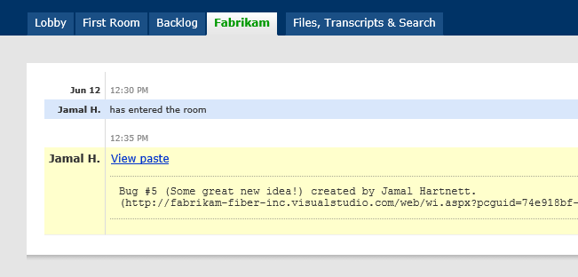

# Notifications and Campfire

Post messages to a room in Campfire in response to events from Azure DevOps Services.
For example, you can post a message when a work item is created or changed, or a build occurs.

## Get a Campfire authorization token

1. If you don't have a Campfire account, get one [here](https://campfirenow.com/signup), and create a room.

2. Copy the token from your Campfire profile page. 

   

## Post messages to a room

0. Go to your Azure DevOps Services project service hooks page: `https://dev.azure.com/{orgName}/{project_name}/_apps/hub/ms.vss-servicehooks-web.manageServiceHooks-project`

	

	Click **Create Subscription**.

3. Configure the Azure DevOps Services event that will post a message in a Campfire room.

   

4. Configure the action with your Campfire account name, authentication token and room. 

   

5. Test the service hook subscription and finish the wizard. 
   
   

    Now the messages are set up. Go to Campfire and see the messages. 

    

## Pricing
Azure DevOps Services doesn't charge for the framework for integrating with external services. Check out the specific service's site
for pricing related to their services. 

## Q & A

<!-- BEGINSECTON class="m-qanda" -->

####Q: Can I programmatically create subscriptions?

A: Yes, see details [here](../create-subscription.md).

####Q: Where can I get more information about Campfire?

A: At [campfirenow.com](https://campfirenow.com/).

<!-- ENDSECTION -->