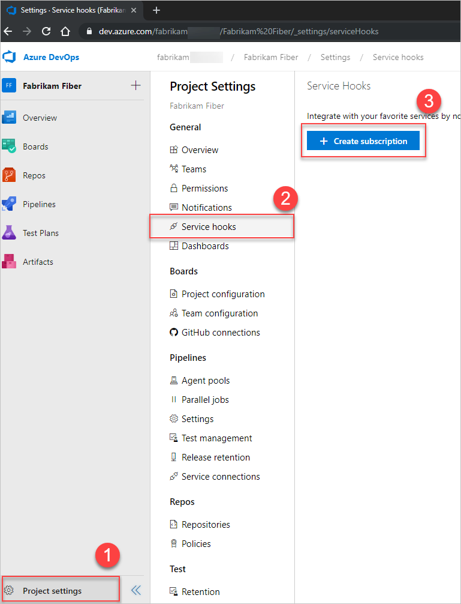
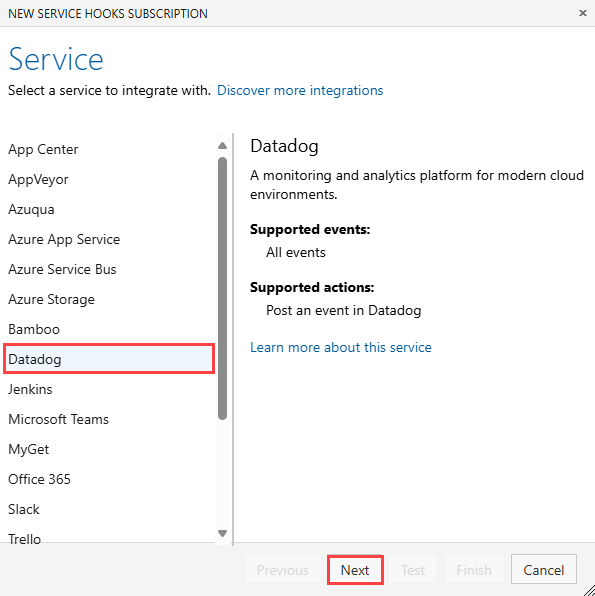

# Create a service hook for Azure DevOps with Datadog 

[!INCLUDE [version-azure-devops](../../includes/version-azure-devops.md)]

Create events and metrics in Datadog in response to events from Azure DevOps. Use these metrics and events in Datadog to create dashboards, troubleshoot issues, and create monitors to alert you of critical issues. Accepts all Azure DevOps event types.

## Get your Datadog API key

1. If you don't have a Datadog account, get one at [Get started with Datadog](https://aka.ms/AzureDevOpsDataDog).
2. In the Datadog app, go to [Integrations > API](https://aka.ms/AzureDevOpsDataDogAPI)
3. Create a new key or select an existing one, and then copy the key to your clipboard. 

## Start sending DevOps events to Datadog

1. Go to **Project settings > Service hooks**: `https://{orgName}/{project_name}/_settings/serviceHooks`.

2. Select **Create subscription**.

   

3. Select the Datadog service.

   

    Configure the triggering event.

   

4. Paste (ctrl+v) your Datadog API Key into the required field.
5. Indicate whether your Datadog account is US or EU.

   

7.	Test the service hook subscription and finish the wizard.
8.	Repeat steps 2-5 for each event type you want to send to Datadog. Datadog accepts and encourages users to send all event types.
9.	Now that the service hooks are configured, go to Datadog to see events and metrics start to flow into your environment.

## FAQs

### Q: Can I create service hook subscriptions programmatically?

A: Yes. For details, see [Create a service hooks subscription programmatically](../create-subscription.md). Submit to either of the following Datadog endpoints: 
- **US:** `https://app.datadoghq.com/intake/webhook/azuredevops?api_key=<API_KEY>`
- **EU:** `https://app.datadoghq.eu/intake/webhook/azuredevops?api_key=<API_KEY>`

### Q: How can I use these events in Datadog?

A: Azure DevOps events sent to Datadog are useful for creating dashboards, setting up monitors, and finding correlations during troubleshooting. You can also use them to get insights into how your developer operations processes impact application performance. 

### Q: What event types can I send to Datadog?

A: Datadog accepts all event types.

### Q: Can I get more general information about Datadog?

A: Yes, see [datadoghq.com](https://datadoghq.com).

