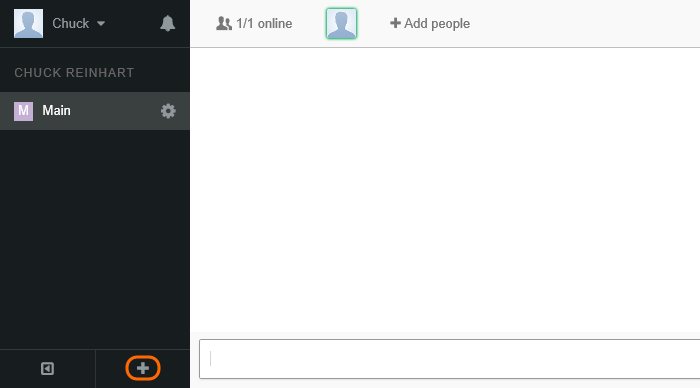
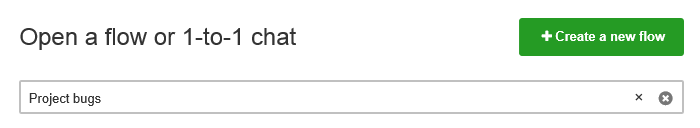
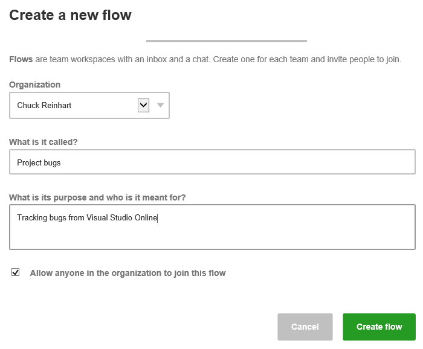
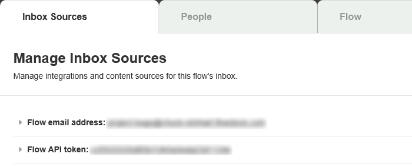
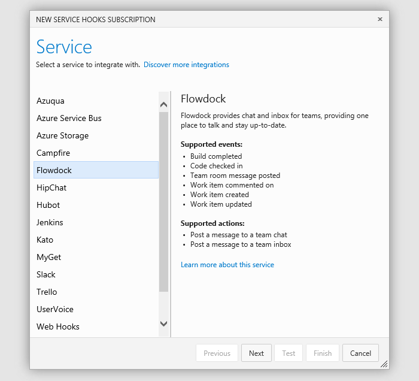
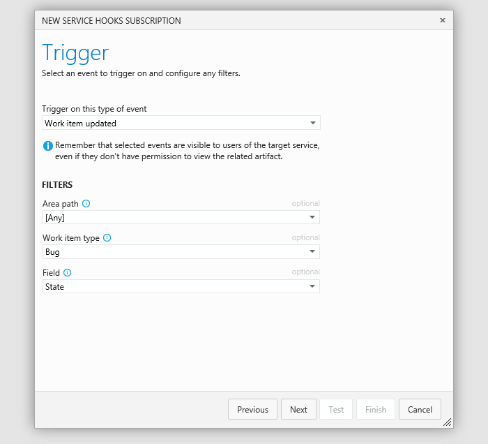

# Notifications and Flowdock

Azure DevOps Services can post messages to your flow in Flowdock
so everyone will know when code has been pushed or checked in, 
a build has finished, or a work item has been created or updated.

## Set up a flow

1. If you don't have a Flowdock account, get one [here](https://flowdock.com/signup).

1. In Flowdock, add a flow.

   

1. Create the flow. 

   

1. Configure the flow.

   

1. Go to the flow's administration page.

   

1. Get the API token.

   

## Use a service hook to push messages

0. Go to your Azure DevOps Services project service hooks page: `https://dev.azure.com/{orgName}/{project_name}/_apps/hub/ms.vss-servicehooks-web.manageServiceHooks-project`

	

	Click **Create Subscription**.

1. Choose Flowdock

   

1. Configure the Azure DevOps Services event that will push a message to Flowdock. 

   

1. Tell Flowdock what action to take.

   

1. Test the service hook subscription and finish the wizard.

   

Now messages will be posted to your flow in Flowdock.

## Pricing
Azure DevOps Services doesn't charge for the framework for integrating with external services. Check out the specific service's site
for pricing related to their services. 

## Q & A

<!-- BEGINSECTION class="m-qanda" -->

####Q: Can I programmatically create subscriptions?

A: Yes, see details [here](../create-subscription.md).

####Q: Where can I get more information about Flowdock?

A: At [flowdock.com](https://www.flowdock.com/).

<!-- ENDSECTION -->
