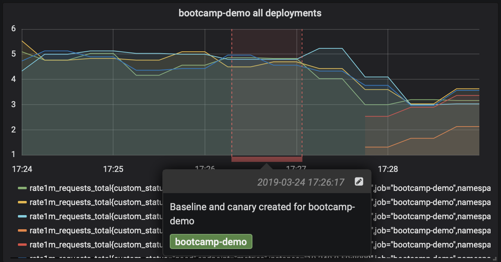
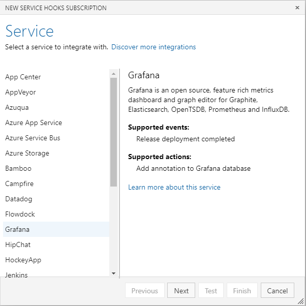
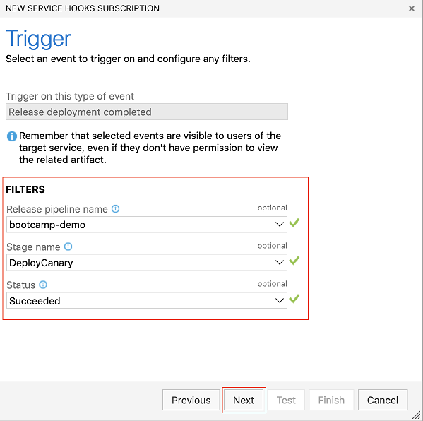
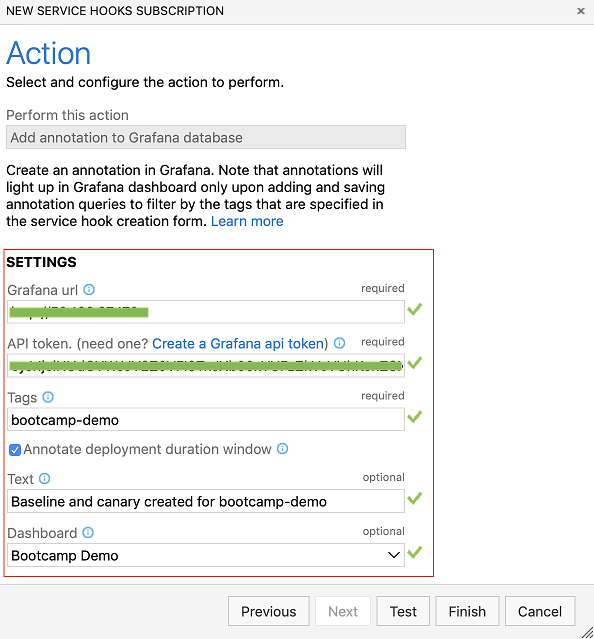

# Create a service hook for Azure DevOps with Grafana

[!INCLUDE [version](../../includes/version-vsts-plus-azdevserver-2019.md)]

Grafana is an open source, feature-rich metrics dashboard and graph editor for Graphite, Elasticsearch, OpenTSDB, Prometheus and InfluxDB. You can use the service hook described in this article to annotate Grafana dashboards upon completion of deployments in Azure Pipelines.

::: moniker range="azure-devops-2019"

> [!NOTE]   
> The service hook for Grafana is supported for Azure DevOps Server 2019.1 and later versions.   

::: moniker-end

## Create a service hook subscription

1. Navigate to project settings: 

	`https://dev.azure.com/{orgName}/{project_name}/_settings/serviceHooks`

	

	Select **Create Subscription**.

2. Choose **Grafana** among the list of services and choose **Next**

    

3. For **Release deployment completed** event, configure the optional filters - **Release pipeline name**, **Stage name** and **Status**

    

4. Provide the Grafana URL and [Grafana API token](https://go.microsoft.com/fwlink/?linkid=2085301) required for Azure DevOps to post annotations. 
	- If the **Annotate deployment duration window** checkbox is checked, the annotation added corresponds to the duration of the deployment (start and end timestamps of deployment). 
	- If unchecked, annotation corresponds to only the completion timestamp of the deployment. The dashboard input can be used to choose a specific dashboard as the target of annotations rather than the default behavior of annotating all dashboards. 

5. CHoose **Test** to verify that Azure DevOps is able to use the provided configuration and successfully create a subscription. 

6. Once verified, choose **Finish** to complete the creation of subscription.

    
