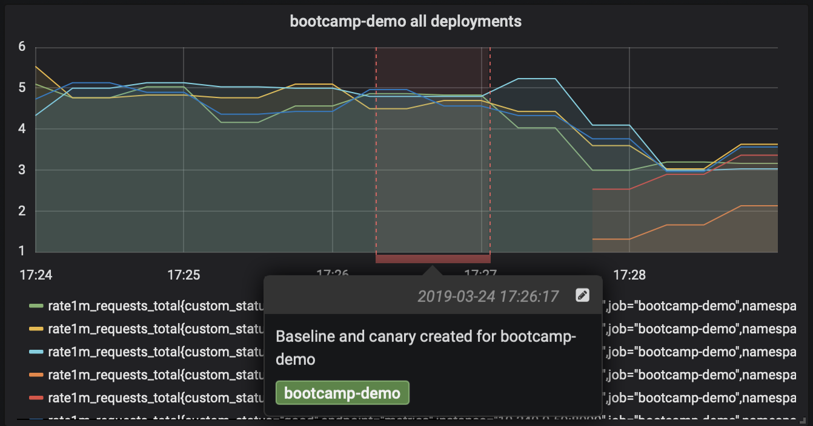
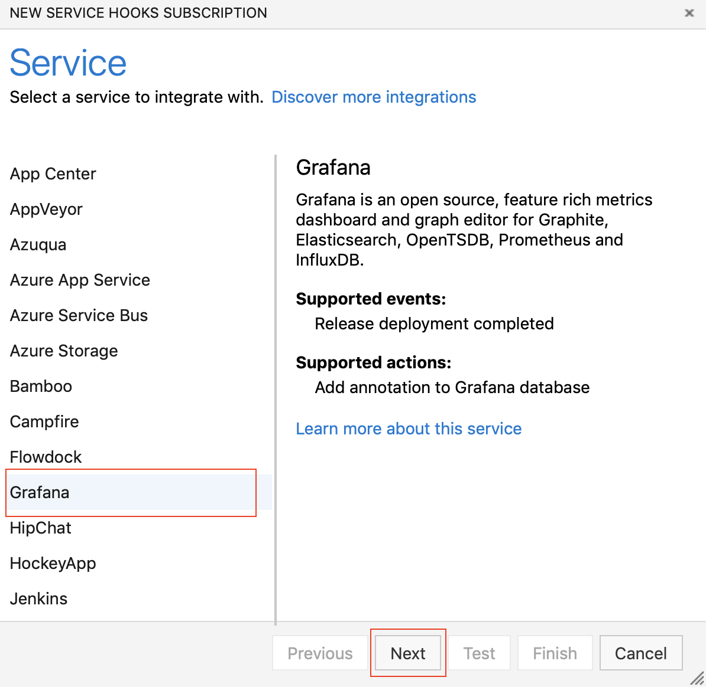

# Create a service hook for Azure DevOps Services and TFS with Grafana

Grafana is an open source, feature rich metrics dashboard and graph editor for Graphite, Elasticsearch, OpenTSDB, Prometheus and InfluxDB. The service hook described in this document can be used to annotate Grafana dashboards upon completion of deployments in Azure Pipelines.

## Create a service hook subscription
1. Navigate to project settings: 

	`https://dev.azure.com/{orgName}/{project_name}/_settings/serviceHooks`

	

	Select **Create Subscription**.

2. Choose **Grafana** among the list of services and click on **Next**

    

3. For **Release deployment completed** event, configure the optional filters - **Release pipeline name**, **Stage name** and **Status**

    

4. Provide the Grafana URL and [API token](https://go.microsoft.com/fwlink/?linkid=2085301) required for Azure DevOps to post annotations. If the **Annotate deployment duration window** checkbox is checked, the annotation added corresponds to the duration of the deployment (start and end timestamps of deployment). If unchecked, annotation corresponds to only the completion timestamp of the deployment. The dashboard input can be used to choose a specific dashboard as the target of annotations rather than the default behaviour of annotating all dashboards. Click on **Test** to verify that Azure DevOps is able to use the provided configuration and successfully create a subscription. Once verified, click on **Finish** to complete the creation of subscription.

    
