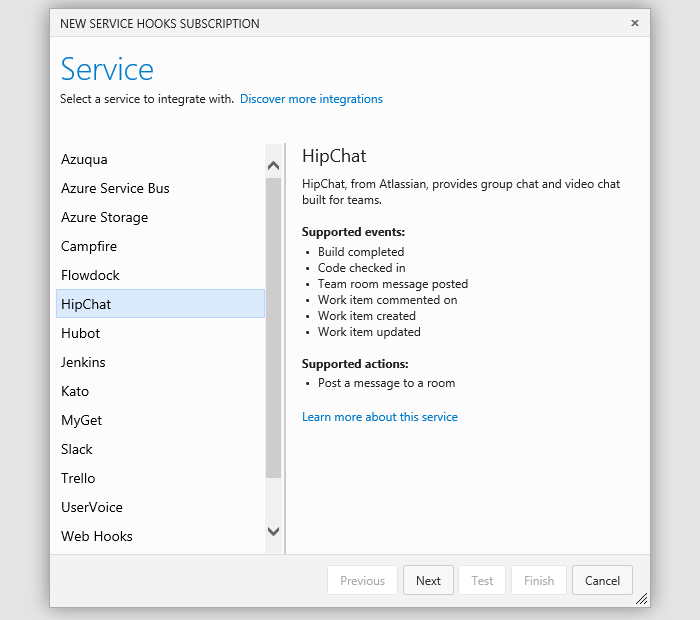
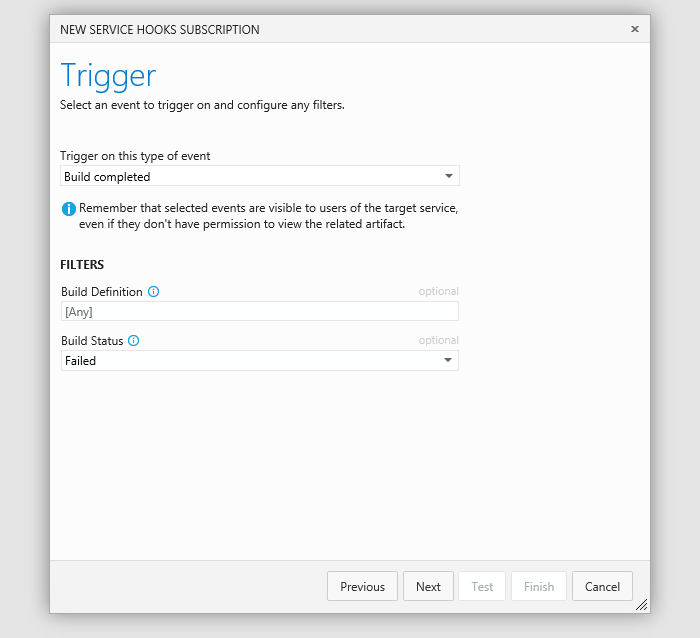
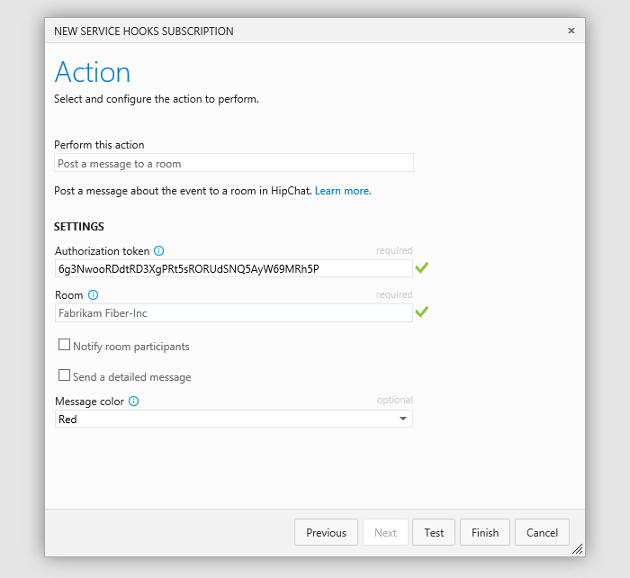
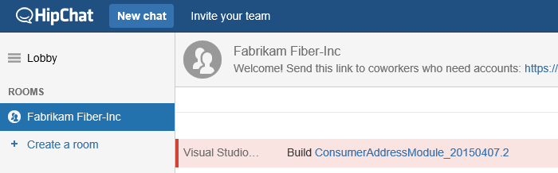

# HipChat with Azure DevOps Services

Post messages to a room in HipChat in response to events from Azure DevOps Services.
For example, when code is pushed, or a build occurs.

Get a HipChat authorization token

1. If you don't have a HipChat account, get one [here](https://hipchat.com/).

2. In HipChat, get a room token. 

   

3. Copy the token.

   

## Post a message to a room

0. Go to your Azure DevOps Services project service hooks page: `https://dev.azure.com/{orgName}/{project_name}/_apps/hub/ms.vss-servicehooks-web.manageServiceHooks-project`

	

	Click **Create Subscription**.

3. Choose HipChat.

   

3. Configure the Azure DevOps Services event that you want to post a message in HipChat.

   

4. Tell HipChat what to do when the event occurs.

   

5. Test the service hook subscription and finish the wizard.

   

Now the messages are setup. Go to HipChat and see the messages appear. 

## Pricing
Azure DevOps Services doesn't charge for the framework for integrating with external services. Check out the specific service's site
for pricing related to their services. 

## Q & A

<!-- BEGINSECTION class="m-qanda" -->

####Q: Can I programmatically create subscriptions?

A: Yes, see details [here](../create-subscription.md).

####Q: Where can I get more information about HipChat?

A: At [hipchat.com](https://www.hipchat.com/).

<!-- ENDSECTION -->

