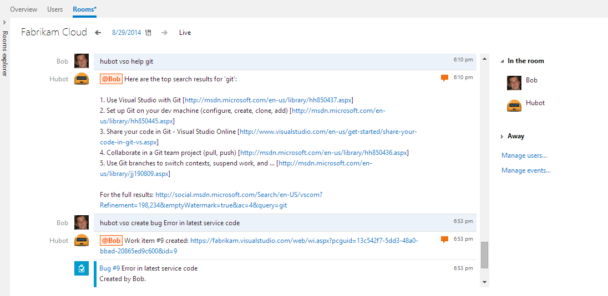
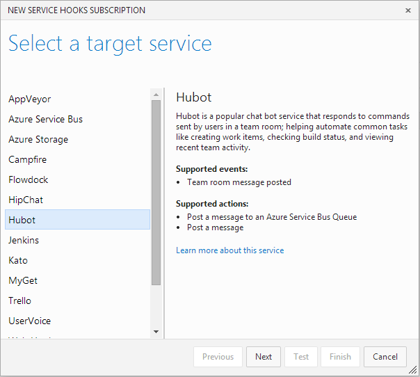
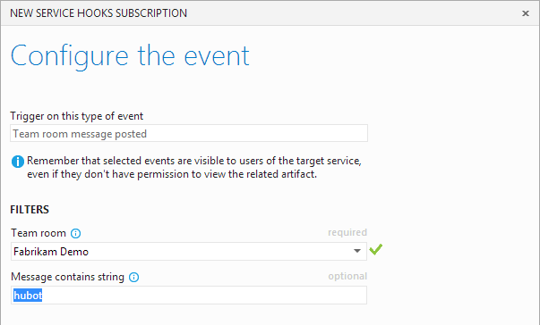
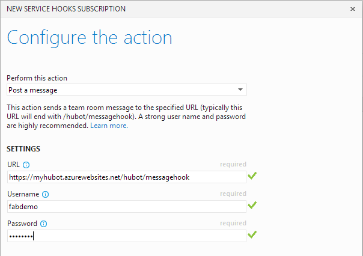

# Hubot with Azure DevOps Services

Using Hubot, you can type a command in your Azure DevOps Services team room
to create a work item, queue a build, recall what you last worked on, and more.
For example, create a bug by typing "hubot vso create bug Error in latest service code"
or assign a work item with the command "hubot vso assign 123 to Sally".
And you can add scripts to extend what your Hubot service can do.



## Set up Hubot

Set up a Hubot instance and configure the Azure DevOps Services adapter
to accept messages from a team room in Azure DevOps Services.

1. If you don't already have your own Hubot instance, set one up.
A good way to do that is to deploy Hubot to an Azure web site.

   1. Create an Azure web site enabled for local Git deployment.

   2. Create your own Hubot instance locally by cloning [Hubot](https://github.com/github/hubot).

2. Add the [Azure DevOps Services adapter for Hubot](https://github.com/scrumdod/hubot-VSOnline).

3. Add the [Azure DevOps Services scripts for Hubot](https://github.com/scrumdod/vso-hubotscripts).

4. Push your configured Hubot instance to your web site.

5. Set the necessary configuration parameters on your site,
including HUBOT_ADAPTER=vsonline, and start it.

6. Create a service hook subscription in your Azure DevOps Services project
that sends messages from a team room to your Hubot instance.

Here are more [detailed instructions](https://github.com/scrumdod/hubot-VSOnline)
for deploying a Hubot instance to an Azure web site.

## Subscribe Hubot to team room messages in Azure DevOps Services

Now that you've set up Hubot, create a service hook subscription
that will forward messages in an Azure DevOps Services team room
to your Hubot instance.

0. Go to your Azure DevOps Services project service hooks page: `https://dev.azure.com/{orgName}/{project_name}/_apps/hub/ms.vss-servicehooks-web.manageServiceHooks-project`

	

	Click **Create Subscription**.

3. Select the Hubot service.

   

4. Configure an event to trigger when there are messages posted in your team room.

   

5. Select the **Post a message** action from the drop-down and supply the full URL and user name and password of your Hubot instance.

   

6. Click **Finish** to save the subscription.

Now when you post commands starting with "hubot" to the selected room, Hubot will receive the command and respond back to that room.

## Commands

Here are the available Azure DevOps Services commands available to users:

* ```vso assign <work item list> to <user name>```: Assigns one more or more work item(s) to a user (comma separated ids)
* ```vso build <build pipeline number>```: Triggers a build
* ```vso builds```: Shows a list of build pipelines
* ```vso commits [last <number> days]```: Shows a list of commits you have made in the last day (or specified number of days)
* ```vso create pbi|bug|feature|impediment|task <title> with description <description>```: Creates a work item, and optionally sets a description (repro step for some work item types)
* ```vso forget credentials```: Removes the access token issued to Hubot when you accepted the authorization request
* ```vso help <search text>```: Get help from VS related forums about the &lt;search text&gt;
* ```vso me```: Shows info about your Azure DevOps Services profile
* ```vso projects```: Shows a list of projects
* ```vso room default <key> = <value>```: Sets a room default project, etc.
* ```vso room defaults```: Shows room defaults (e.g. project, etc)
* ```vso status```: Shows status for the Azure DevOps Services service
* ```vso today```: Shows work items you have touched and code commits you have made today

## Pricing
Azure DevOps Services doesn't charge for the framework for integrating with external services. Check out the specific service's site
for pricing related to their services. 