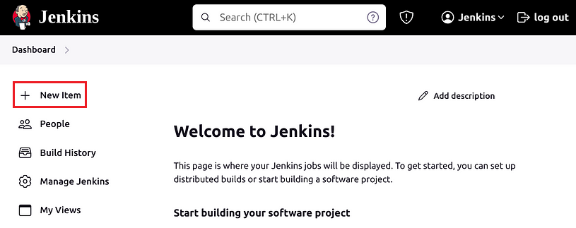
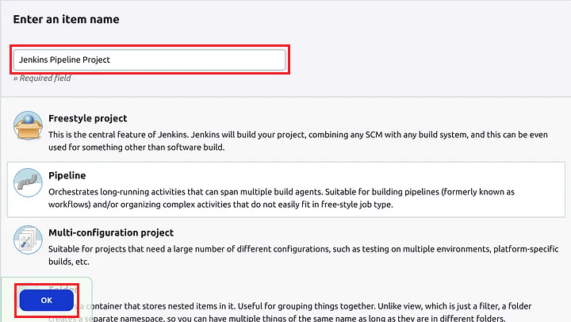
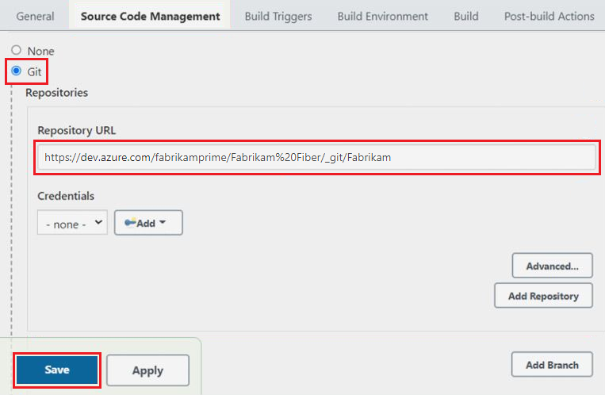
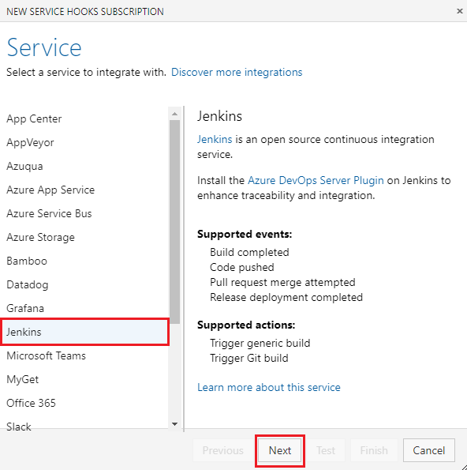
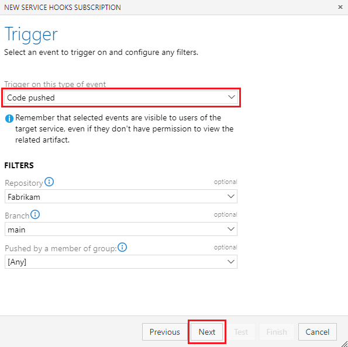
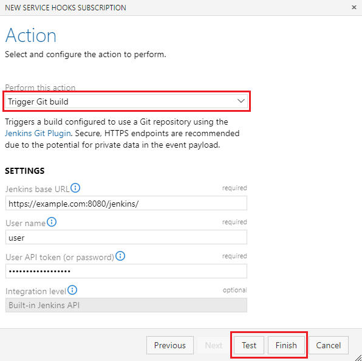

# Create a service hook for Azure DevOps with Jenkins

[!INCLUDE [version](../../includes/version-tfs-2017-through-vsts.md)]

If you use Jenkins to build your apps, you can store your code in Azure DevOps and continue to use Jenkins for your continuous integration builds.
You can trigger a Jenkins build when you push code to your project's
Git repository or when you check in code to Team Foundation version control.

[!INCLUDE [alt-creds-deprecation-notice](../../includes/alt-creds-deprecation-notice.md)]

## Configure Jenkins

1. If you haven't already, set up a [Jenkins](https://jenkins-ci.org/) server.

2. If you're setting up Jenkins on-premises, [enable HTTPS](https://jenkins.io/doc/book/installing/#configuring-http).

## Set up a Jenkins build

1. In Jenkins, create a new item.

   

2. Create the type of build that's appropriate for your project.

   

3. Set the URL for your Git repository in Azure DevOps Services.
The URL is in the form ```https://dev.azure.com/{orgName}/DefaultCollection/_git/{projectName}```.

   

## Trigger Jenkins

::: moniker range=">= azure-devops-2019"

1. Go to your project Service Hooks page: 

    `https://{orgName}/{project_name}/_settings/serviceHooks`

    

    Select **Create Subscription**.

2. Add Jenkins.

   

3. Pick the event from Azure DevOps Services that you want to trigger a Jenkins build.

   

4. Configure the action to take in Jenkins.

   

::: moniker-end

::: moniker range=">= tfs-2017 < azure-devops-2019"

1. Go to your project Service Hooks page: 

    `https://dev.azure.com/{orgName}/{project_name}/_apps/hub/ms.vss-servicehooks-web.manageServiceHooks-project`

    

    Select **Create Subscription**.

2. Add Jenkins.

   

3. Pick the event from Azure DevOps Services that you want to trigger a Jenkins build.

   

4. Configure the action to take in Jenkins.

   

::: moniker-end

Now, when that event occurs in Azure DevOps Services, your Jenkins build gets triggered.

## Pricing
Azure DevOps Services doesn't charge for the framework for integrating with external services. Check out the specific service's site
for pricing related to their services. 

## Q & A

<!-- BEGINSECTION class="m-qanda" -->

#### Q: Can I build part of my app in Azure DevOps Services and part in Jenkins?

A: Yes. You can trigger a Jenkins build when your Azure DevOps Services build is completed so that you use both systems to build your app.

#### Q: Can I programmatically create subscriptions?

A: Yes, use [REST APIs](../create-subscription.md).

<!-- ENDSECTION -->
