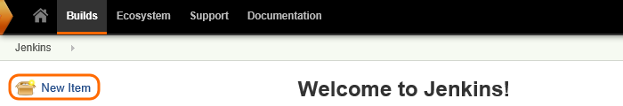
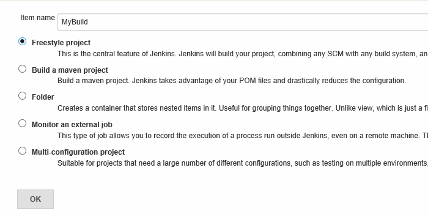

# Jenkins with VSTS

If you use Jenkins to build your apps, you can store your code in VSTS
and continue to use Jenkins for your continuous integration builds.
You can trigger a Jenkins build when you push code to your team project's
Git repository or when you check code in to Team Foundation version control.

## Configure Jenkins

1. If you haven't already, set up a [Jenkins](http://jenkins-ci.org/) server.

2. If you're setting up Jenkins on-premises, [enable HTTPS](https://wiki.jenkins-ci.org/display/JENKINS/Starting+and+Accessing+Jenkins).

## Set up a Jenkins build

1. In Jenkins, create a new item.

   

2. Create the type of build that's appropriate for your project.

   

3. Set the URL for your Git repository in VSTS.
The URL is in the form ```https://{VSTS account}.visualstudio.com/DefaultCollection/_git/{team project}```.

   

## Trigger Jenkins from VSTS 

1. If you haven't already, enable alternate credentials in your VSTS profile.
Be sure to set a secondary user name because you won't be able to use your email account
to connect VSTS to Jenkins.

   

0. Go to your VSTS project service hooks page: `https://{account_name}.visualstudio.com/{project_name}/_apps/hub/ms.vss-servicehooks-web.manageServiceHooks-project`

	

	Click **Create Subscription**.

4. Add Jenkins.

   

5. Pick the event from VSTS that you want to trigger a Jenkins build.

   

6. Configure the action to take in Jenkins.

   

Now, when that event occurs in VSTS, your Jenkins build will be triggered.

## Pricing
VSTS doesn't charge for the framework for integrating with external services. Check out the specific service's site
for pricing related to their services. 

## Q & A

<!-- BEGINSECTION class="m-qanda" -->

#### Q: Can I build part of my app in VSTS and part in Jenkins?

A: Yes. You can trigger a Jenkins build when your VSTS build is completed so that you use both systems to build your app.

#### Q: Can I programmatically create subscriptions?

A: Yes, use [REST APIs](../create-subscription.md).

<!-- ENDSECTION -->