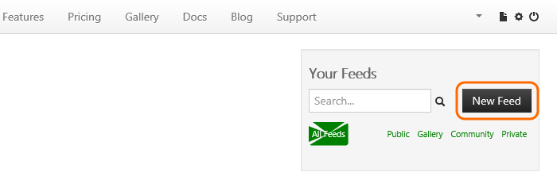
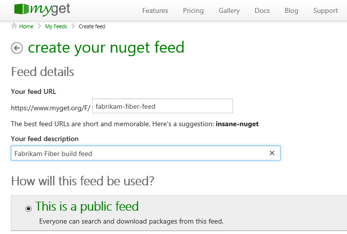
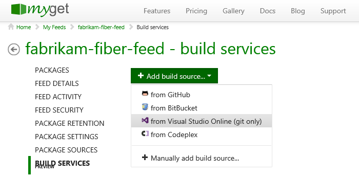
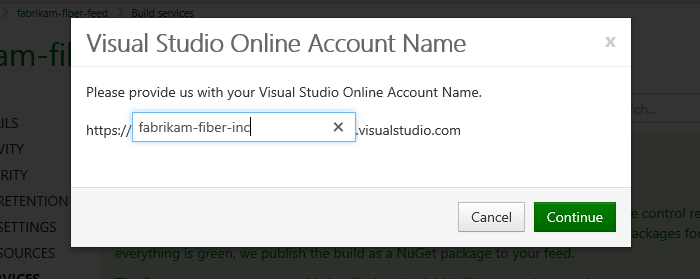
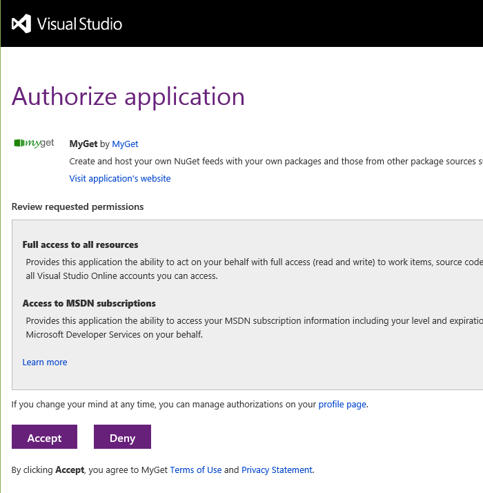
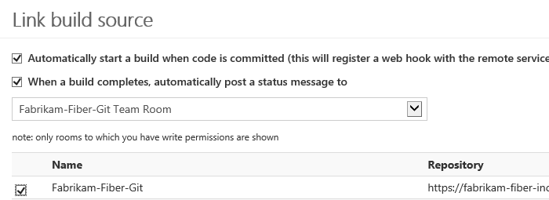
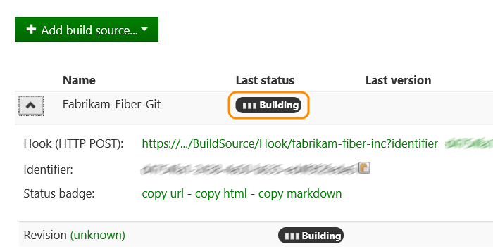
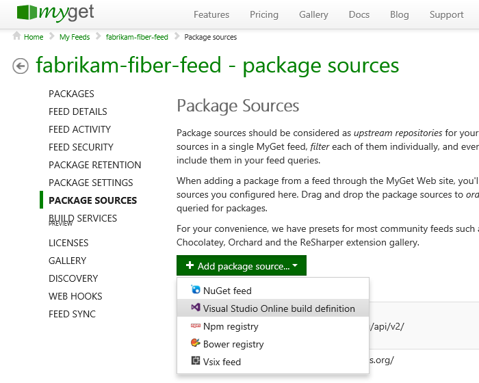
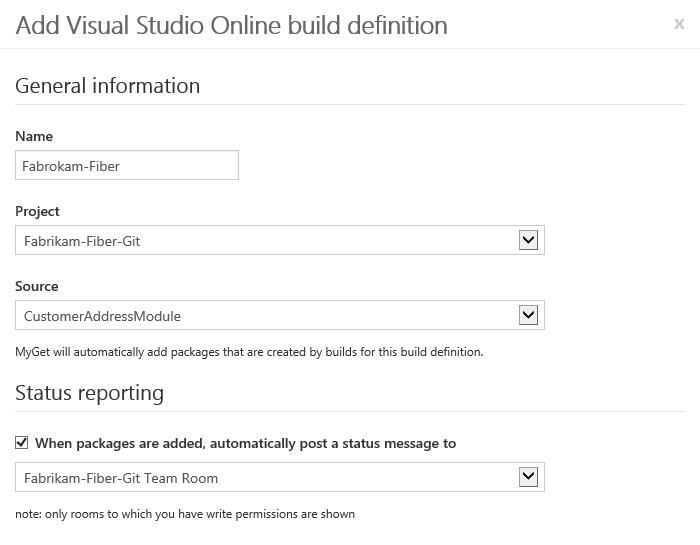
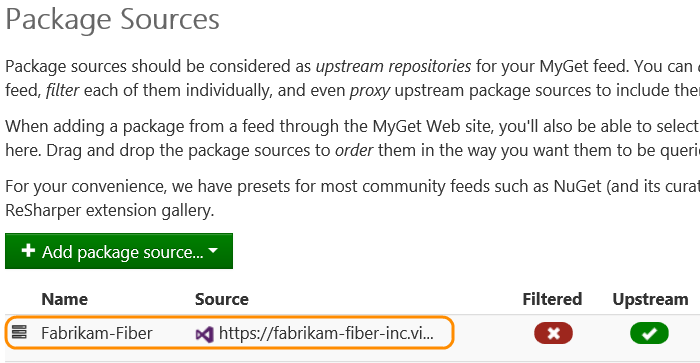

# MyGet with Azure DevOps Services

Use a MyGet feed for the following integration scenarios with Azure DevOps Services:

- When code is pushed to a Git repository in Azure DevOps Services, MyGet pulls the code, builds it, and adds any resulting NuGet packages to a feed. 
- When a NuGet package is built in Azure DevOps Services, MyGet downloads the package and adds it to a feed.

## Create and configure a MyGet feed

1. If you don't have a MyGet account, get one [here](http://myget.org/).

2. In MyGet, add a feed.

   

3. Configure the feed.

   

## Build and deploy a package when code is pushed

2. Add Azure DevOps Services to your feed as a build source.

   

3. Use your Azure DevOps Services organization.

   

4. Authorize MyGet to access your organization.

   

5. Configure the build source.

   

    Now the feed is set up. When code is pushed, view the status of the triggered MyGet builds.

    

## Deploy a package built on Azure DevOps Services
 
2. Add the Azure DevOps Services build pipeline as a package source for your feed.

   

3. Use your Azure DevOps Services organization.

   

4. Authorize MyGet to access your organization.

   

5. Choose a build pipeline that includes a NuGet package in the build drop.

   

    You've defined the package source.

    

## Pricing
Azure DevOps Services doesn't charge for the framework for integrating with external services. Check out the specific service's site
for pricing related to their services. 

## Q & A

<!-- BEGINSECTION class="m-qanda" -->

#### Q: Where can I get more information about MyGet?

A: At [myget.org](http://www.myget.org/).

<!-- ENDSECTION -->
