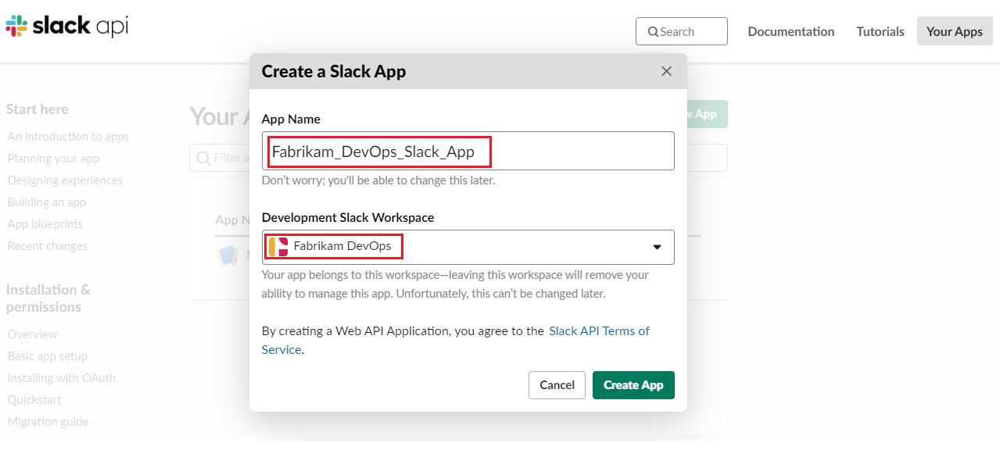
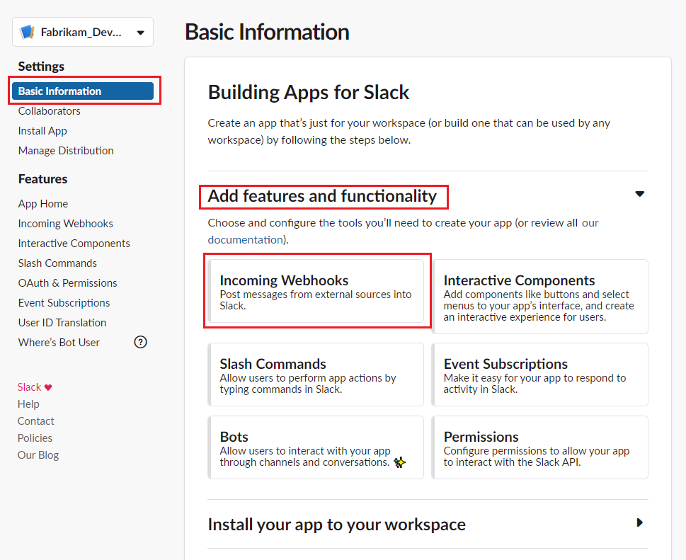
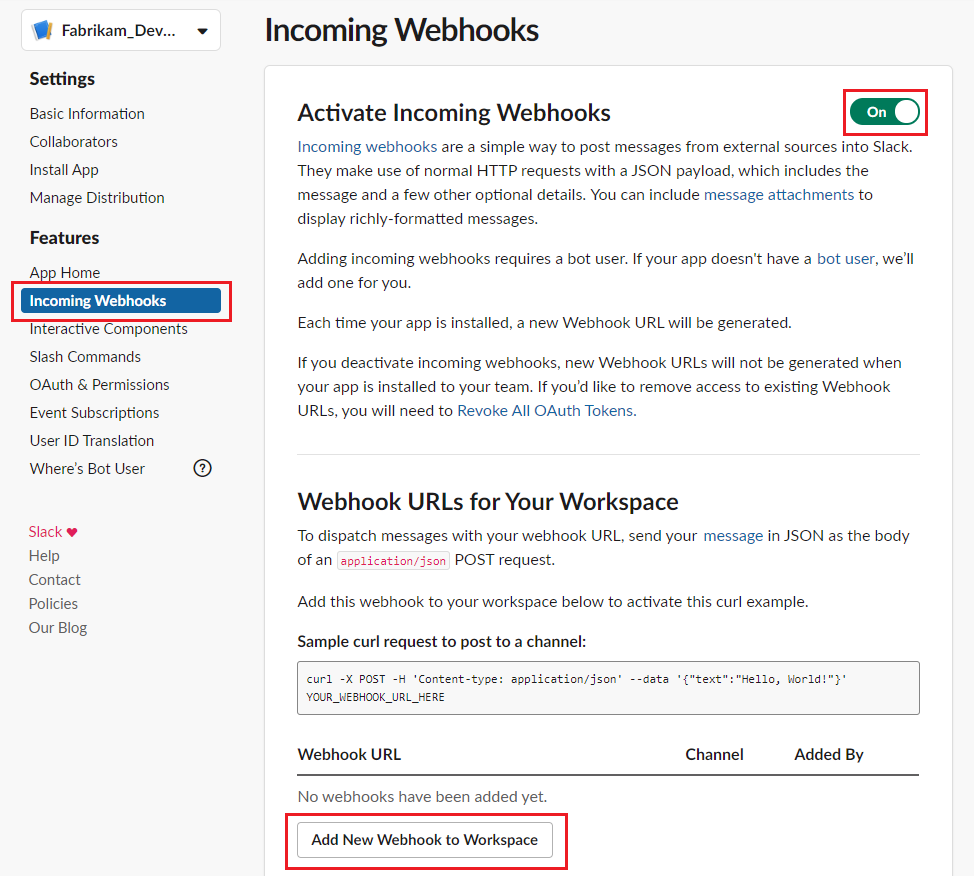
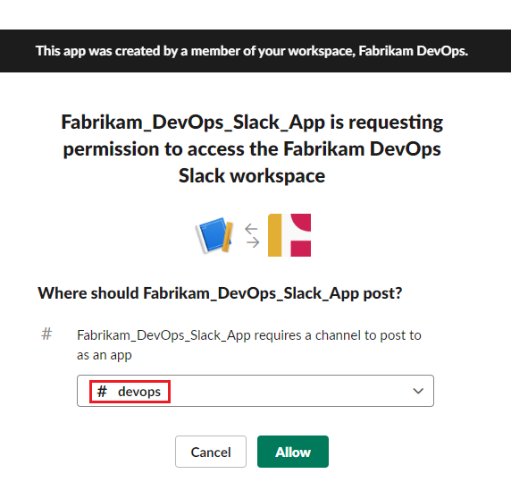
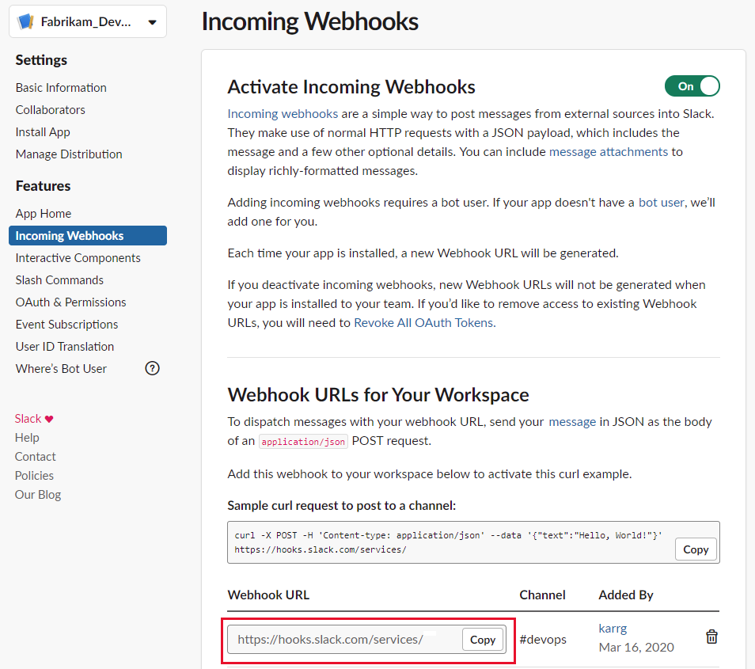
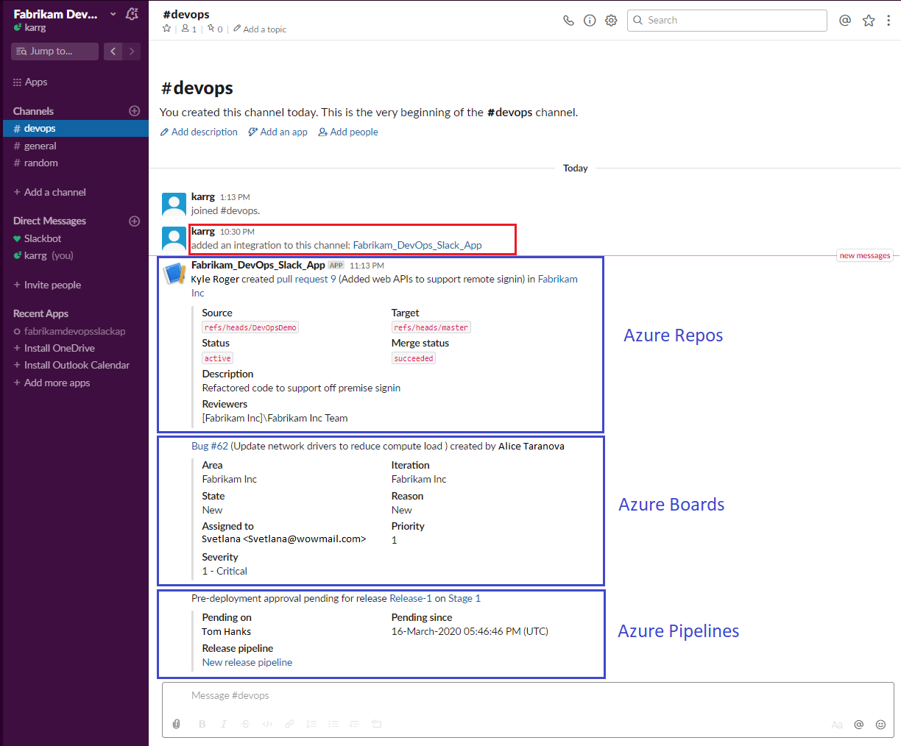

# Create a service hook for Azure DevOps with Slack

[!INCLUDE [version](../../includes/version-tfs-2017-through-vsts.md)]

Post messages to [Slack](https://slack.com/) in response to events in your Azure DevOps organization,
such as completed builds, code changes, pull requests, releases, work items changes, and more.

::: moniker range=">= azure-devops-2020"
> [!NOTE]
> For Azure DevOps Services and Azure DevOps 2020 and later versions, we recommend you use the following suite of apps  which offer rich features, to integrate with Slack.

### Azure Boards app for Slack

[Azure Boards app for Slack](../../boards/integrations/boards-slack.md) helps to easily create and monitor work items from your Slack channels. 
Users can create work items using a slash command, or use message actions to convert conversations in the channel into work items. 
Users can also set up and manage subscriptions to get notifications in their channel whenever work items are created or updated. 

### Azure Pipelines app for Slack

[Azure Pipelines app for Slack](../../pipelines/integrations/slack.md) helps to easily monitor the events in your pipelines. Users can set up and manage 
subscriptions for completed builds, releases, pending approvals and more from the app and get notifications for these events in their channels. Users can also approve release deployments from their channels. 

### Azure Repos app for Slack

[Azure Repos app for Slack](../../repos/integrations/repos-slack.md) helps to easily monitor the events in your repositories. Users can set up and manage subscriptions for code commits, PR creation and PR updates and more from the app and get notifications for these events in their channels.

::: moniker-end

::: moniker range=">= tfs-2017 <= azure-devops-2019"

## Create a custom app in Slack

1. Refer to the [Slack documentation, Sending messages using Incoming Webhooks](https://api.slack.com/messaging/webhooks) to understand the process of using Web Hooks to push information to a Slack channel.

2. Create a new [Slack app](https://api.slack.com/apps/new)
	

3. Activate incoming Web Hook and add a new Web Hook to the desired workspace
	

	

4. Select the channel for which Web Hook must be created

	

5. Copy the Web Hook URL and go to Azure DevOps

	

## Create a service hook subscription in your organization

::: moniker-end

::: moniker range=">= azure-devops-2019"

1. Go to your project **Service Hooks** page: 

	`https://{orgName}/{project_name}/_settings/serviceHooks`

	

	Select **Create Subscription**.

2. Choose the types of events you want to appear in your Slack channel.
   > You can filter each of the triggers in specific ways.
   > For example, the *pull request created* trigger can be filtered on the repository in which the pull request occurs,
   > the target branch it applies to, and the team members that are required or invited to review the request.

3. Paste the Web Hook URL from the Slack integration that you created and select **Finish**.

   

4. Now, when the event you configured occurs in your project, a notification appears in your team's Slack channel.

	

::: moniker-end

::: moniker range=">= tfs-2017 < azure-devops-2019"

1. Go to your project Service Hooks page: 

    `https://dev.azure.com/{orgName}/{project_name}/_apps/hub/ms.vss-servicehooks-web.manageServiceHooks-project`

	

	Select **Create Subscription**.

2. Choose the types of events you want to appear in your Slack channel.
   > You can filter each of the triggers in specific ways.
   > For example, the *pull request created* trigger can be filtered on the repository in which the pull request occurs,
   > the target branch it applies to, and the team members that are required or invited to review the request.

3. Paste the Web Hook URL from the Slack integration that you created and select **Finish**.

   ![Action dialog box with the Web Hook URL]./media/slack/action.png) 

4. Now, when the event you configured occurs in your project, a notification appears in your team's Slack channel.

	

::: moniker-end

::: moniker range=">= tfs-2017 < azure-devops-2019"

## Q & A

<!-- BEGINSECTION class="m-qanda" -->

#### Q: Why don't I have the pull request events as an option when I configure my trigger?

A: Pull requests are only available with projects that use Git.
If your project uses TFVC, pull event triggers aren't available,
and your code event is called "Code checked in" instead of "Code pushed".

#### Q: How can I get multiple events to show up in my Slack channel?

A: Create a new subscription for each type of event you want.
For example, if you want to see build failures and new work items in your Slack channel,
create two additional subscriptions.

<!-- ENDSECTION -->

::: moniker-end