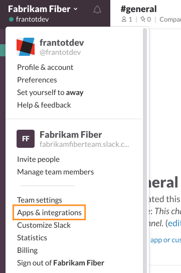
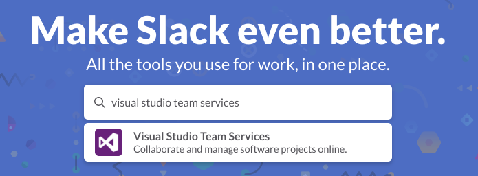
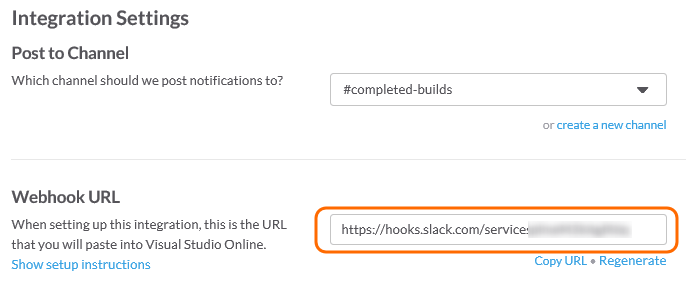
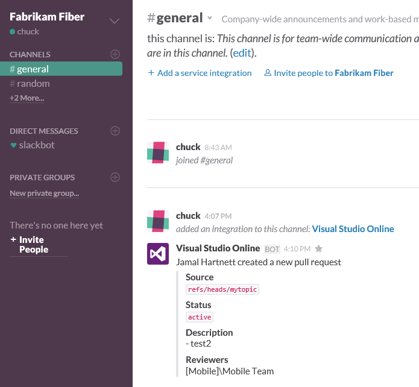

# Create a service hook for Azure DevOps Services and TFS with Slack

Post messages to [Slack](https://slack.com/) in response to events in your Azure DevOps Services organization,
like completed builds, code changes, pull requests, releases, work items changes, and more.

>[!NOTE]
> If you are only interested in integrating Slack with Azure Pipelines, we recommend you use our [Azure Pipelines app](../../pipelines/integrations/slack.md) for Slack.

## Create the Slack integration

1. From any page on your team's Slack (```https://[team].slack.com/...```), click your account name in the left window pane
to open up the menu, and find **Apps and integrations**:

   

1. Search for and click the Azure DevOps Services integration (Search "Visual Studio Team Services"):

   

1. On the Azure DevOps Services integration page, click **Install**.
1. Choose a channel to have notifications posted to from the dropdown and click **Add Visual Studio Integration**. 
1. Scroll down the page and copy the web hook URL to use when you create the service hook subscription in your organization.



## Create a service hook subscription in your organization

::: moniker range=">= azure-devops-2019"

1. Go to your project Service Hooks page: 

	`https://{orgName}/{project_name}/_settings/serviceHooks`

	

	Select **Create Subscription**.

1. Choose the types of events you want to appear in your Slack channel.
   > You can filter each of the triggers in specific ways.
   > For example, the *pull request created* trigger can be filtered on the repository in which the pull request occurs,
   > the target branch it applies to, and the team members that are required or invited to review the request.

1. Paste the web hook URL from the Slack integration that you created and select **Finish**.

   

1. Now, when the event you configured occurs in your project, a notification will appear in your team's Slack channel.

   

::: moniker-end

::: moniker range=">= tfs-2017 < azure-devops-2019"

1. Go to your project Service Hooks page: 

    `https://dev.azure.com/{orgName}/{project_name}/_apps/hub/ms.vss-servicehooks-web.manageServiceHooks-project`

	

	Select **Create Subscription**.

1. Choose the types of events you want to appear in your Slack channel.
   > You can filter each of the triggers in specific ways.
   > For example, the *pull request created* trigger can be filtered on the repository in which the pull request occurs,
   > the target branch it applies to, and the team members that are required or invited to review the request.

1. Paste the web hook URL from the Slack integration that you created and select **Finish**.

   

1. Now, when the event you configured occurs in your project, a notification will appear in your team's Slack channel.

   

::: moniker-end

## Pricing
Azure DevOps Services doesn't charge for the framework for integrating with external services. Check out the specific service's site
for pricing related to their services. 

## Q & A

<!-- BEGINSECTION class="m-qanda" -->

#### Q: Why don't I have the pull request events as an option when I configure my trigger?

A: Pull requests are only available with projects that use Git.
If your project uses TFVC, pull event triggers aren't available,
and your code event is called "Code checked in" instead of "Code pushed".

#### Q: How can I get multiple events to show up in my Slack channel?

A: Create a new subscription for each type of event you want.
For example, if you want to see build failures and new work items in your Slack channel,
create two additional subscriptions.


<!-- ENDSECTION -->
