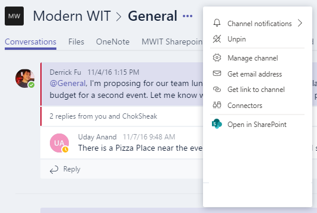
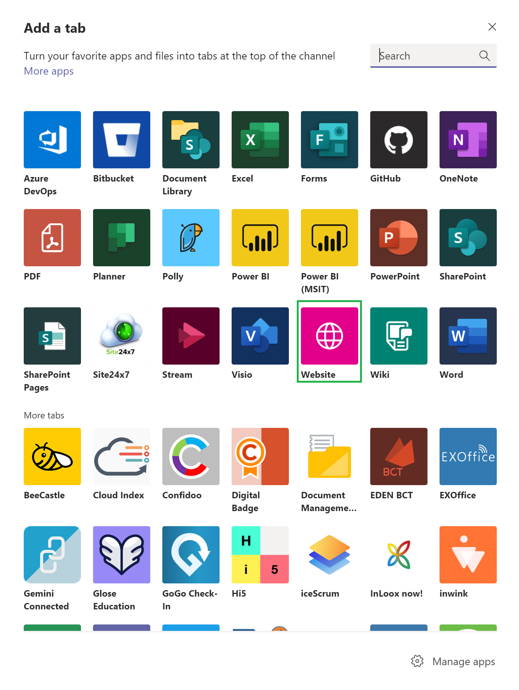

# Create a service hook for Azure DevOps with Microsoft Teams 

[!INCLUDE [version](../../includes/version-tfs-2017-through-vsts.md)]

See activity about your Azure DevOps Server (2017.2 and later) projects directly in your Microsoft Teams channel, for example:
* Work item updates
* Pull requests
* Code commits
* Builds
* Release deployments and approvals

::: moniker range="azure-devops"
> [!NOTE]
> For Azure DevOps Services, we recommend you use the following suite of apps which offer rich features, to integrate with Microsoft Teams.

### Azure Boards app for Teams

[Azure Boards app for Microsoft Teams](../../boards/integrations/boards-teams.md) helps to easily create and monitor work items from your Teams channels. Users can create work items using a command, or use message actions to convert conversations in the channel into work items. Users can also set up and manage subscriptions to get notifications in their channel whenever work items are created or updated. 

### Azure Pipelines app for Teams

[Azure Pipelines app for Microsoft Teams](../../pipelines/integrations/microsoft-teams.md) helps to easily monitor the events in your pipelines. Users can set up and manage subscriptions for completed builds, releases, pending approvals and more from the app and get notifications for these events in their channels. Users can also approve release deployments from their channels. 

### Azure Repos app for Teams

[Azure Repos app for Microsoft Teams](../../repos/integrations/repos-teams.md) helps to easily monitor the events in your repositories. Users can set up and manage subscriptions for code commits, PR creation and PR updates and more from the app and get notifications for these events in their channels. 

::: moniker-end

::: moniker range=">= tfs-2017 <= azure-devops-2020"

## Configure a new connector for Azure DevOps Server

Configuring integration between Azure DevOps Server and Teams is a two-step process. First set up a connector in Teams, then set up one or more service hook subscriptions in your Azure DevOps Server project.

> [!NOTE]  
> Project administrator permissions are required to create service hook subscriptions. 
> Events for YAML pipelines are not supported. 

### From Teams 

1. To bring events from Azure DevOps into Microsoft Teams, select '...', the ellipsis, or at the upper navigation of your team channel, select **Connectors**. 

    

2. Select **Azure DevOps** from the list.

	:::image type="content" source="./media/teams/connectors-list-s172.png" alt-text="Connectors list":::

3. Choose **Add**.

4. Configure the connector. 

5. Copy the generated webhook URL. Provide this URL when you're setting up service hook subscriptions in your Azure DevOps project.

### From Azure DevOps Server

1. From your project page (`https://mycompany/tfs/[collection]/[project]`), go to **Service Hooks** in the settings:

     

1. Click **Create subscription** and select the **Teams** service.

1. Choose the type of activity you want to appear in your Teams channel.	You can filter each of the triggers in specific ways.

	For example, the *pull request created* trigger can be filtered on the repository in which the pull request occurs, 
    the target branch it applies to, and the team members that are required or invited to review the request.

1. Paste the webhook URL from the Teams connector configuration step and select **Finish**.

Activity from your project begins appearing in your Teams channel.

## Configure Azure DevOps tabs in Microsoft Teams

1. To bring your Kanban board or dashboard into Microsoft Teams, select **+ Add new tab** on the upper portion of your team channel. Find the Website icon and add the link to your Azure DevOps board or dashboard. 

   

2. Once you've authenticated, your Kanban board or dashboard appears.
   

## Frequently asked questions (FAQs)

<!-- BEGINSECTION class="m-qanda" -->

### Q: How can I get multiple events from my Azure DevOps Server project to show up in my Teams channel?

A: Create a new subscription for each type of event you want.
For example, if you want to see build failures and new work items in your Teams channel,
create two additional subscriptions.

### Q: Why don't I see my organization when trying to connect Microsoft Teams?

A: Only organizations in the same Azure Active Directory tenant as your Microsoft Teams account can be connected. Even if your email address is the same for Azure DevOps Services and Microsoft Teams, they may be backed by different tenants, so they can't be linked.

Create a new Team in the same Azure Active Directory (Azure AD) as Azure DevOps Services, or move your Azure DevOps Services to the same Azure AD as Teams, see [Q: Why is my organization already connected to a directory? Can I change that directory?](../../organizations/accounts/faq-azure-access.yml#q--why-is-my-organization-already-connected-to-a-directory--can-i-change-that-directory-).

<!-- ENDSECTION -->

::: moniker-end
