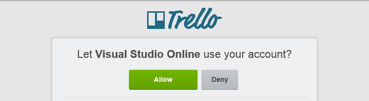
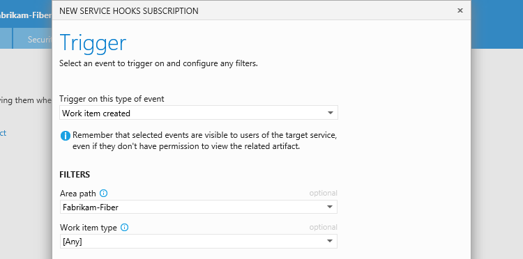
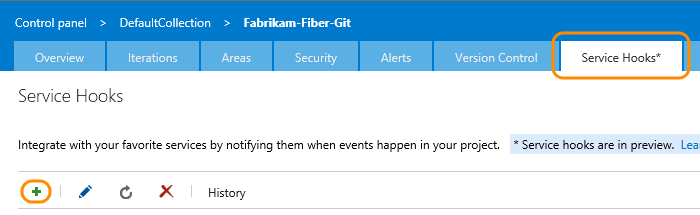

# Create a service hook for Azure DevOps Services and TFS with Trello

Create cards and lists in Trello in response to events from Azure DevOps Services.
For example, when code is pushed, or a build occurs.

## Get a Trello authorization token

1. If you don't have a Trello account, get one [here](https://trello.com/signup).

2. Go to the [Authorize Azure DevOps Services for Trello page](https://trello.com/1/authorize?key=7d6630fd03ac2b6fc9fde2f2ef0c4096&name=Visual%20Studio%20Online&expiration=never&response_type=token&scope=read%2cwrite), and sign in with your Trello credentials.

3. Allow Azure DevOps Services to use your Trello account.

   

4. Copy the authorization token.

   

Create a Trello card or list from an Azure DevOps Services event.

::: moniker range=">= azure-devops-2019"

1. Go to your project Service Hooks page: 

	`https://{orgName}/{project_name}/_settings/serviceHooks`

	

	Select **Create Subscription**.

1. Pick the Trello service.

   

1. Configure the triggering Visual Studio event. In this case,
we're going to have the subscription respond when a work item is created.

   


1. Set up the action that Trello will take in response to the trigger -
either create a card or a list.

   

   You can use  placeholders to insert content from the event into the
   name and description of the cards or lists that the subscription creates.
   For example, when we run the test notification, the card that gets created is named
   "Bug #5: Some great new idea!" because the test work item is a bug (ID=5)
   with the title "Some great new idea!".

1. Test the service hook subscription and finish the wizard.

   

::: moniker-end

::: moniker range=">= tfs-2017 < azure-devops-2019"

1. Go to your project Service Hooks page: 

    `https://dev.azure.com/{orgName}/{project_name}/_apps/hub/ms.vss-servicehooks-web.manageServiceHooks-project`

	

	Select **Create Subscription**.

1. Pick the Trello service.

   

1. Configure the triggering Visual Studio event. In this case,
we're going to have the subscription respond when a work item is created.

   


1. Set up the action that Trello will take in response to the trigger -
either create a card or a list.

   

   You can use  placeholders to insert content from the event into the
   name and description of the cards or lists that the subscription creates.
   For example, when we run the test notification, the card that gets created is named
   "Bug #5: Some great new idea!" because the test work item is a bug (ID=5)
   with the title "Some great new idea!".

1. Test the service hook subscription and finish the wizard.

   

::: moniker-end

Now it's set up. Go to Trello and see the cards appear.


## Placeholders

You can insert placeholders in the name of a list or the name or description of a card to be created by your subscription.
When a list or card is created, the placeholders will be replaced by values from the event that was raised.
The example we used for the card name in this page uses:

```
    {{workitem.workItemType}} #{{workitem.id}}: {{workitem.title}}
```

So when a bug is created with the ID 5 and title "Some great new idea!",
the card name is "Bug #5: Some great new idea!".

The basic form of the placeholder is ```{{resource.field}}```
where resource is the name of the resource raising the event (workitem, build, and so on)
and field is a field within the resource section of the event, like ID.
So, if the subscription is for a completed build, it might be something like

```
    Build {{build.id}} completed at {{build.finishTime}}
```

To understand what fields are available to use, look at the [events reference](../events.md).

### Work item fields

Work item fields appear in the event in the fields array, like this example:

```
    " fields": {
                " System.AreaPath": "Fabrikam-Fiber-Git", 
                " System.TeamProject": "Fabrikam-Fiber-Git", 
                " System.IterationPath": "Fabrikam-Fiber-Git", 
                " System.WorkItemType": "Product Backlog Item", 
                " System.State": "New", 
                " System.Reason": "New backlog item", 
                " System.CreatedDate": "2014-11-05T21:11:28.85Z", 
                " System.CreatedBy": "Normal Paulk", 
                " System.ChangedDate": "2014-11-05T21:11:29.23Z", 
                " System.ChangedBy": "Normal Paulk", 
                " System.Title": "Test PBI", 
                " Microsoft.Azure DevOps Services.Common.BacklogPriority": 999999999, 
                " WEF_6CB513B6E70E43499D9FC94E5BBFB784_Kanban.Column": "New"
           },
```

Working directly from the event definition, we would have created our card name like this example:

```
    {{workitem.fields["System.workItemType"]}} #{{workitem.fields["System.id"]}: {{workitem.fields["System.title"]}}
```

As a shortcut, you can reference any fields in the System or Microsoft.Azure DevOps Services.Common namespaces
as if they were fields of the resource.
So ```{{workitem.fields["System.workItemType"]}}``` becomes ```{{workitem.workItemType}}```.

### Placeholder expressions

These placeholders use a [handlebars templates](http://handlebarsjs.com/)
implementation that is largely compatible with [Mustache](http://mustache.github.io/mustache.5.html).
Some useful expressions include

Type of expression         | examples
---------------------------|-----------------------------
basic expressions          | ```{{workitem.name}}```
array expressions          | ```{{pullRequest.reviewers.[0].displayName}}```
Mustache sections          | ```{{#workitem.assignedTo}}``` This WI is assigned ```{{/workitem.assignedTo}}```
Mustache Inverted Sections | ```{{^workitem.assignedTo}}``` This WI isn't assigned ```{{/workitem.assignedTo}}```
Handlebars block helpers   | with<br/>if/else<br/>unless<br/>each
Handlebars paths          | ...<br/>this<br/>For example, ```{{../comment/id}}``` or ```{{this/title}}```
Template comments          | ```{{!-- this is a handlebar comment --}}``` 

## Pricing
Azure DevOps Services doesn't charge for the framework for integrating with external services. Check out the specific service's site
for pricing related to their services. 

## Q & A

<!-- BEGINSECTION class="m-qanda" -->

#### Q: Can I programmatically create subscriptions?

A: Yes, see details [here](../create-subscription.md).

#### Q: Can I get more information about Trello?

A: Yes, [trello.com](http://www.trello.com/).

<!-- ENDSECTION -->
