# UserVoice

Use User Voice to get feedback from your customers and push that feedback directly into your backlog in Visual Studio Team Services.
When your team updates the item in the backlog, the User Voice item is updated, too. 

Link your Visual Studio Team Services account to your UserVoice account.

1. If you don't have a UserVoice account, get one [here](https://www.uservoice.com/for/visual-studio-online/).

2. In UserVoice, go to the integrations page.

	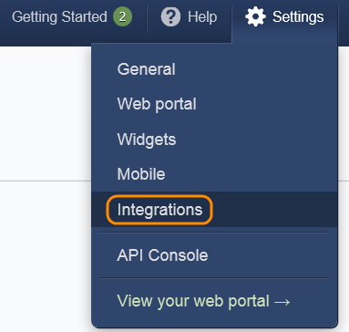

3. Set up a synced service.

	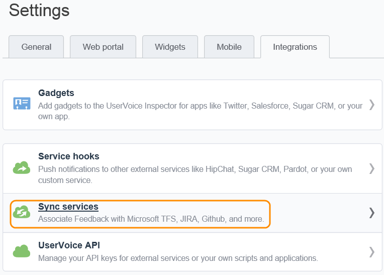

4. Sync to Visual Studio Team Services.

	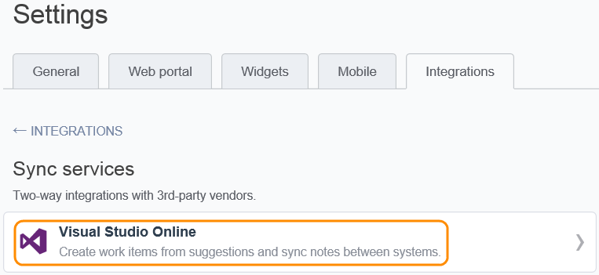

5. Link your Visual Studio Team Services account to your UserVoice account. 

	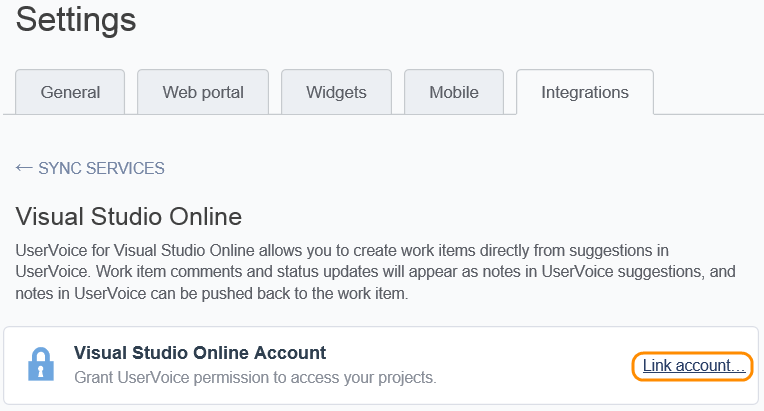

	
6. Authorize UserVoice to access your Visual Studio Team Services account. 

	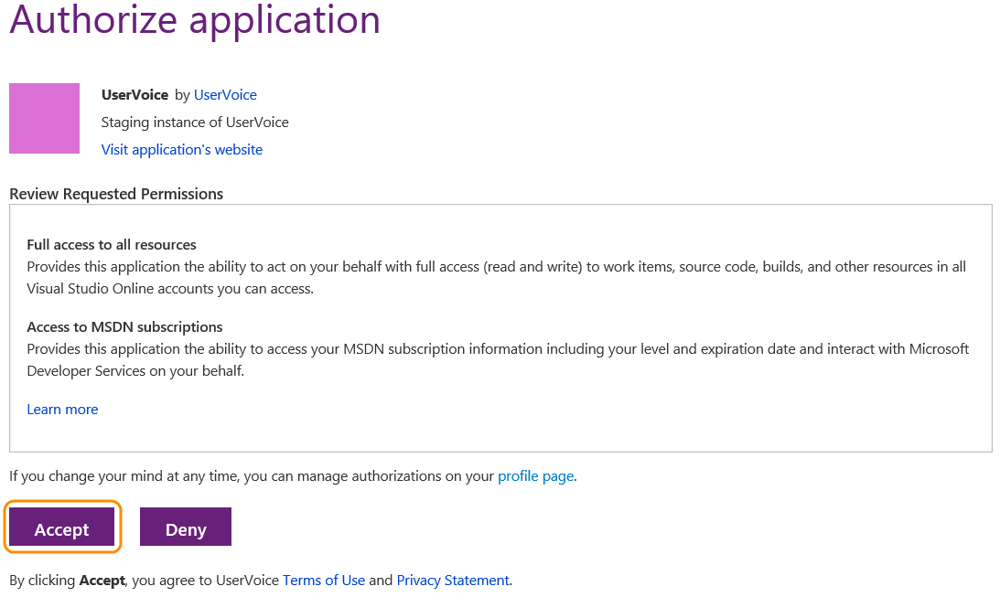

## Add an item to your backlog from a UserVoice idea

You can create a work item in Visual Studio Team Services form an idea in UserVoice.
In this case, we're creating a product backlog item. You might want to create a bug in some cases.
Or, if your team uses user stories instead of product backlog items, you can create those.

1. Open an idea in the admin area of UserVoice and then create a work item in Visual Studio.

	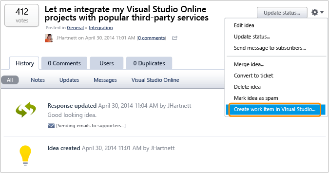

2. Create the backlog item in Visual Studio Team Services.
The description you type here will be the description of the item in Visual Studio Team Services.

	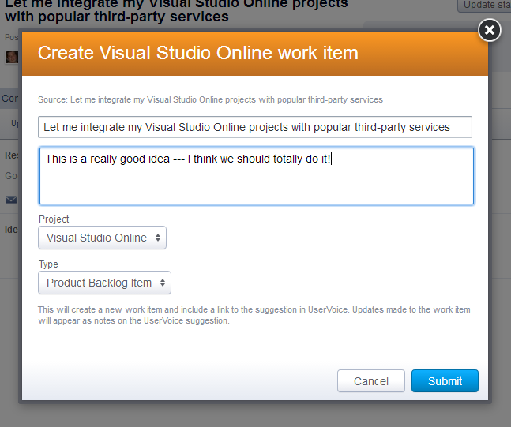

3. Submit the idea. A link to the item in Visual Studio Team Services shows up on the UserVoice idea.

	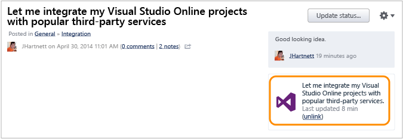

4. Follow that link to open the backlog item in Visual Studio Team Services.

	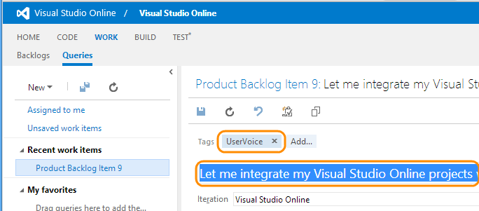

## Update a your backlog

When you update your backlog in Visual Studio Team Services, the UserVoice idea is updated, too.

1. Approve the backlog item.

	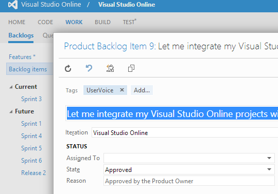

2. Add a comment in the history control.

	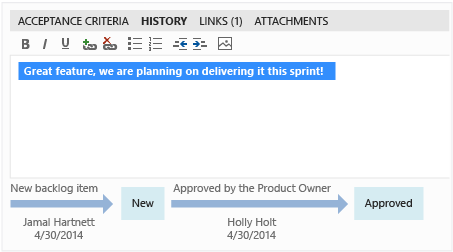

3.In UserVoice, refresh the page and you'll see that the item was just updated
and that the comment added in the history control is displayed with the item in UserVoice.
Your customers can see that you're doing this work.

	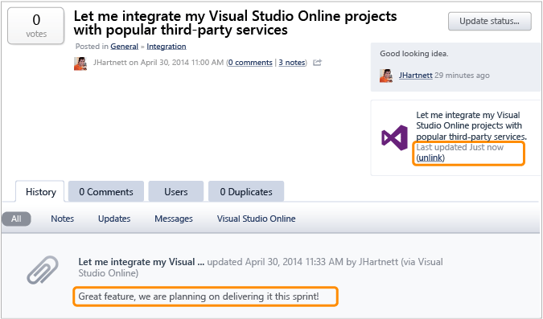

## Add comments to items in Visual Studio Team Services from UserVoice

1. In UserVoice, add a note to the linked Visual Studio Team Services item.

	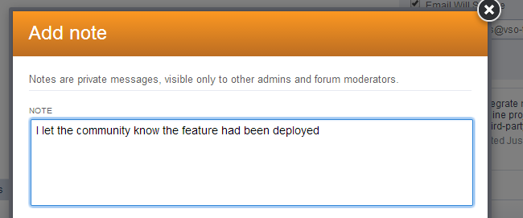

2. In Visual Studio Team Services, refresh the work item to see the note in the discussion tab.

	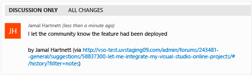

## Pricing
Visual Studio Team Services doesn't charge for the framework for integrating with external services. Check out the specific service's site
for pricing related to their services. 

## Q & A

<!-- BEGINSECTION class="m-qanda" -->

#### Q: Can I programmatically create subscriptions?

A: Yes, see details [here](../create-subscription.md).

#### Q: Where can I get more information about UserVoice?

A: At UserVoice for [Visual Studio Team Services](https://www.uservoice.com/for/visual-studio-online/).

<!-- ENDSECTION -->