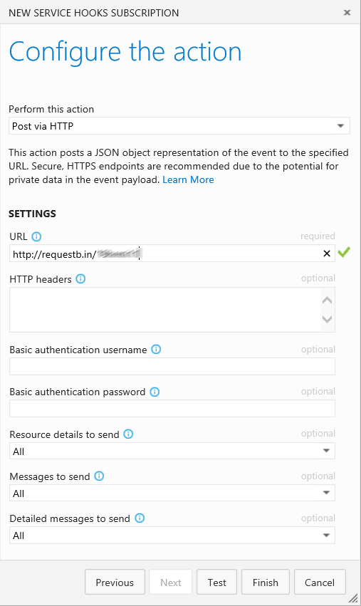
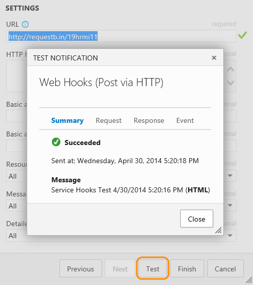
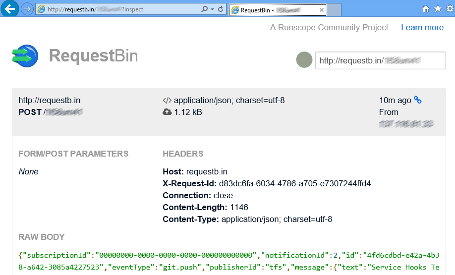

# Web Hooks

Web Hooks provides a way to send a JSON representation of an event to any service. All that is required is a public endpoint (HTTP or HTTPS).

For more information about the JSON payloads posted by this consumer, see [events](../events.md).

## Send JSON representation to a service

::: moniker range=">= azure-devops-2019"

1. Go to your project Service Hooks page: 

	`https://{orgName}/{project_name}/_settings/serviceHooks`

	

	Select **Create Subscription**.

1.  Select and configure the Azure DevOps Services event:

	

1. Configure what to do when the event occurs:

	See Q & A below for information on the **Resource details to send**, **Messages to send**, and **Detailed messages to send** settings.

	

1. Test the service hook subscription and finish the wizard:

	

::: moniker-end

::: moniker range=">= tfs-2017 < azure-devops-2019"

1. Go to your project Service Hooks page: 

    `https://dev.azure.com/{orgName}/{project_name}/_apps/hub/ms.vss-servicehooks-web.manageServiceHooks-project`

	

	Select **Create Subscription**.

1.  Select and configure the Azure DevOps Services event:

	

1. Configure what to do when the event occurs:

	See Q & A below for information on the **Resource details to send**, **Messages to send**, and **Detailed messages to send** settings.

	

1. Test the service hook subscription and finish the wizard:

	

::: moniker-end

Now the Web hook is set up. Go to the target service to view the JSON representation:




## Pricing
Azure DevOps Services doesn't charge for the framework for integrating with external services. Check out the specific service's site
for pricing related to their services. 

## Q & A

<!-- BEGINSECTION class="m-qanda" -->

#### Q: What are the Resource details to send, Messages to send, and Detailed messages to send settings for?

A: They control the size of the JSON payload that is sent.

The **Resource details to send** setting controls how much of the resource is sent.
The default is **All**, but you can also choose to send **Minimal** (only sends key fields like URL and ID), or **None**.

**None** and **Minimal** are useful in scenarios where the caller doesn't actually need much,
if anything, about the resource because it's relying on the message or detailed message.
**None** and **Minimal** are also useful for security reasons, for example,
the caller needs to call back into Azure DevOps Services and go through normal security/permission checks to get more details about the resource.

Sample JSON:

```json
	{
	    "event.type": "git.push",
	    ...
	    "messages": {
	        "text": "...",
	        "html": "...",
	        "markdown": "..."
	    },
	    "detailedMessages": {
	        "text": "...",
	        "html": "...",
	        "markdown": "..."
	    },
	    "resource": {
	        "id": "...",
	        "url": "https://...",
	        "name": "...",
	        "field1:": "..."
	    }
	}	
```

#### Q: Can I programmatically create subscriptions?

A: Yes, see details [here](../create-subscription.md).

#### Q: Can I send web hooks to non HTTPS endpoints?

A: Yes. However, it's recommended that you only use HTTPS endpoints for your web hooks. Using HTTP means there is a the potential for private data being sent unencrypted. This includes any authentication headers in your web hook. 

#### Q: Can I use basic authentication when setting up a web hook that isn't HTTPS?

A: No. You must use HTTPS when utilizing basic authentication on a web hook. 

#### Q: Can we use localhost or special range IPs as web hook targets?

A: No. Web hooks cannot target localhost (loopback) or special range [IPv4](https://www.iana.org/assignments/iana-ipv4-special-registry/iana-ipv4-special-registry.xhtml)/[IPv6](https://www.iana.org/assignments/iana-ipv6-special-registry/iana-ipv6-special-registry.xhtml) addresses. 

<!-- ENDSECTION -->