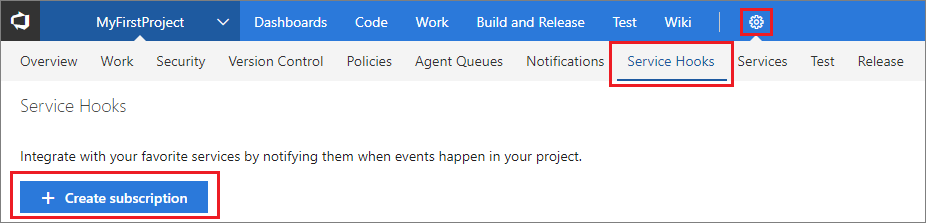

# Web Hooks

Web Hooks provides a way to send a JSON representation of an event to any service.
All that is required is a public endpoint (HTTP or HTTPS).

For more information about the JSON payloads posted by this consumer, see [events](../events.md).

## Send JSON representation to a service

1. Open the admin page for the team project in Visual Studio Team Services.

2. On the Service Hooks tab, run the subscription wizard.

   For details about the subscription wizard, go [here](../get-started.md). 

   

3. Pick and configure the Visual Studio Team Services event.

   

4. Configure what to do when the event occurs. 

   See Q & A below for information on the **Resource details to send**,
   **Messages to send**, and **Detailed messages to send** settings.

   

5. Test the service hook subscription and finish the wizard.

   

Now the Web hook is set up. Go to the target service to view the JSON representation. 


## Pricing
Visual Studio Team Services doesn't charge for the framework for integrating with external services. Check out the specific service's site
for pricing related to their services. 

## Q & A

<!-- BEGINSECTION class="m-qanda" -->

#### Q: What are the Resource details to send, Messages to send, and Detailed messages to send settings for?

A: They control the size of the JSON payload that is sent.

The **Resource details to send** setting controls how much of the resource is sent.
The default is **All**, but you can also choose to send **Minimal** (only sends key fields like URL and ID), or **None**.

**None** and **Minimal** are useful in scenarios where the caller doesn't actually need much,
if anything, about the resource because it is relying on the message or detailed message.
**None** and **Minimal** are also useful for security reasons, for example,
the caller needs to call back into Visual Studio Team Services and go through normal security/permission checks 
in order to get more details about the resource.

Sample JSON:

```
	{
	    "event.type": "git.push",
	    ...
	    "messsages": {
	        "text": "...",
	        "html": "...",
	        "markdown": "..."
	    },
	    "detailedMesssages": {
	        "text": "...",
	        "html": "...",
	        "markdown": "..."
	    },
	    "resource": {
	        "id": "...",
	        "url": "https://...",
	        "name": "...",
	        "field1:": "..."
	    }
	}	
```

#### Q: Can I programmatically create subscriptions?

A: Yes, see details [here](../create-subscription.md).

<!-- ENDSECTION -->